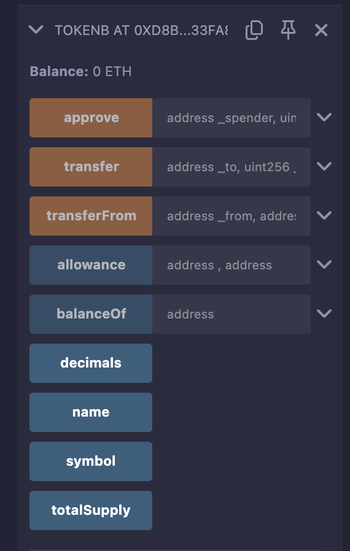
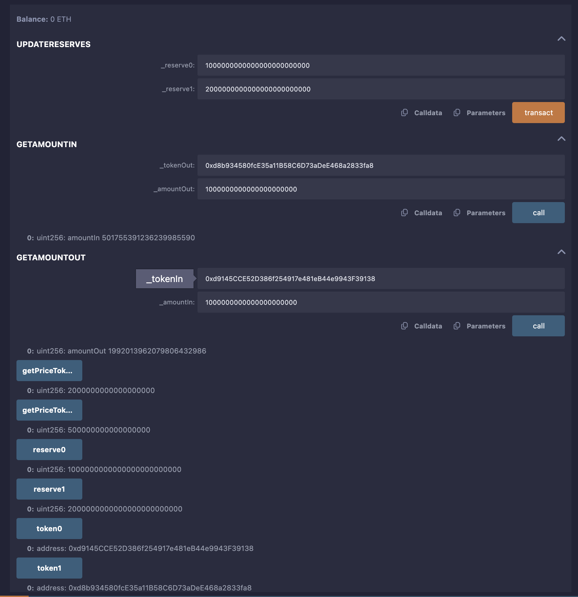

# AMMPriceCalculator Contract

## Overview
The `AMMPriceCalculator` contract is a utility smart contract designed to calculate token prices and trade amounts for an Automated Market Maker (AMM) trading pair using the constant product formula (x * y = k), similar to Uniswap. It supports a trading pair of two ERC20 tokens (`TokenA` and `TokenB`) and provides functions to compute the price of one token in terms of the other, as well as the expected output or input amounts for trades, accounting for a 0.3% fee. Unlike a full AMM like the Constant Sum AMM (CSAMM), this contract focuses solely on price calculations without managing liquidity or executing token swaps.

The repository includes three contracts:
- `TokenA.sol`: An ERC20 token contract representing `TokenA`.
- `TokenB.sol`: An ERC20 token contract representing `TokenB`.
- `AMMPriceCalculator.sol`: The main contract for price calculations.

This README provides a detailed, step-by-step guide to deploying and testing these contracts using the Remix IDE, along with instructions for capturing screenshots to document the process. The testing process is based on the provided environment details, which include deployed contract addresses and test results.

## Contract Details
- **Purpose**: The `AMMPriceCalculator` contract calculates:
  - The price of `TokenA` in terms of `TokenB` (`getPriceToken0`).
  - The price of `TokenB` in terms of `TokenA` (`getPriceToken1`).
  - The output amount for a given input amount in a trade (`getAmountOut`).
  - The input amount required for a desired output amount (`getAmountIn`).
- **Key Features**:
  - Uses the constant product formula for AMM pricing.
  - Accounts for a 0.3% trading fee.
  - Stores reserves (`reserve0` and `reserve1`) for the token pair.
  - Immutable token addresses (`token0` and `token1`) set during deployment.
- **Relation to CSAMM**: The `CSAMM` (Constant Sum AMM) is a full AMM implementation that manages liquidity and swaps using a constant sum model. In contrast, `AMMPriceCalculator` is a lightweight utility for price calculations using the constant product model, making it suitable for applications needing pricing logic without liquidity management.

## Prerequisites
Before starting, ensure you have the following:
- **Remix IDE**: Access at https://remix.ethereum.org.
- **MetaMask**: Installed and configured with a testnet (e.g., Sepolia) or use Remix’s JavaScript VM for testing.
- **Testnet ETH**: Obtain from a faucet (e.g., https://sepoliafaucet.com) if deploying on a testnet.
- **Repository Files**: Ensure `TokenA.sol`, `TokenB.sol`, and `AMMPriceCalculator.sol` are available in your Remix workspace.

## Deployment Process
Follow these steps to deploy the contracts using Remix. The process assumes you’re using the provided contract addresses and environment details for reference.

### Step 1: Set Up Remix Environment
1. Open Remix IDE (https://remix.ethereum.org).
2. In the File Explorer, ensure the following files are present:
   - `TokenA.sol`
   - `TokenB.sol`
   - `AMMPriceCalculator.sol`
3. Configure the environment:
   - **Environment**: Select `Remix VM (Cancun)` for local testing or `Injected Provider - MetaMask` for testnet deployment.
   - **Account**: Ensure an account with sufficient ETH is selected (e.g., `0x5B38Da6a701c568545dCfcB03FcB875f56beddC4` in the provided details).
   - **Gas Limit**: Set to `3000000` (as per provided details).
   - **Value**: Set to `0 Wei`.

### Step 2: Deploy TokenA
1. In Remix, select `TokenA.sol` in the File Explorer.
2. Compile the contract using Solidity version `0.8.26`.
3. Go to the "Deploy & Run Transactions" tab.
4. Select `TokenA` from the contract dropdown.
5. Set `_initialSupply` to `1000000` (for 1,000,000 tokens with 18 decimals).
6. Click "Deploy" and confirm the transaction (in MetaMask for testnet or automatically in Remix VM).
7. Note the deployed address (e.g., `0xd9145CCE52D386f254917e481eB44e9943F39138` from the provided details).
8. **Capture Screenshot**:
   - Take a screenshot of the Remix "Deployed Contracts" section showing `TokenA` at its address.
   - Save as `tokenA_deployment.png`.

### Step 3: Deploy TokenB
1. Select `TokenB.sol` and compile with Solidity version `0.8.26`.
2. In the "Deploy & Run Transactions" tab, select `TokenB`.
3. Set `_initialSupply` to `1000000`.
4. Click "Deploy" and confirm the transaction.
5. Note the deployed address (e.g., `0xd8b934580fcE35a11B58C6D73aDeE468a2833fa8`).
6. **Capture Screenshot**:
   - Take a screenshot of the "Deployed Contracts" section showing `TokenB` at its address.
   - Save as `tokenB_deployment.png`.

### Step 4: Deploy AMMPriceCalculator
1. Select `AMMPriceCalculator.sol` and compile with Solidity version `0.8.26`.
2. In the "Deploy & Run Transactions" tab, select `AMMPriceCalculator`.
3. Enter the constructor arguments:
   - `_token0`: `0xd9145CCE52D386f254917e481eB44e9943F39138` (TokenA address).
   - `_token1`: `0xd8b934580fcE35a11B58C6D73aDeE468a2833fa8` (TokenB address).
4. Click "Deploy" and confirm the transaction.
5. Note the deployed address (e.g., `0xf8e81D47203A594245E36C48e151709F0C19fBe8`).
6. **Capture Screenshot**:
   - Take a screenshot of the "Deployed Contracts" section showing `AMMPriceCalculator` at its address.
   - Save as `ammPriceCalculator_deployment.png`.

## Testing Process
The testing process verifies the functionality of the `AMMPriceCalculator` contract using the provided test data. All tests are conducted in the Remix VM (Cancun) environment unless specified otherwise.

### Step 1: Set Up Reserves
1. In the "Deployed Contracts" section, expand the `AMMPriceCalculator` contract at `0xf8e81D47203A594245E36C48e151709F0C19fBe8`.
2. Call the `updateReserves` function:
   - `_reserve0`: `1000000000000000000000000` (1,000,000 TokenA).
   - `_reserve1`: `2000000000000000000000000` (2,000,000 TokenB).
3. Click "Transact" and confirm.
4. Verify the reserves:
   - Call `reserve0`: Should return `1000000000000000000000000`.
   - Call `reserve1`: Should return `2000000000000000000000000`.
5. **Capture Screenshot**:
   - Take a screenshot showing the `updateReserves` call and the `reserve0`/`reserve1` outputs.
   - Save as `reserves_setup.png`.

### Step 2: Test Token Prices
1. Call `getPriceToken0` to get the price of TokenA in terms of TokenB:
   - Expected output: `2000000000000000000` (2 * 1e18, since `reserve1 / reserve0 = 2,000,000 / 1,000,000 = 2`).
2. Call `getPriceToken1` to get the price of TokenB in terms of TokenA:
   - Expected output: `500000000000000000` (0.5 * 1e18, since `reserve0 / reserve1 = 1,000,000 / 2,000,000 = 0.5`).
3. **Capture Screenshot**:
   - Take a screenshot showing the `getPriceToken0` and `getPriceToken1` calls with their outputs.
   - Save as `price_tests.png`.

### Step 3: Test Amount Calculations
1. Call `getAmountOut` to calculate the output amount for a given input:
   - `_tokenIn`: `0xd9145CCE52D386f254917e481eB44e9943F39138` (TokenA).
   - `_amountIn`: `1000000000000000000000` (1,000 TokenA).
   - Expected output: `1992013962079806432986` (approximately 1,992 TokenB, accounting for 0.3% fee).
2. Call `getAmountIn` to calculate the input amount for a desired output:
   - `_tokenOut`: `0xd8b934580fcE35a11B58C6D73aDeE468a2833fa8` (TokenB).
   - `_amountOut`: `1000000000000000000000` (1,000 TokenB).
   - Expected output: `501755391236239985590` (approximately 501.75 TokenA).
3. **Capture Screenshot**:
   - Take a screenshot showing the `getAmountOut` and `getAmountIn` calls with their outputs.
   - Save as `amount_tests.png`.

### Step 4: Verify Token Details
1. Expand `TokenA` at `0xd9145CCE52D386f254917e481eB44e9943F39138`:
   - Call `name`: Should return `Token A`.
   - Call `symbol`: Should return `TKNA`.
   - Call `decimals`: Should return `18`.
   - Call `totalSupply`: Should return `1000000000000000000000000`.
   - Call `balanceOf` with `0x5B38Da6a701c568545dCfcB03FcB875f56beddC4`: Should return `1000000000000000000000000`.
2. Expand `TokenB` at `0xd8b934580fcE35a11B58C6D73aDeE468a2833fa8`:
   - Call `name`: Should return `Token B`.
   - Call `symbol`: Should return `TKNB`.
   - Call `decimals`: Should return `18`.
   - Call `totalSupply`: Should return `1000000000000000000000000`.
   - Call `balanceOf` with `0x5B38Da6a701c568545dCfcB03FcB875f56beddC4`: Should return `1000000000000000000000000`.
3. **Capture Screenshot**:
   - Take a screenshot showing the token details for both `TokenA` and `TokenB`.
   - Save as `token_details.png`.

### Step 5: Testnet Deployment (Optional)
1. Switch MetaMask to a testnet (e.g., Sepolia).
2. Ensure sufficient test ETH (from a faucet).
3. Repeat the deployment steps (Steps 2–4) using the "Injected Provider - MetaMask" environment.
4. Verify contract deployments on Sepolia Etherscan (https://sepolia.etherscan.io).
5. **Capture Screenshot**:
   - Take a screenshot of the Etherscan page showing the deployed `AMMPriceCalculator` contract (if deployed on testnet).
   - Save as `testnet_deployment.png`.

## Screenshots
- 

## Troubleshooting
- **"Insufficient liquidity" Error**: Ensure `updateReserves` is called with non-zero values.
- **"Invalid token" Error**: Verify token addresses match `token0` and `token1`.
- **Deployment Fails**: Check ETH balance and Solidity version (`0.8.26`).
- **Debugging**: Use Remix’s "Debug" tab to inspect failed transactions.

## Notes
- **Security**: This is a basic implementation. For production, add access controls (e.g., `onlyOwner` for `updateReserves`) and reentrancy protection.
- **Testing**: For advanced testing, use Hardhat or Truffle with automated scripts.
- **Usage**: The contract can be integrated into DeFi applications or front-ends for price display.

This README provides a comprehensive guide to deploying and testing the `AMMPriceCalculator` contract, with clear steps and screenshot instructions based on the provided environment details.
