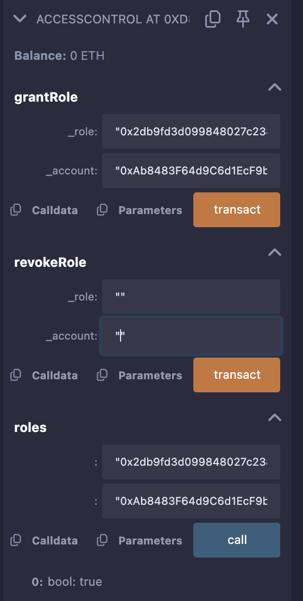
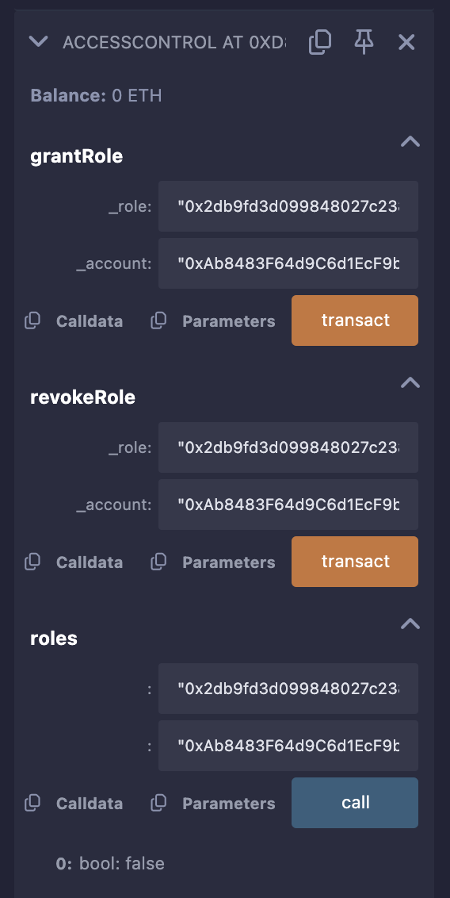

# AccessControl Smart Contract

This is a Solidity smart contract implementing role-based access control system using Solidity ^0.8.10.

## Features
- Role-based access control with ADMIN and USER roles
- Admin can grant and revoke roles
- Event emission for role changes
- Access restriction through modifiers

## Prerequisites
- Remix IDE (https://remix.ethereum.org/)
- MetaMask (optional, for real deployment)
- Basic understanding of Solidity and Ethereum

## Installation and Testing in Remix

### Setup
1. Open Remix IDE in your browser
2. Create a new file named `AccessControl.sol`
3. Copy and paste the contract code
4. In Remix:
   - Select Solidity compiler version ^0.8.10
   - Compile the contract (Ctrl+S or Compile button)

### Deployment
1. Go to "Deploy & Run Transactions" tab
2. Select environment: JavaScript VM (for testing)
3. Click "Deploy"
4. The deployer address will automatically become the ADMIN

### Contract Explanation
The `AccessControl.sol` contract includes:
- **Events**: 
  - `GrantRole`: Emitted when a role is granted
  - `RevokeRole`: Emitted when a role is revoked
- **Mapping**: 
  - `roles`: Public mapping tracking role assignments (role => account => bool)
- **Constants**: 
  - `ADMIN`: `0xdf8b4c520ffe197c5343c6f5aec59570151ef9a492f2c624fd45ddde6135ec42`
  - `USER`: `0x2db9fd3d099848027c2383d0a083396f6c41510d7acfd92adc99b6cffcf31e96`
- **Modifier**: 
  - `onlyRole`: Restricts function access to specific roles
- **Functions**:
  - `constructor`: Grants ADMIN role to deployer
  - `_grantRole`: Internal function to grant roles
  - `grantRole`: External function for admins to grant roles
  - `revokeRole`: External function for admins to revoke roles

### Testing in Remix
1. **Check Initial Admin**
   - Copy the ADMIN hash: `0xdf8b4c520ffe197c5343c6f5aec59570151ef9a492f2c624fd45ddde6135ec42`
   - Use "roles" function with ADMIN hash and deployer address
   - Expected output: `true`.
     
   

2. **Grant Role**
   - Use "grantRole" function
   - Input: USER hash `0x2db9fd3d099848027c2383d0a083396f6c41510d7acfd92adc99b6cffcf31e96` and another address
   - Check "roles" mapping to verify
   

3. **Revoke Role**
   - Use "revokeRole" with same parameters
   - Verify with "roles" mapping (should return false)
   

## Test Cases (AccessControlTest.t.sol)
Below are the test cases from `AccessControlTest.t.sol` and how to verify them in Remix.

### Test File Explanation
The test file `AccessControlTest.t.sol` is designed for a testing framework like Foundry but can be manually verified in Remix. Here's each test case:

1. **`testInitialAdmin`**
   - **Purpose**: Verifies the deployer gets the ADMIN role
   - **Remix Steps**:
     - Deploy contract
     - Call: `roles("0xdf8b4c520ffe197c5343c6f5aec59570151ef9a492f2c624fd45ddde6135ec42", [deployer_address])`
     - **Expected**: `true`
     - **How it Works**: Checks the `roles` mapping for the ADMIN role and deployer address

2. **`testGrantRole`**
   - **Purpose**: Tests granting a USER role
   - **Remix Steps**:
     - Call: `grantRole("0x2db9fd3d099848027c2383d0a083396f6c41510d7acfd92adc99b6cffcf31e96", "0xAb8483F64d9C6d1EcF9b849Ae677dD3315835cb2")`
     - Verify: `roles("0x2db9fd3d099848027c2383d0a083396f6c41510d7acfd92adc99b6cffcf31e96", "0xAb8483F64d9C6d1EcF9b849Ae677dD3315835cb2")`
     - **Expected**: `true`
     - **How it Works**: Admin grants USER role, updates mapping, emits GrantRole event

3. **`testRevokeRole`**
   - **Purpose**: Tests revoking a USER role
   - **Remix Steps**:
     - Grant role first (as above)
     - Call: `revokeRole("0x2db9fd3d099848027c2383d0a083396f6c41510d7acfd92adc99b6cffcf31e96", "0xAb8483F64d9C6d1EcF9b849Ae677dD3315835cb2")`
     - Verify: `roles("0x2db9fd3d099848027c2383d0a083396f6c41510d7acfd92adc99b6cffcf31e96", "0xAb8483F64d9C6d1EcF9b849Ae677dD3315835cb2")`
     - **Expected**: `false`
     - **How it Works**: Admin revokes USER role, updates mapping, emits RevokeRole event

4. **`testNonAdminCannotGrant`**
   - **Purpose**: Ensures non-admins can't grant roles
   - **Remix Steps**:
     - Switch to a non-admin account in Remix (select different address)
     - Attempt: `grantRole("0x2db9fd3d099848027c2383d0a083396f6c41510d7acfd92adc99b6cffcf31e96", "0xAb8483F64d9C6d1EcF9b849Ae677dD3315835cb2")`
     - **Expected**: Transaction reverts with "not authorized"
     - **How it Works**: Modifier `onlyRole` checks caller’s role, reverts if not ADMIN
     - **Note**: In Remix, you'll see a failed transaction in the logs

5. **`testGrantRoleEvent`**
   - **Purpose**: Verifies GrantRole event emission
   - **Remix Steps**:
     - Call: `grantRole("0x2db9fd3d099848027c2383d0a083396f6c41510d7acfd92adc99b6cffcf31e96", "0x5B38Da6a701c568545dCfcB03FcB875f56beddC4")`
     - Check transaction logs in Remix
     - **Expected**: Log shows `GrantRole` event with USER hash and address
     - **How it Works**: Event is emitted in `_grantRole` internal function

### Running Tests in Remix
- Copy `AccessControl.sol` into Remix
- Deploy using JavaScript VM
- Manually execute each test step above
- Check outputs in the Remix console/logs
- For revert tests, observe the transaction failure message

## Security Notes
- Only ADMIN can modify roles
- ADMIN role is granted to deployer on construction
- Role hashes are private constants to save gas

