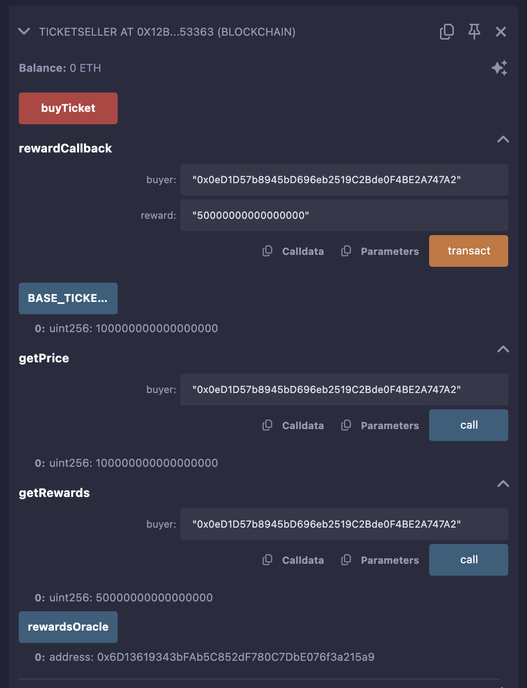
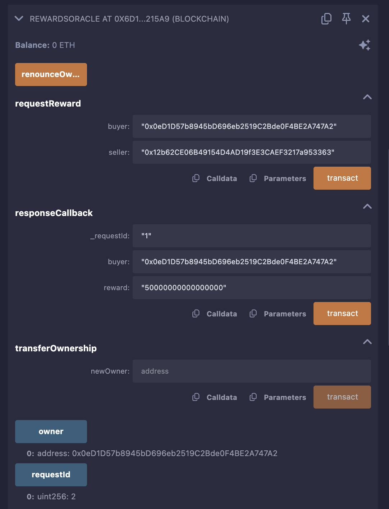

# Bus Ticket Rewards dApp with Blockchain Oracle

This project demonstrates a decentralized application (dApp) for buying bus tickets with a rewards system, implemented using Solidity smart contracts on the Polygon Mumbai testnet. It leverages a blockchain oracle to fetch off-chain reward data, showcasing a request-response model. Below, you'll find details about each contract, their purpose, and step-by-step instructions to deploy and test them using Remix and MetaMask.

## Contracts Overview

### 1. RewardsOracleInterface
- **Purpose**: Defines the interface for the `RewardsOracle` contract, specifying how other contracts (like `TicketSeller`) interact with the oracle.
- **Why We Use It**: This interface ensures a standard structure for requesting and receiving off-chain data (rewards). It acts as a blueprint, allowing the dApp to communicate with the oracle without needing to know its internal logic.
- **Real-World Use**: In a real bus ticket system, this interface would allow the dApp to request dynamic rewards (e.g., based on purchase history or promotions) from an external service.

### 2. RewardsOracleClientInterface
- **Purpose**: Defines the interface that the dApp (`TicketSeller`) must implement to receive reward data from the oracle.
- **Why We Use It**: It ensures the dApp has a `rewardCallback` function that the oracle can call, creating a standardized way to deliver off-chain data back to the blockchain.
- **Real-World Use**: This allows the bus ticket system to receive and apply rewards calculated off-chain (e.g., discounts for early bookings).

### 3. RewardsOracle
- **Purpose**: Acts as the blockchain oracle, managing requests for off-chain rewards and delivering responses to the dApp.
- **Why We Use It**: Blockchains can’t directly access off-chain data (e.g., reward calculations). This contract bridges that gap by emitting requests for an off-chain service to process and returning the results securely (restricted to the owner).
- **Real-World Use**: In practice, this oracle could connect to a backend service calculating rewards based on real-time data (e.g., ticket demand, user loyalty), ensuring the blockchain stays updated with external information.

### 4. TicketSeller
- **Purpose**: The main dApp contract that allows users to buy bus tickets, applies rewards fetched via the oracle, and requests new rewards after each purchase.
- **Why We Use It**: This contract simulates a bus ticket vending system where users pay in Ether, receive discounts from rewards, and earn new rewards for future purchases, all on-chain.
- **Real-World Use**: A real ticket system could use this to offer dynamic pricing (e.g., cheaper tickets for frequent buyers) while maintaining transparency and security on the blockchain.

### Comparison to BasicOracleConsumer
- **BasicOracleConsumer**: A simpler oracle model (e.g., from your earlier questions) that fetches static off-chain data (like ETH/USD prices) directly from a pre-deployed data feed (e.g., Chainlink Price Feeds). It’s passive and doesn’t require a request-response flow.
- **Why We Use RewardsOracle Instead**: Our dApp needs dynamic, user-specific rewards calculated off-chain based on parameters (e.g., buyer address). The request-response model of `RewardsOracle` allows this flexibility, unlike the static data feed approach of `BasicOracleConsumer`. In a real system, this enables personalized promotions, making it more practical for a rewards-based application.

---

## Prerequisites
- **MetaMask**: Browser extension for interacting with Polygon Mumbai.
- **Test MATIC**: Funds for gas fees on Polygon Mumbai.
- **Remix IDE**: Online tool for writing, deploying, and testing Solidity contracts.
- **Polygon Mumbai Testnet**: A Layer 2 testnet for low-cost transactions.

---

## Deployment Instructions

### Step 1: Set Up MetaMask and Polygon Mumbai
1. **Install MetaMask**:
   - Download from [metamask.io](https://metamask.io/) and set up a wallet.
2. **Add Polygon Mumbai Network**:
   - Open MetaMask, click the network dropdown, and select **Add Network** > **Add a network manually**.
   - Enter:
     - **Network Name**: Polygon Mumbai
     - **RPC URL**: `https://rpc-mumbai.maticvigil.com`
     - **Chain ID**: `80001`
     - **Currency Symbol**: MATIC
     - **Block Explorer**: `https://mumbai.polygonscan.com/`
   - Save and switch to Polygon Mumbai.
3. **Get Test MATIC**:
   - Visit [Polygon Faucet](https://faucet.polygon.technology/).
   - Select Mumbai, enter your MetaMask address (e.g., `0x0eD1D57b8945bD696eb2519C2Bde0F4BE2A747A2`), and request 0.5–1 MATIC.

### Step 2: Prepare Remix
1. **Open Remix**:
   - Go to [Remix IDE](https://remix.ethereum.org/).
2. **Create Files**:
   - In the **File Explorer** tab, create four files:
     - `RewardsOracleInterface.sol`
     - `RewardsOracleClientInterface.sol`
     - `RewardsOracle.sol`
     - `TicketSeller.sol`
   - Paste the respective contract code into each file (code not included here; see project source).
3. **Add OpenZeppelin Dependency**:
   - Right-click in **File Explorer** > **Add External Library**.
   - URL: `https://github.com/OpenZeppelin/openzeppelin-contracts/blob/master/contracts/access/Ownable.sol`.
4. **Compile Contracts**:
   - Go to **Solidity Compiler** tab.
   - Select version `0.8.17`.
   - Compile `RewardsOracle.sol` and `TicketSeller.sol` (interfaces compile automatically).

### Step 3: Deploy Contracts
1. **Set Environment**:
   - Go to **Deploy & Run Transactions** tab.
   - Set **Environment** to **Injected Provider - MetaMask**.
   - Connect MetaMask when prompted (select your account, e.g., `0x0eD1...747A2`).
2. **Deploy `RewardsOracle`**:
   - Select `RewardsOracle` from the **Contract** dropdown.
   - Constructor input: Your MetaMask address (e.g., `0x0eD1D57b8945bD696eb2519C2Bde0F4BE2A747A2`).
   - Click **Deploy**, confirm in MetaMask.
   - Transaction Hash: `0x3257868dc74068e4b2a987386abd1f33347cf4f40e6d48cd89ee5080529b796b`.
   - Deployed Address: `0x2163ce94ea699afb6ef56d5140adfb081123172e717d7738b1a58cacc9f29f2b`.
3. **Deploy `TicketSeller`**:
   - Select `TicketSeller`.
   - Constructor input: `RewardsOracle` address (e.g., `0x2163...9f2b`).
   - Click **Deploy**, confirm in MetaMask.
   - Transaction Hash: `0x6eef545f89cdbaa6fe3c3ac4d4659af5b47598fbe92ff0ce8e541d112fc18e2d`.
   - Deployed Address: `0x12b...53363` (derived from logs).

**Screenshot of Deployed Contracts**:
-   
-   
  *(Placeholder: Insert screenshot showing `RewardsOracle` at `0x2163...9f2b` and `TicketSeller` at `0x12b...53363` in Remix’s Deployed Contracts section.)*

---

## Testing Instructions

### Step 1: Verify Initial State
1. **Check `RewardsOracle`**:
   - Expand `RewardsOracle` at `0x2163...9f2b`.
   - Call `owner()`: Returns `0x0eD1...747A2`.
   - Call `requestId()`: Returns `0`.
2. **Check `TicketSeller`**:
   - Expand `TicketSeller` at `0x12b...53363`.
   - Call `rewardsOracle()`: Returns `0x2163...9f2b`.
   - Call `BASE_TICKET_PRICE()`: Returns `100000000000000000` (0.1 ether).
   - Call `getPrice("0x0eD1...747A2")`: Returns `100000000000000000`.
   - Call `getRewards("0x0eD1...747A2")`: Returns `0`.

### Step 2: Request a Reward
1. **Call `requestReward`**:
   - In `RewardsOracle`, input:
     - `buyer`: `0x0eD1D57b8945bD696eb2519C2Bde0F4BE2A747A2`.
     - `seller`: `0x12b...53363` (TicketSeller address).
   - Click **Transact**, confirm in MetaMask.
   - Transaction Hash: `0x421ff4ae9826b24eaae9176f34131a28af99d39ef35fde3b3b8bdc3452504f05`.
   - Check console for `Request(0, 0x0eD1...)`.
   - Call `requestId()`: Returns `1`.

### Step 3: Simulate Off-Chain Response
1. **Call `responseCallback`**:
   - In `RewardsOracle`, input:
     - `requestId`: `0`.
     - `buyer`: `0x0eD1D57b8945bD696eb2519C2Bde0F4BE2A747A2`.
     - `reward`: `50000000000000000` (0.05 ether in wei).
   - Click **Transact**, confirm in MetaMask.
   - Transaction Hash: `0x6bc...b4d5b` (example; replace with actual hash if different).
   - Verify: `TicketSeller.getRewards("0x0eD1...747A2")` returns `50000000000000000`.

### Step 4: Buy a Ticket
1. **Call `buyTicket`**:
   - In `TicketSeller`, set **Value** (top of Deploy tab) to `100000000000000000` (0.1 ether).
   - Click **Transact**, confirm in MetaMask.
   - Transaction Hash: `0x757...02504` (example; replace with actual hash).
   - Check console for:
     - `TicketPurchased(0x0eD1..., 50000000000000000)` (price reduced by 0.05 ether reward).
     - `Request(1, 0x0eD1...)` (new reward request).
   - Verify:
     - `getRewards("0x0eD1...747A2")`: Returns `0` (reward used).
     - `getPrice("0x0eD1...747A2")`: Returns `100000000000000000` (pending new reward).

---

## Transaction Hashes
- **RewardsOracle Deployment**: [0x3257868dc74068e4b2a987386abd1f33347cf4f40e6d48cd89ee5080529b796b](https://polygon.blockscout.com/tx/0x3257868dc74068e4b2a987386abd1f33347cf4f40e6d48cd89ee5080529b796b)
- **TicketSeller Deployment**: [0x6eef545f89cdbaa6fe3c3ac4d4659af5b47598fbe92ff0ce8e541d112fc18e2d](https://polygon.blockscout.com/tx/0x6eef545f89cdbaa6fe3c3ac4d4659af5b47598fbe92ff0ce8e541d112fc18e2d)
- **requestReward**: [0x421ff4ae9826b24eaae9176f34131a28af99d39ef35fde3b3b8bdc3452504f05](https://polygon.blockscout.com/tx/0x421ff4ae9826b24eaae9176f34131a28af99d39ef35fde3b3b8bdc3452504f05)

---

## Notes
- **Why Polygon Mumbai?**: Low-cost testnet ideal for experimenting with smart contracts.
- **Testing Tips**:
  - Use wei for amounts (e.g., `100000000000000000` for 0.1 ether).
  - Ensure `seller` in `requestReward` is the `TicketSeller` address.
- **Real-World Extension**: Integrate an off-chain Node.js service (e.g., `RewardsOracleNode.js`) to automate `responseCallback` based on `Request` events.

