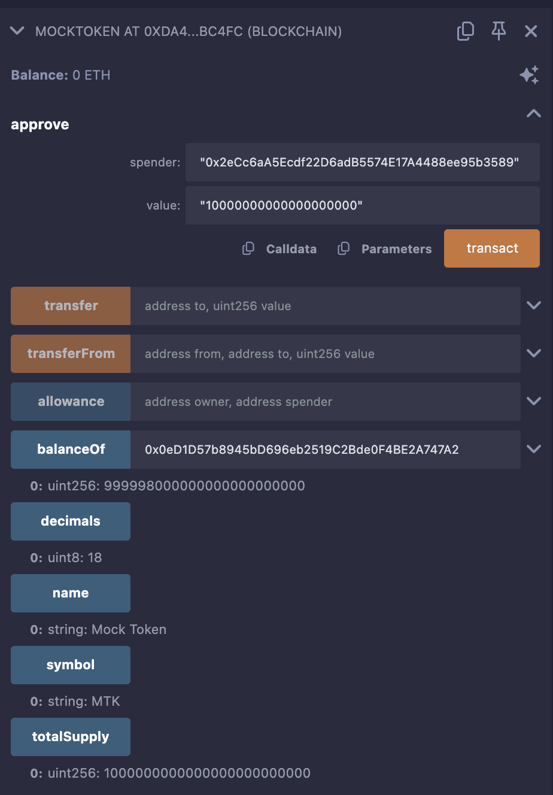
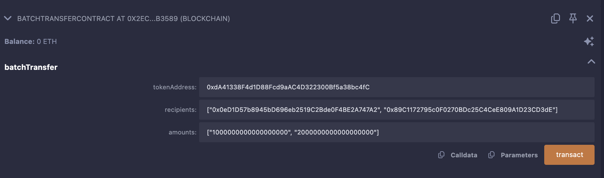

# BatchTransferContract and MockToken 

This repository contains two Solidity smart contracts: `BatchTransferContract` and `MockToken`. These contracts allow you to batch transfer ERC20 tokens to multiple recipients in a single transaction and test this functionality with a mock ERC20 token. Below, you’ll find details about the contracts, how to deploy and test them using MetaMask and Remix, transaction hashes from a successful deployment on Polygon Mumbai, and screenshots for reference.

## Contracts Overview

### 1. MockToken
- **Purpose**: A simple ERC20 token used for testing the `BatchTransferContract`.
- **Features**:
  - Token Name: "Mock Token" (MTK).
  - Initial Supply: 1,000,000 MTK (1M tokens with 18 decimals) minted to the deployer.
- **File**: `MockToken.sol`.


### 2. BatchTransferContract
- **Purpose**: Allows batch transferring of ERC20 tokens (e.g., `MockToken`) to multiple addresses in one transaction.
- **Features**:
  - Takes a token address, recipient array, and amount array as inputs.
  - Validates inputs and ensures the sender has sufficient balance and allowance.
  - Emits a `BatchTransfer` event upon success.
- **File**: `BatchTransferContract.sol`.


## Deployment and Testing with MetaMask

This section explains how to deploy and test both contracts on the Polygon Mumbai testnet using Remix and MetaMask. The contracts have been successfully deployed and tested, with transaction details provided below.

### Prerequisites
- **MetaMask**: Installed and configured with the Polygon Mumbai testnet.
  - Add Mumbai: RPC URL `https://rpc-mumbai.matic.today`, Chain ID `80001`.
  - Get test MATIC from [Mumbai Faucet](https://mumbaifaucet.com/).
- **Remix**: Open [remix.ethereum.org](https://remix.ethereum.org).
- **Funds**: Ensure your MetaMask account (e.g., `0x0eD1D57b8945bD696eb2519C2Bde0F4BE2A747A2`) has ~0.1-0.5 MATIC for gas.

### Step-by-Step Instructions

#### 1. Set Up Remix
1. Open Remix in your browser.
2. Create two files in the “File Explorer”:
   - `MockToken.sol`: Paste the `MockToken` code.
   - `BatchTransferContract.sol`: Paste the `BatchTransferContract` code.
3. Compile both contracts:
   - Go to “Solidity Compiler” tab.
   - Select version `0.8.19`.
   - Compile each file (ensure no errors).

#### 2. Connect MetaMask to Remix
1. In Remix, go to “Deploy & Run Transactions”.
2. Set “Environment” to “Injected Provider - MetaMask”.
3. MetaMask will prompt to connect; select your account and confirm.

#### 3. Deploy `MockToken`
1. Select `MockToken` from the “Contract” dropdown.
2. Click “Deploy”.
3. MetaMask pops up; confirm the transaction (~1-2M gas).
4. Once mined, note the contract address from Remix’s “Deployed Contracts” section or Blockscout.
   - **Deployed Address**: `0x30fE85F51dC4fB8C24e4af299C4aB25B4108f925`.
   - **Transaction Hash**: `0x8db0abe31cc5311f2a8dceb0297faa6047af3a8be9ad6bc83507c76ba3fff0c5`.
   - **Blockscout Link**: [View Transaction](https://polygon.blockscout.com/tx/0x8db0abe31cc5311f2a8dceb0297faa6047af3a8be9ad6bc83507c76ba3fff0c5).

   **Screenshot**:
   
 

#### 4. Deploy `BatchTransferContract`
1. Select `BatchTransferContract` from the “Contract” dropdown.
2. Click “Deploy”.
3. Confirm in MetaMask (~500k-1M gas).
4. Note the deployed address.
   - **Deployed Address**: `0x7F9eD3f4235eA9AFB68290e839ECe2cF7E451C5e`.
   - **Transaction Hash**: `0x43bae5ffb2a2eea7cb81a9828fdd5892f7eed3b81436648bb3bc2625270e62c3`.
   - **Blockscout Link**: [View Transaction](https://polygon.blockscout.com/tx/0x43bae5ffb2a2eea7cb81a9828fdd5892f7eed3b81436648bb3bc2625270e62c3).

   **Screenshot**:
   

#### 5. Approve `BatchTransferContract` to Spend Tokens
1. Expand `MockToken` at `0x30fE85F51dC4fB8C24e4af299C4aB25B4108f925` in “Deployed Contracts”.
2. Call `approve`:
   - `spender`: `0x7F9eD3f4235eA9AFB68290e839ECe2cF7E451C5e`.
   - `amount`: `1000000000000000000000` (1000 tokens).
   - Click “transact” and confirm in MetaMask.
3. Transaction details:
   - **Transaction Hash**: `0x23fb379774daaeea66b8e6b4984bbc9d54d8ef693c8e6891b6f0c0149a1049e6`.
   - **Blockscout Link**: [View Transaction](https://polygon.blockscout.com/tx/0x23fb379774daaeea66b8e6b4984bbc9d54d8ef693c8e6891b6f0c0149a1049e6).

   **Screenshot**:
   
   *(Replace with your screenshot.)*

#### 6. Test `batchTransfer`
1. Expand `BatchTransferContract` at `0x7F9eD3f4235eA9AFB68290e839ECe2cF7E451C5e`.
2. Call `batchTransfer` with:
   - `tokenAddress`: `0x30fE85F51dC4fB8C24e4af299C4aB25B4108f925`.
   - `recipients`: `["0x0eD1D57b8945bD696eb2519C2Bde0F4BE2A747A2", "0x89C1172795c0F0270BDc25C4CeE809A1D23CD3dE"]`.
   - `amounts`: `["1000000000000000000", "2000000000000000000"]` (1 and 2 tokens).
   - Input in Remix:
     ```
     "0x30fE85F51dC4fB8C24e4af299C4aB25B4108f925", ["0x0eD1D57b8945bD696eb2519C2Bde0F4BE2A747A2", "0x89C1172795c0F0270BDc25C4CeE809A1D23CD3dE"], ["1000000000000000000", "2000000000000000000"]
     ```
3. Click “transact” and confirm in MetaMask.
4. Transaction details:
   - **Transaction Hash**: `0xcab3011c722451bb555df2b6d0c4f00ece194597733fe93c34e9ded578daed65`.
   - **Blockscout Link**: [View Transaction](https://polygon.blockscout.com/tx/0xcab3011c722451bb555df2b6d0c4f00ece194597733fe93c34e9ded578daed65).

  #### 7. Verify Results
- Check balances in Remix:
  - `MockToken.balanceOf(0x0eD1D57b8945bD696eb2519C2Bde0F4BE2A747A2)`: `1M * 10^18 - 2 * 10^18`.
  - `MockToken.balanceOf(0x89C1172795c0F0270BDc25C4CeE809A1D23CD3dE)`: `2 * 10^18`.
- On Blockscout:
  - Search the `MockToken` address and check the “Token Holders” tab.

## Deployed Contract Details
| Contract               | Address                                    | Transaction Hash                          | Blockscout Link                                                                 |
|-----------------------|--------------------------------------------|------------------------------------------|---------------------------------------------------------------------------------|
| MockToken             | `0x30fE85F51dC4fB8C24e4af299C4aB25B4108f925` | `0x8db0abe31cc5311f2a8dceb0297faa6047af3a8be9ad6bc83507c76ba3fff0c5` | [View](https://polygon.blockscout.com/tx/0x8db0abe31cc5311f2a8dceb0297faa6047af3a8be9ad6bc83507c76ba3fff0c5) |
| BatchTransferContract | `0x7F9eD3f4235eA9AFB68290e839ECe2cF7E451C5e` | `0x43bae5ffb2a2eea7cb81a9828fdd5892f7eed3b81436648bb3bc2625270e62c3` | [View](https://polygon.blockscout.com/tx/0x43bae5ffb2a2eea7cb81a9828fdd5892f7eed3b81436648bb3bc2625270e62c3) |
| Approve Transaction   | -                                          | `0x23fb379774daaeea66b8e6b4984bbc9d54d8ef693c8e6891b6f0c0149a1049e6` | [View](https://polygon.blockscout.com/tx/0x23fb379774daaeea66b8e6b4984bbc9d54d8ef693c8e6891b6f0c0149a1049e6) |
| BatchTransfer         | -                                          | `0xcab3011c722451bb555df2b6d0c4f00ece194597733fe93c34e9ded578daed65` | [View](https://polygon.blockscout.com/tx/0xcab3011c722451bb555df2b6d0c4f00ece194597733fe93c34e9ded578daed65) |

*Note*: Addresses are derived from Blockscout links; verify them against your deployment if they differ.

## Common Errors and Fixes
When testing `batchTransfer`, incorrect input formatting can cause errors. Here are examples and solutions:

### Error 1: Incorrect Array Format
- **Input**: `[0x0eD1D57b8945bD696eb2519C2Bde0F4BE2A747A2, 0x89C1172795c0F0270BDc25C4CeE809A1D23CD3dE]`.
- **Error**: `Error encoding arguments: Error: expected array value`.
- **Fix**: Use JSON format:
  ```
  "0x30fE85F51dC4fB8C24e4af299C4aB25B4108f925", ["0x0eD1D57b8945bD696eb2519C2Bde0F4BE2A747A2", "0x89C1172795c0F0270BDc25C4CeE809A1D23CD3dE"], ["1000000000000000000", "2000000000000000000"]
  ```

### Error 2: Wrong Token Address
- **Input**: `"0xWrongAddress", ["0x0eD1...", "0x89C1..."], ["1000000000000000000", "2000000000000000000"]`.
- **Error**: `Contract not approved to spend tokens` or transaction revert.
- **Fix**: Ensure `tokenAddress` matches the deployed `MockToken` (`0x30fE85F51dC4fB8C24e4af299C4aB25B4108f925`).

### Error 3: Insufficient Allowance
- **Input**: Correct, but allowance is too low.
- **Error**: `Contract not approved to spend tokens`.
- **Fix**: Re-run `approve` with a higher amount (e.g., `1000000000000000000000`).

### Error 4: Mismatched Array Lengths
- **Input**: `"0x30fE85...", ["0x0eD1...", "0x89C1..."], ["1000000000000000000"]`.
- **Error**: `Recipients and amounts arrays must have the same length`.
- **Fix**: Ensure `recipients` and `amounts` have the same number of elements.

## How to Contribute
1. Fork this repository.
2. Make changes or improvements (e.g., add more features to `BatchTransferContract`).
3. Submit a pull request with a description of your changes.

## License
This project is licensed under the MIT License - see the `SPDX-License-Identifier: MIT` in the contract files.

