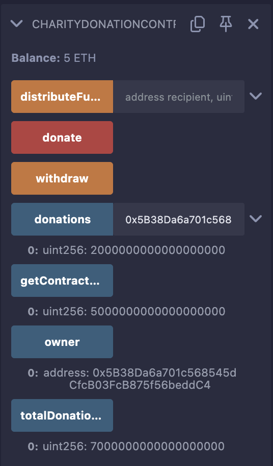

# CharityDonationContract


A Solidity smart contract designed to collect and distribute Ether donations to charities or beneficiaries in a transparent manner.

## Overview

The `CharityDonationContract` enables:
- Anyone to donate Ether to the contract
- The contract owner to distribute collected funds to specified recipients
- Tracking of total donations and individual contributions
- Event logging for transparency and auditability

## Features

- Donation collection with a mapping to track individual contributions
- Owner-only fund distribution to recipients
- Public balance checking function
- Emergency withdrawal capability for the owner
- Event emissions for donation and distribution activities

## Contract Details

- **License**: MIT (SPDX-License-Identifier: MIT)
- **Solidity Version**: ^0.8.0
- **Key Functions**:
  - `donate()`: Accepts Ether donations
  - `distributeFunds()`: Distributes funds to recipients (owner-only)
  - `withdraw()`: Allows owner to withdraw all funds
  - `getContractBalance()`: Returns current contract balance

## Prerequisites

- A web browser with access to Remix IDE (https://remix.ethereum.org/)
- Basic familiarity with Ethereum, Solidity, and smart contract concepts
- Understanding of Ether units (wei, gwei, ETH)

## Setup and Testing in Remix

### Step-by-Step Setup in Remix

1. **Access Remix IDE**:
   - Open your browser and navigate to https://remix.ethereum.org/
   - Wait for the IDE to load; you'll see a file explorer on the left, a code editor in the center, and tabs on the right.

2. **Create Contract File**:
   - In the "File Explorers" panel (left sidebar), click the "+" button to create a new file.
   - Name it `CharityDonationContract.sol`.
   - Copy and paste the contract code into the editor.

3. **Compile the Contract**:
   - Go to the "Solidity Compiler" tab (hammer icon) on the right sidebar.
   - Select compiler version `0.8.0` or higher from the dropdown (ensure compatibility with `^0.8.0`).
   - Click the "Compile CharityDonationContract.sol" button.
   - Check the green checkmark to confirm successful compilation. If there are errors, review the code for typos.

4. **Deploy the Contract**:
   - Switch to the "Deploy & Run Transactions" tab (rocket icon) on the right sidebar.
   - In the "Environment" dropdown, select "JavaScript VM (London)" for a local test blockchain.
     - This provides 100 ETH to multiple test accounts for free testing.
   - Ensure the "Account" dropdown shows an address with 100 ETH (default in JavaScript VM).
   - Click the orange "Deploy" button next to `CharityDonationContract`.
   - After deployment, note the contract address in the "Deployed Contracts" section below.

### Detailed Testing in Remix

#### Preparation
- Remix's JavaScript VM provides multiple test accounts (e.g., Account[0], Account[1], etc.), each with 100 ETH.
- Account[0] (the deployer) is the owner by default.
- Use Account[1], Account[2], etc., as donors or recipients.
- Expand the deployed contract in the "Deployed Contracts" section to access all functions.

#### Testing Scenarios with Detailed Instructions

1. **Test Donation Functionality**
   - **Objective**: Verify that donations are recorded correctly.
   - **Steps**:
     1. In the "Account" dropdown, switch to Account[1] (e.g., `0xCA35...`).
     2. In the "Value" field (above the contract functions), enter `1` and select `ether` from the unit dropdown.
     3. Find the `donate` function (orange button) and click it.
     4. Check the transaction receipt in the Remix terminal (bottom panel) for success.
   - **Verification**:
     - Call `getContractBalance()` (blue button) → Should return `1000000000000000000` (1 ETH in wei).
     - Call `totalDonations()` → Should return `1000000000000000000`.
     - Call `donations(Account[1])` (enter Account[1]’s address) → Should return `1000000000000000000`.
     - Check the terminal logs for the `DonationReceived` event with donor address and amount.

2. **Test Direct Ether Transfer (Fallback)**:
   - **Objective**: Test the `receive()` function for direct ETH sends.
   - **Steps**:
     1. Switch to Account[2].
     2. Copy the deployed contract address from the "Deployed Contracts" section.
     3. In the "Value" field, enter `0.5` ether.
     4. Click "Send Transaction" (below "At Address") and paste the contract address in the "At Address" field.
     5. Confirm the transaction.
   - **Verification**:
     - `getContractBalance()` → Should now show `1500000000000000000` (1.5 ETH total).
     - `donations(Account[2])` → Should return `500000000000000000` (0.5 ETH).
     - Check logs for `DonationReceived` event.

3. **Test Fund Distribution**:
   - **Objective**: Ensure the owner can distribute funds.
   - **Steps**:
     1. Switch to Account[0] (owner).
     2. Find `distributeFunds` function.
     3. Enter parameters:
        - `recipient`: Account[3]’s address (e.g., `0x4B08...`).
        - `amount`: `500000000000000000` (0.5 ETH in wei).
     4. Click the `distributeFunds` button.
   - **Verification**:
     - `getContractBalance()` → Should decrease to `1000000000000000000` (1 ETH remaining).
     - Check Account[3]’s balance in the "Account" dropdown → Should increase by 0.5 ETH.
     - Look for `FundsDistributed` event in logs.

4. **Test Owner Withdrawal**:
   - **Objective**: Verify owner can withdraw all funds.
   - **Steps**:
     1. Stay on Account[0].
     2. Click the `withdraw` button.
   - **Verification**:
     - `getContractBalance()` → Should return `0`.
     - Account[0]’s balance → Should increase by remaining contract balance (e.g., 1 ETH).

5. **Test Access Control**:
   - **Objective**: Ensure non-owners can’t distribute funds.
   - **Steps**:
     1. Switch to Account[1].
     2. Try calling `distributeFunds(Account[2], 500000000000000000)`.
   - **Verification**:
     - Transaction should fail with "Only owner can call this function" error in the terminal.

#### Troubleshooting Tips
- **Transaction Fails**: Check the terminal for error messages (e.g., insufficient balance, access denied).
- **Values in Wei**: Remix displays large numbers in wei (1 ETH = 10^18 wei). Use a converter if needed.
- **Reset Environment**: If balances seem off, restart JavaScript VM by refreshing Remix.
- **Logs Missing**: Expand the transaction receipt in the terminal to see event logs.

## Test Cases (Simplified)

```solidity
contract CharityDonationContractTest {
    CharityDonationContract charity = new CharityDonationContract();
    
    function testDonation() public {
        payable(address(charity)).transfer(1 ether);
        assert(charity.totalDonations() == 1 ether);
    }
    
    function testDistribution() public {
        payable(address(charity)).transfer(1 ether);
        charity.distributeFunds(payable(address(0x1)), 0.5 ether);
        assert(address(charity).balance == 0.5 ether);
    }
}