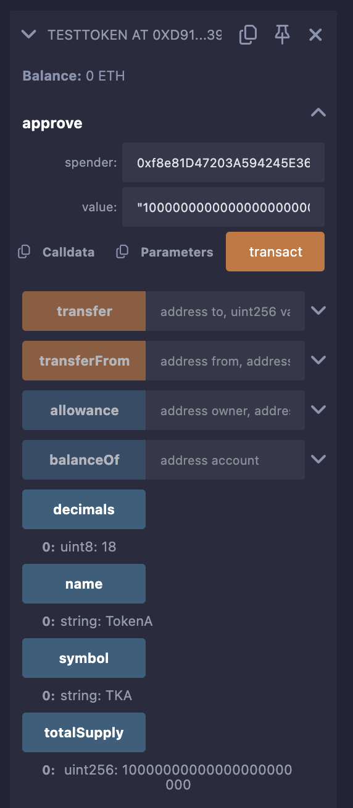
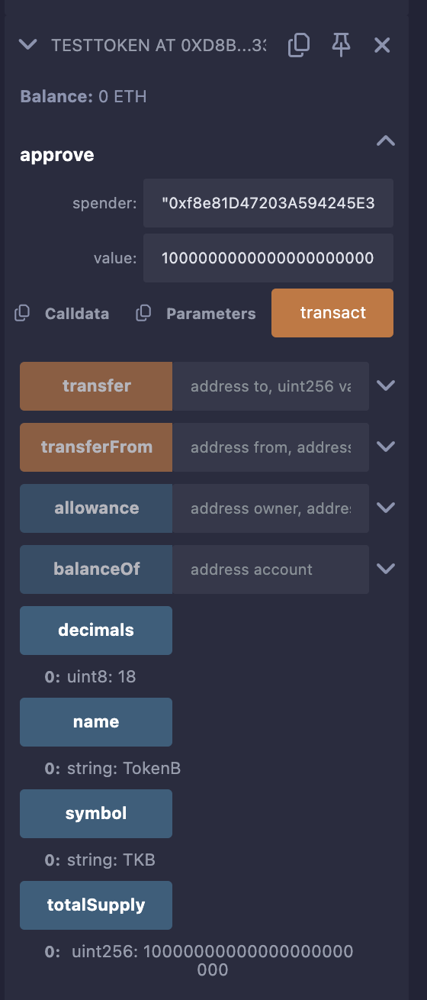
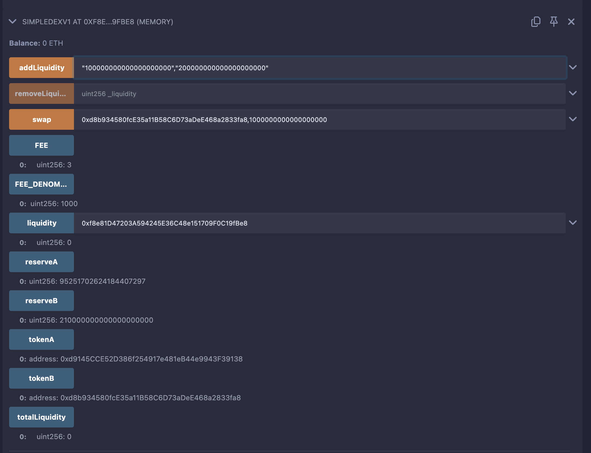
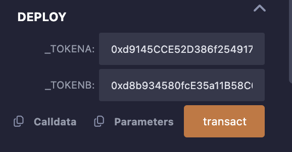

# SimpleDEXV1 - Decentralized Exchange

## Overview

SimpleDEXV1 is a basic decentralized exchange (DEX) smart contract inspired by Uniswap V1. It allows users to:
- Swap between two ERC20 tokens using an Automated Market Maker (AMM) model with a constant product formula (`x * y = k`).
- Add and remove liquidity to/from the token pool.
- Pay a 0.3% fee on swaps, which benefits liquidity providers by increasing pool reserves.

The project includes:
- **SimpleDEXV1.sol**: The DEX contract managing swaps and liquidity.
- **TestToken.sol**: An ERC20 token contract used to create test tokens (e.g., TokenA and TokenB).

This is an educational implementation and **not suitable for production** without further security audits.

---

## Features

- **Token Swaps**: Swap TokenA for TokenB or vice versa with a 0.3% fee.
- **Liquidity Provision**: Add liquidity to the pool to earn shares; remove liquidity to withdraw tokens.
- **Constant Product AMM**: Maintains `x * y = k` for pricing, ensuring fair swaps.
- **Events**: Emits `Swap`, `LiquidityAdded`, and `LiquidityRemoved` for transparency.
- **ERC20 Integration**: Works with any ERC20 tokens via OpenZeppelin’s `IERC20` interface.

---

## Setup Instructions

1. **Open Remix IDE**:
   - Navigate to [remix.ethereum.org](https://remix.ethereum.org).
   - Create a new workspace or use the default one.

2. **Install OpenZeppelin**:
   - In Remix’s **File Explorers** panel, click the npm icon (package symbol).
   - Search for `@openzeppelin/contracts` and click **Install**.
   - This provides the `IERC20` and `ERC20` interfaces used by the contracts.

3. **Load Contract Files**:
   - Ensure `SimpleDEXV1.sol` and `TestToken.sol` are in the `contracts/` directory or Remix workspace.
   - If not, create them and paste the respective contract code (already provided in your project).

4. **Connect MetaMask**:
   - Install MetaMask if not already set up ([metamask.io](https://metamask.io)).
   - Switch to the **Sepolia testnet** in MetaMask.
   - Fund your wallet with test ETH via a Sepolia faucet.

---

## Screenshots
- **TokenA Contract**:
  
  *Description*: Shows the deployed TokenA contract in Remix.

- **TokenB Contract**:
  
  *Description*: Shows the deployed TokenB contract in Remix.

- **SimpleDEXV1 Contract**:
  
  *Description*: Shows the deployed SimpleDEXV1 contract in Remix.

- **SimpleDEXV1 Deployment**:
  
  *Description*: Illustrates the deployment process of SimpleDEXV1 in Remix.

---

## Testing in Remix IDE

Follow these steps to deploy and test the contracts in Remix using the Sepolia testnet.

### Step 1: Compile Contracts
1. **Compile TestToken.sol**:
   - Go to the **Solidity Compiler** panel (hammer icon).
   - Select compiler version `0.8.24`.
   - Click **Compile TestToken.sol**.
   - Verify a green checkmark appears, indicating successful compilation.

2. **Compile SimpleDEXV1.sol**:
   - Select `SimpleDEXV1.sol` in the File Explorers.
   - Click **Compile SimpleDEXV1.sol** with the same compiler version.
   - Confirm successful compilation.

**Purpose**: Compilation converts Solidity code into EVM bytecode and ensures no syntax errors.

---

### Step 2: Deploy TestToken Contracts
1. **Deploy TokenA**:
   - Go to the **Deploy & Run Transactions** panel (play icon).
   - Set **Environment** to `Injected Provider - MetaMask`.
   - MetaMask will prompt to connect; select your Sepolia account.
   - Select `TestToken` from the contract dropdown.
   - Enter constructor parameters:
     - `name`: `"TokenA"`
     - `symbol`: `"TKA"`
     - `initialSupply`: `10000000000000000000000` (10,000 tokens, 18 decimals).
   - Click **Deploy** and confirm the transaction in MetaMask.
   - Copy the deployed contract address from the **Deployed Contracts** section.
   - **Screenshot Reference**: See `tokenA.png` for the deployed TokenA interface.

2. **Deploy TokenB**:
   - Repeat for `TestToken`:
     - `name`: `"TokenB"`
     - `symbol`: `"TKB"`
     - `initialSupply`: `10000000000000000000000` (10,000 tokens).
   - Click **Deploy** and confirm.
   - Copy the TokenB address.
   - **Screenshot Reference**: See `tokenB.png` for TokenB.

3. **Verify Tokens**:
   - Expand `TestToken` at each address in **Deployed Contracts**.
   - Call `balanceOf` with your MetaMask address:
     - TokenA: Should return `10000000000000000000000` (10,000 TKA).
     - TokenB: Same for TKB.
   - Call `name` and `symbol` to confirm correct metadata.

**Purpose**: Creates two ERC20 tokens for testing the DEX. Each token has 10,000 units minted to your wallet.

---

### Step 3: Deploy SimpleDEXV1
1. **Deploy the DEX**:
   - Select `SimpleDEXV1` in the contract dropdown.
   - Enter constructor parameters:
     - `_tokenA`: TokenA contract address (e.g., `0xd9145CCE...`).
     - `_tokenB`: TokenB contract address (e.g., `0xd8b934580...`).
   - Click **Deploy** and confirm in MetaMask.
   - Copy the DEX address from **Deployed Contracts**.
   - **Screenshot Reference**: See `deployment.png` for the deployment process and `simpleDEXV1.png` for the deployed contract.

2. **Verify Deployment**:
   - Expand `SimpleDEXV1` at the deployed address.
   - Call `tokenA` (should return TokenA’s address).
   - Call `tokenB` (should return TokenB’s address).
   - Call `reserveA` and `reserveB` (both should return `0`, as no liquidity is added yet).

**Purpose**: Initializes the DEX with the two token addresses, setting up the trading pair.

---

### Step 4: Approve Tokens
1. **Approve TokenA**:
   - Expand `TestToken` at TokenA’s address.
   - Call `approve`:
     - `spender`: SimpleDEXV1 address (e.g., `0xf8e81D47203...`).
     - `value`: `10000000000000000000000` (10,000 TKA).
   - Click **transact** and confirm in MetaMask.

2. **Approve TokenB**:
   - Expand `TestToken` at TokenB’s address.
   - Call `approve`:
     - `spender`: SimpleDEXV1 address.
     - `value`: `10000000000000000000000` (10,000 TKB).
   - Confirm in MetaMask.

3. **Verify Approvals**:
   - For TokenA, call `allowance`:
     - `owner`: Your MetaMask address.
     - `spender`: DEX address.
     - Should return `10000000000000000000000`.
   - Repeat for TokenB.

**Purpose**: Allows the DEX to transfer tokens on your behalf for liquidity provision and swaps.

---

### Step 5: Test addLiquidity
1. **Add Initial Liquidity**:
   - Expand `SimpleDEXV1` at the DEX address.
   - Call `addLiquidity`:
     - `amountA`: `100000000000000000000` (100 TKA).
     - `amountB`: `200000000000000000000` (200 TKB).
   - Click **transact** and confirm.
   - **Process**:
     - Transfers 100 TKA and 200 TKB to the DEX.
     - Since `totalLiquidity = 0`, assigns shares as `sqrt(100 * 200) ≈ 141.42 * 10^18`.
     - Updates `reserveA = 100 TKA`, `reserveB = 200 TKB`.

2. **Verify Liquidity**:
   - Call `liquidity` with your address:
     - Should return ~`141421356237309504880` shares.
   - Call `totalLiquidity` (same value).
   - Call `reserveA`: `100000000000000000000`.
   - Call `reserveB`: `200000000000000000000`.
   - Check token balances:
     - TokenA `balanceOf` your address: ~`9900 * 10^18` (10,000 - 100).
     - TokenB: ~`9800 * 10^18` (10,000 - 200).
   - Check the `LiquidityAdded` event in Remix’s transaction log:
     - `provider`: Your address.
     - `amountA`: `100000000000000000000`.
     - `amountB`: `200000000000000000000`.
     - `liquidity`: ~`141421356237309504880`.

3. **Add More Liquidity**:
   - Call `addLiquidity`:
     - `amountA`: `50000000000000000000` (50 TKA).
     - `amountB`: `100000000000000000000` (100 TKB, maintaining 1:2 ratio).
   - Confirm transaction.
   - **Process**:
     - Calculates shares as `min((50 * 141.42) / 100, (100 * 141.42) / 200) ≈ 70.71 * 10^18`.
     - Updates reserves to `reserveA = 150 TKA`, `reserveB = 300 TKB`.

4. **Verify Additional Liquidity**:
   - Call `liquidity`: ~`212132034355964257320` (141.42 + 70.71 * 10^18).
   - Call `reserveA`: `150000000000000000000`.
   - Call `reserveB`: `300000000000000000000`.
   - Check token balances (decreased by 50 TKA, 100 TKB).
   - Check `LiquidityAdded` event.

**Purpose**: Tests liquidity provision, ensuring tokens are locked and shares are minted correctly.

---

### Step 6: Test swap
1. **Swap TKA for TKB**:
   - Call `swap`:
     - `tokenIn`: TokenA address.
     - `amountIn`: `10000000000000000000` (10 TKA).
   - Confirm transaction.
   - **Process**:
     - Transfers 10 TKA to the DEX.
     - Applies 0.3% fee: `10 * 0.997 = 9.97 TKA`.
     - Calculates output: `(300 * 9.97) / (150 + 9.97) ≈ 18.72 TKB`.
     - Updates `reserveA = 160 TKA`, `reserveB ≈ 281.28 TKB`.

2. **Verify Swap**:
   - Call `reserveA`: `160000000000000000000`.
   - Call `reserveB`: ~`281275614039233058896`.
   - Check balances:
     - TokenA: Decreases by 10 TKA.
     - TokenB: Increases by ~18.72 TKB.
   - Check `Swap` event:
     - `tokenIn`: TokenA address.
     - `amountIn`: `10000000000000000000`.
     - `tokenOut`: TokenB address.
     - `amountOut`: ~`18724385960766941104`.

3. **Swap TKB for TKA**:
   - Call `swap`:
     - `tokenIn`: TokenB address.
     - `amountIn`: `10000000000000000000` (10 TKB).
   - Confirm transaction.
   - **Process**:
     - Output: `(160 * 9.97) / (281.28 + 9.97) ≈ 5.48 TKA`.
     - Updates `reserveA ≈ 154.52 TKA`, `reserveB ≈ 291.28 TKB`.

4. **Verify Second Swap**:
   - Call `reserveA`: ~`154520547945205753680`.
   - Call `reserveB`: ~`291275614039233058896`.
   - Check balances and `Swap` event.

**Purpose**: Tests token-to-token swaps, verifying the AMM pricing and fee mechanism.

---

### Step 7: Test removeLiquidity
1. **Check Liquidity**:
   - Call `liquidity` with your address: ~`212132034355964257320`.

2. **Remove Half Liquidity**:
   - Call `removeLiquidity`:
     - `_liquidity`: `106066017177982128660` (half your shares).
   - Confirm transaction.
   - **Process**:
     - Returns: `(106.06 * 154.52) / 212.13 ≈ 77.26 TKA`, `(106.06 * 291.28) / 212.13 ≈ 145.64 TKB`.
     - Updates `reserveA ≈ 77.26 TKA`, `reserveB ≈ 145.64 TKB`.

3. **Verify Removal**:
   - Call `liquidity`: ~`106066017177982128660`.
   - Call `reserveA`: ~`77260265960947965020`.
   - Call `reserveB`: ~`145637806519616529448`.
   - Check balances:
     - TokenA: Increases by ~77.26 TKA.
     - TokenB: Increases by ~145.64 TKB.
   - Check `LiquidityRemoved` event.

**Purpose**: Tests liquidity withdrawal, ensuring proportional tokens are returned.

---

### Step 8: Test Edge Cases
1. **Invalid Inputs**:
   - `addLiquidity` with `amountA = 0` (reverts with “Invalid amounts”).
   - `swap` with `amountIn = 0` (reverts with “Invalid amount”).
   - `removeLiquidity` with `_liquidity` greater than your shares (reverts with “Insufficient liquidity”).

2. **Large Swap**:
   - Swap 100 TKA to test high price impact (low output due to slippage).

3. **Full Liquidity Removal**:
   - Remove all remaining shares to empty the pool.

**Purpose**: Ensures the contract handles errors and edge cases gracefully.

---

### Step 9: Verify Contract State
1. **Reserves**:
   - Call `reserveA` and `reserveB` after each action.
   - Verify `reserveA * reserveB` remains approximately constant (increases slightly due to fees).

2. **Events**:
   - Check Remix’s transaction logs for all emitted events.
   - Optionally, verify on [Sepolia Etherscan](https://sepolia.etherscan.io) using the DEX address.

3. **Balances**:
   - Confirm token balances reflect all transfers and swaps.

**Purpose**: Ensures the contract maintains correct state and transparency.

---

## Troubleshooting

- **Transaction Fails**:
  - Check gas limit in MetaMask (increase if needed).
  - Use Remix’s **Debug** tab to view revert messages.
- **Insufficient Test ETH**:
  - Request more from a Sepolia faucet.
- **Approval Issues**:
  - Verify `allowance` for the DEX; re-approve if needed.
- **Balance Mismatches**:
  - Double-check `balanceOf` for each token.
- **Remix Issues**:
  - Refresh the page (Remix autosaves).
  - Clear browser cache if dependencies fail.

---

## Notes

- **Security**: This is an educational contract. Production DEXs require audits for reentrancy, front-running, and other vulnerabilities.
- **Decimals**: All token amounts use 18 decimals (e.g., 1 TKA = `1 * 10^18`).
- **Fees**: The 0.3% swap fee stays in the pool, benefiting liquidity providers.
- **Testnet**: Sepolia is stable but may reset; redeploy if needed.

