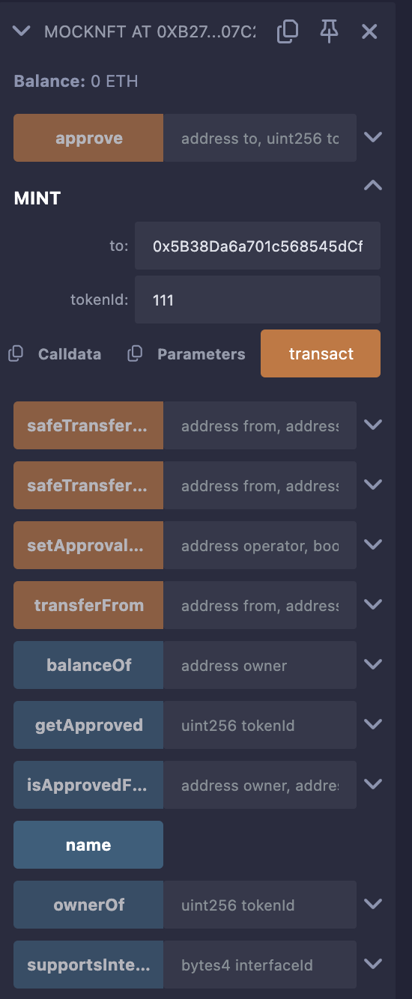
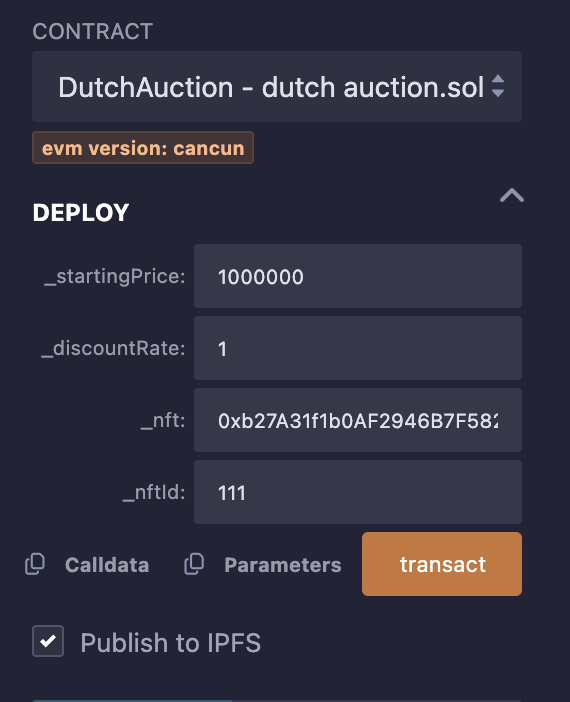
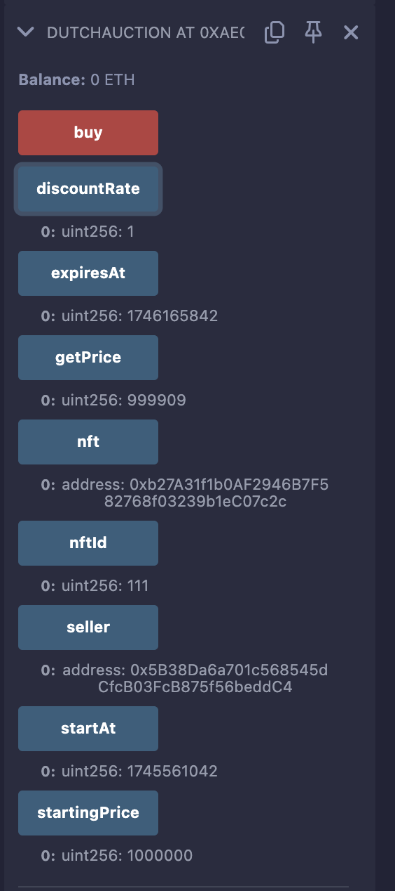
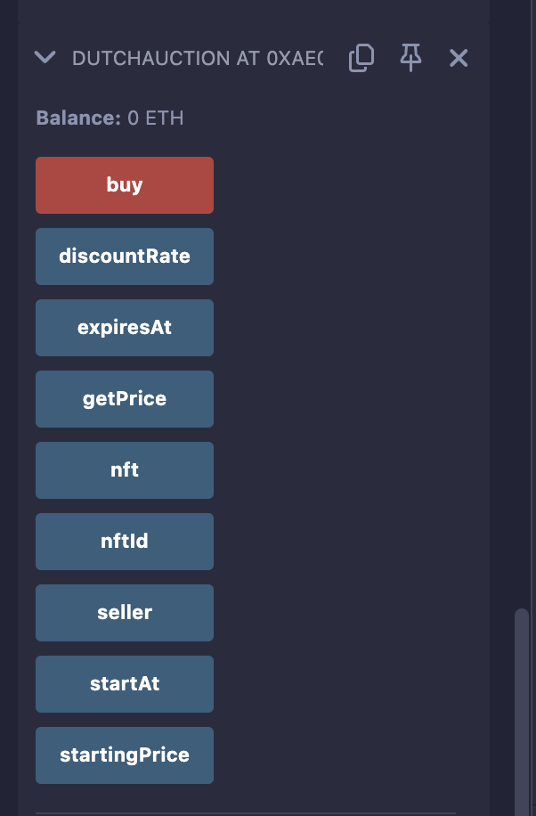

# Dutch Auction Smart Contract with NFT Deployment

## Overview of Dutch Auction
A Dutch Auction, also known as a reverse or descending price auction, is a mechanism where the auctioneer begins with a high starting price and gradually lowers it over time until a bidder accepts the current price or the auction reaches a predetermined reserve price or time limit. In this smart contract, the Dutch Auction is used to sell an ERC721 Non-Fungible Token (NFT). The price decreases linearly over a 7-day period based on a specified discount rate, allowing buyers to purchase the NFT at the current price before the auction expires.

### Key Features:
- **Descending Price**: The NFT's price starts high and decreases at a fixed rate per second.
- **Time-Bound**: The auction lasts for 7 days.
- **NFT Sale**: Facilitates the transfer of an ERC721 NFT from the seller to the buyer.
- **Automated Refund**: Excess ETH sent by the buyer is refunded.
- **Self-Destruct**: The contract self-destructs after a successful purchase, sending remaining funds to the seller.

## Contract Files
This repository includes three Solidity smart contract files:

1. **IERC721.sol**:
   - An ERC721 contract for creating and managing NFTs.
   - A minimal interface for the ERC721 standard, defining the `transferFrom` function to transfer NFTs.
   - Used by the Dutch Auction contract to interact with ERC721-compliant NFT contracts.
   - Includes functions to mint NFTs and approve other contracts (e.g., Dutch Auction) to transfer them.

2. **DutchAuction.sol**:
   - The main contract implementing the Dutch Auction logic.
   - Allows a seller to auction an NFT with a starting price and discount rate.
   - Buyers can purchase the NFT by sending sufficient ETH before the auction expires.
   - Upon purchase, the NFT is transferred, excess ETH is refunded, and the contract self-destructs.

## Prerequisites
To deploy and test the contracts, you need:
- A web browser with the MetaMask extension installed.
- Access to the Remix IDE (https://remix.ethereum.org).
- Test ETH on a testnet (e.g., Sepolia) for gas fees.
- Node.js and npm installed locally (optional, for OpenZeppelin imports in Remix).
- Multiple MetaMask accounts for testing (seller and buyer roles).

## Screenshots
- **NFT721 Contract**:
  
 

- **Dutchauction Contract**:
  
 
  


## Deployment Steps
Follow these detailed steps to deploy the `NFT.sol` and `DutchAuction.sol` contracts using Remix IDE.

### Step 1: Set Up Remix IDE
1. Open Remix IDE at https://remix.ethereum.org.
2. Create three new files in the Remix file explorer:
   - `NFT.sol`: Paste the provided IERC721 interface code.
   - `DutchAuction.sol`: Paste the provided Dutch Auction contract code.
3. Install OpenZeppelin contracts in Remix:
   - Go to the "File Explorers" tab.
   - Click the "npm" button to initialize a package.json.
   - Install OpenZeppelin by running the following in the Remix terminal:
     ```
     npm install @openzeppelin/contracts
     ```
   - Ensure the `node_modules` folder appears with `@openzeppelin/contracts`.

### Step 2: Compile the Contracts
1. Go to the "Solidity Compiler" tab in Remix.
2. Select compiler version `0.8.26` (or a compatible version).
3. Compile the contracts in the following order:
   - `NFT.sol`
   - `DutchAuction.sol`
4. Check for compilation errors. If errors occur, ensure the OpenZeppelin imports are correctly resolved.

### Step 3: Set Up MetaMask
1. Install MetaMask in your browser and log in.
2. Connect MetaMask to a testnet (e.g., Sepolia).
3. Obtain test ETH for the seller’s account:
   - Use a Sepolia faucet (e.g., https://sepoliafaucet.com).
   - Ensure the seller’s account has enough ETH for deployment and gas (e.g., 0.1 ETH).
4. Create a second MetaMask account for the buyer and fund it with test ETH.

### Step 4: Deploy the NFT Contract
1. Go to the "Deploy & Run Transactions" tab in Remix.
2. Select the "Injected Provider - MetaMask" environment and connect the seller’s account.
3. Choose the `NFT` contract from the contract dropdown.
4. Click "Deploy" and confirm the transaction in MetaMask.
5. Note the deployed NFT contract address (visible in Remix or the testnet explorer).

### Step 5: Mint an NFT
1. In the "Deploy & Run Transactions" tab, select the deployed `NFT` contract.
2. Call the `mint` function:
   - Parameters:
     - `to`: The seller’s address (e.g., the MetaMask account address).
     - `tokenId`: A unique ID for the NFT (e.g., `1` you can put any token id  you like but in numbers only eg.111,76,777).
   - Click "Transact" and confirm in MetaMask.
3. Verify the NFT was minted:
   - Call the `ownerOf` function with `tokenId` (e.g., `1`).
   - Expected Result: Returns the seller’s address.

### Step 6: Approve the Dutch Auction Contract
1. The Dutch Auction contract needs permission to transfer the NFT from the seller.
2. In the `NFT` contract, call the `approve` function after deploy `DutchAuction`contract then do this step :
   - Parameters:
     - `to`: The address of the Dutch Auction contract (to be deployed in the next step; you’ll need to redeploy if not yet known).
     - `tokenId`: The ID of the minted NFT (e.g., `1`).
   - Click "Transact" and confirm in MetaMask.
3. Alternatively, call `setApprovalForAll` to allow the Dutch Auction contract to transfer any NFT:
   - Parameters:
     - `operator`: The Dutch Auction contract address.
     - `approved`: `true`.
4. Verify approval:
   - Call `getApproved` with `tokenId` (e.g., `1`).
   - Expected Result: Returns the Dutch Auction contract address.

### Step 7: Deploy the Dutch Auction Contract
1. Select the `DutchAuction` contract in the "Deploy & Run Transactions" tab.
2. Enter the constructor parameters:
   - `_startingPrice`: The initial price in wei (e.g., `1000000000000000000` for 1 ETH).
   - `_discountRate`: The price decrease per second in wei (e.g., `1000000000000000` for 0.001 ETH/second).
   - `_nft`: The address of the deployed `NFT` contract.
   - `_nftId`: The ID of the minted NFT (e.g., `1`).
3. Ensure the seller’s MetaMask account is selected (must own the NFT and have approved the contract).
4. Click "Deploy" and confirm in MetaMask.
5. Note the deployed Dutch Auction contract address.
6. If you hadn’t approved the NFT earlier, update the approval now using the Dutch Auction contract address.

### Step 8: Verify Deployment
1. Call the following public variables to verify:
   - `seller`: Should return the seller’s address.
   - `startingPrice`: Should return the input starting price (e.g., 1 ETH).
   - `nft`: Should return the NFT contract address.
   - `nftId`: Should return the NFT ID (e.g., `1`).
   - `expiresAt`: Should return the deployment timestamp + 7 days.
2. Call `getPrice` to check the initial price (should equal `startingPrice`).

## Testing Steps
Follow these detailed steps to test the Dutch Auction contract in Remix IDE.

### Setup
- Ensure the `NFT` and `DutchAuction` contracts are deployed on the testnet.
- Use the seller’s MetaMask account for deployment and the buyer’s account for purchasing.
- Connect Remix to the testnet via MetaMask’s "Injected Provider".
- Have a testnet explorer (e.g., Sepolia Etherscan) open to verify transactions.

### Test Case 1: Verify Initial Price
1. Select the deployed `DutchAuction` contract.
2. Call the `getPrice` function.
3. Expected Result: Returns the `startingPrice` (e.g., `1000000000000000000` wei for 1 ETH).

### Test Case 2: Price Decrease Over Time
1. Wait for some time (e.g., 1000 seconds) or use a testnet with adjustable timestamps (e.g., Hardhat local network for faster testing).
2. Call `getPrice` again.
3. Expected Result: Price decreases by `discountRate * timeElapsed` (e.g., for `discountRate = 1000000000000000` wei/second, price decreases by 0.001 ETH after 1000 seconds).

### Test Case 3: Buy NFT at Current Price
1. Switch MetaMask to the buyer’s account.
2. Call `getPrice` to get the current price (e.g., `500000000000000000` wei for 0.5 ETH).
3. In the "Value" field in Remix, enter the exact price (e.g., `0.5` ETH).
4. Call the `buy` function and confirm in MetaMask.
5. Expected Results:
   - In the `NFT` contract, call `ownerOf` with `tokenId` (e.g., `1`). Should return the buyer’s address.
   - Check the Dutch Auction contract address on the testnet explorer; it should have no code (self-destructed).
   - Verify the seller’s balance increased by the purchase price (e.g., 0.5 ETH).

### Test Case 4: Buy with Excess ETH
1. Deploy a new `DutchAuction` contract with the same NFT (mint a new NFT or reuse if approved).
2. As the buyer, call `getPrice` (e.g., 0.5 ETH).
3. Send more ETH than required (e.g., `1` ETH in the "Value" field).
4. Call `buy` and confirm in MetaMask.
5. Expected Results:
   - NFT is transferred to the buyer (`ownerOf` returns buyer’s address).
   - Excess ETH (e.g., 0.5 ETH) is refunded to the buyer (check buyer’s balance).
   - Contract self-destructs (no code at contract address).
   - Seller receives the purchase price (0.5 ETH).

### Test Case 5: Auction Expiration
1. Deploy a new `DutchAuction` contract.
2. Wait until the auction expires (after 7 days, or adjust testnet timestamp).
3. As the buyer, attempt to call `buy` with sufficient ETH.
4. Expected Result: Transaction reverts with "auction expired".

### Test Case 6: Insufficient ETH
1. Deploy a new `DutchAuction` contract.
2. Call `getPrice` (e.g., 0.5 ETH).
3. As the buyer, call `buy` with less ETH (e.g., `0.1` ETH in the "Value" field).
4. Expected Result: Transaction reverts with "ETH < price".

### Test Case 7: Invalid Starting Price
1. Attempt to deploy a new `DutchAuction` contract with `startingPrice` less than `discountRate * DURATION`.
   - Example: `startingPrice = 1000` wei, `discountRate = 1000000000000000` wei.
2. Expected Result: Deployment reverts with "starting price < min".

### Test Case 8: NFT Approval Failure
1. Mint a new NFT but do not call `approve` or `setApprovalForAll` for the Dutch Auction contract.
2. Deploy the `DutchAuction` contract with the NFT.
3. As the buyer, call `buy` with sufficient ETH.
4. Expected Result: Transaction reverts (NFT contract will reject `transferFrom` due to lack of approval).

## Notes
- **Gas Fees**: Ensure sufficient test ETH for deployment, minting, approving, and testing. Typical costs: ~0.01 ETH per deployment, ~0.005 ETH per transaction.
- **NFT Approval**: The `approve` or `setApprovalForAll` call is critical. Without it, the `buy` function will fail.
- **Self-Destruct**: The `selfdestruct` function is deprecated in newer Ethereum versions. For production, consider disabling the contract instead (e.g., using a boolean flag).
- **Testnet Timestamps**: Some testnets have irregular block times, affecting `getPrice`. For precise testing, use a local Hardhat node to control time.
- **OpenZeppelin Imports**: If Remix npm fails, manually upload OpenZeppelin’s ERC721 and Ownable contracts to Remix.

## Troubleshooting
- **Compilation Errors**: Check OpenZeppelin imports and Solidity version compatibility.
- **Transaction Reverts**:
  - "auction expired": Auction has ended (check `expiresAt`).
  - "ETH < price": Insufficient ETH sent (check `getPrice`).
  - "transferFrom failed": NFT not approved (call `approve` or `setApprovalForAll`).
- **NFT Not Transferred**: Verify the seller owns the NFT (`ownerOf`) and has approved the Dutch Auction contract (`getApproved`).
- **Price Not Decreasing**: Check `discountRate` and testnet timestamp progression.


