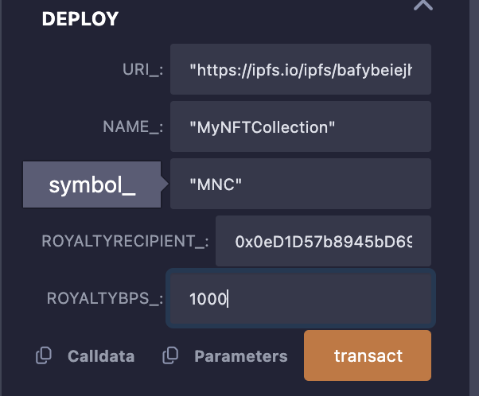

# ERC1155WithRoyalties Smart Contract

## Overview

The `ERC1155WithRoyalties` smart contract is an Ethereum-based token contract implementing the **ERC-1155** multi-token standard with royalty support via the **ERC-2981** standard. It allows creators to mint fungible, non-fungible, or semi-fungible tokens and receive royalties on secondary sales. The contract is built using **OpenZeppelin** libraries for security and includes features like minting, burning, batch operations, and metadata management.

### Key Features
- **ERC-1155 Multi-Token Standard**: Supports multiple token types (fungible, non-fungible, semi-fungible) in a single contract.
- **Royalty Support (ERC-2981)**: Configurable royalty payments for creators, with recipient and percentage set during deployment or updated later.
- **Ownable**: Restricts minting, URI updates, and royalty configuration to the contract owner.
- **Burnable**: Allows token burning to reduce supply.
- **Metadata**: Supports a URI for token metadata, hosted at `https://ipfs.io/ipfs/bafybeiejh623dkrr77b5thr3xo75ptwmurcmb6zzln5wyimfpwvltoewci/`.
- **Total Supply Tracking**: Tracks the total supply of each token ID.
- **Batch Operations**: Supports minting and transferring multiple tokens in one transaction.

### Use Cases
- Creating NFT collections with royalty support for artists.
- Issuing semi-fungible tokens (e.g., event tickets or limited-edition items).
- Managing fungible tokens with royalty distributions.

## Prerequisites
Before deploying or testing the contract, ensure you have:
- **MetaMask**: A browser extension wallet with testnet funds (e.g., Polygon Amoy or Sepolia).
- **Testnet Funds**: Obtain test MATIC for Polygon Amoy from faucets like [Alchemy Amoy Faucet](https://amoyfaucet.com/) or [QuickNode Faucet](https://www.quicknode.com/faucet).
- **Remix IDE**: Access Remix at [remix.ethereum.org](https://remix.ethereum.org/) for compiling, testing, and deploying.
- **Basic Solidity Knowledge**: Familiarity with Ethereum smart contracts and Solidity.

## Contract Details
- **Solidity Version**: `^0.8.20`
- **Dependencies**: OpenZeppelin Contracts (`ERC1155`, `Ownable`, `ERC1155Burnable`, `IERC2981`, `ERC165`).
- **Metadata URI**: `https://ipfs.io/ipfs/bafybeiejh623dkrr77b5thr3xo75ptwmurcmb6zzln5wyimfpwvltoewci/`
  - The URI points to JSON metadata files following the format:
    ```json
    {
      "name": "Token #{id}",
      "description": "An NFT with royalties",
      "image": "https://example.com/image.png"
    }
    ```
- **Royalty Configuration**: Set during deployment (e.g., 10% = 1000 basis points) and modifiable by the owner.
- **License**: MIT

## Deployed Contract
The contract has been deployed on the **Polygon Amoy Testnet**. Below are the transaction hashes for reference:
- **Deployment 1**: [0x22cf5975d29960e9bef74372771dee44dde074788e06d1741ab07392bfa789dc](https://polygon.blockscout.com/tx/0x22cf5975d29960e9bef74372771dee44dde074788e06d1741ab07392bfa789dc)
- **Deployment 2**: [0x0d0d67a9f513d773c9c1f5f83c348be261eeb29b60399a5c8ca896b07c8fe102](https://polygon.blockscout.com/tx/0x0d0d67a9f513d773c9c1f5f83c348be261eeb29b60399a5c8ca896b07c8fe102)
- **Deployment 3**: [0x68c276835ae22585de5e76ff6437f7509d1085e3c715ddf273b92dbae494003b](https://polygon.blockscout.com/tx/0x68c276835ae22585de5e76ff6437f7509d1085e3c715ddf273b92dbae494003b)

### Screenshot of Deployed Contract
Below is a placeholder for the screenshot of the deployed contract in Remix. (Replace this with an actual screenshot during implementation.)



## How to Deploy in Remix

Follow these steps to deploy the `ERC1155WithRoyalties` contract using Remix IDE.

### Step 1: Set Up Remix
1. Open [Remix Ethereum IDE](https://remix.ethereum.org/).
2. Create a new workspace or use the default one.
3. In the **File Explorer** (left sidebar), create a new folder (e.g., `contracts`).
4. Create a new file named `ERC1155WithRoyalties.sol` and paste the contract code.

### Step 2: Install Dependencies
The contract uses OpenZeppelin libraries, which are imported directly from GitHub:
```solidity
import "@openzeppelin/contracts/token/ERC1155/ERC1155.sol";
import "@openzeppelin/contracts/access/Ownable.sol";
import "@openzeppelin/contracts/token/ERC1155/extensions/ERC1155Burnable.sol";
import "@openzeppelin/contracts/utils/introspection/ERC165.sol";
import "@openzeppelin/contracts/interfaces/IERC2981.sol";
```
Remix will automatically fetch these when compiling.

### Step 3: Compile the Contract
1. Navigate to the **Solidity Compiler** tab (hammer icon, left sidebar).
2. Select the compiler version `0.8.20` (or compatible with `^0.8.20`).
3. Click **Compile ERC1155WithRoyalties.sol**.
4. Ensure no compilation errors appear. A green checkmark indicates success.

### Step 4: Configure MetaMask
1. Open MetaMask and switch to the **Polygon Amoy Testnet**.
2. Ensure your wallet has test MATIC (from a faucet).
3. In Remix, go to the **Deploy & Run Transactions** tab (rocket icon).
4. Set **Environment** to **Injected Provider - MetaMask**.
5. MetaMask will prompt you to connect your account. Approve it.

### Step 5: Deploy the Contract
1. In the **Contract** dropdown, select `ERC1155WithRoyalties`.
2. Provide the constructor parameters:
   - `uri_`: `"https://ipfs.io/ipfs/bafybeiejh623dkrr77b5thr3xo75ptwmurcmb6zzln5wyimfpwvltoewci/"`
   - `name_`: `"MyNFTCollection"`
   - `symbol_`: `"MNC"`
   - `royaltyRecipient_`: Your MetaMask address (e.g., `0x123...`).
   - `royaltyBps_`: `1000` (for 10% royalties).
3. Click **Deploy**.
4. MetaMask will prompt you to confirm the transaction. Approve it (gas fees apply in test MATIC).
5. Wait for the transaction to be mined. The contract address will appear in the **Deployed Contracts** section.

### Step 6: Verify Deployment
1. Copy the contract address from Remix.
2. Visit [Polygon Amoy Blockscout](https://polygon.blockscout.com/) and paste the address to view transaction details.
3. Optionally, verify the contract source code on Blockscout:
   - Flatten the contract using Remix’s **Flattener** plugin.
   - Submit the flattened code, ABI, and constructor arguments on Blockscout’s verification page.

## How to Test in Remix

Testing ensures the contract functions as expected. Below are step-by-step instructions to test the contract in Remix using the Remix VM or a testnet.

### Step 1: Deploy Locally (Remix VM)
1. In the **Deploy & Run Transactions** tab, set **Environment** to **Remix VM (Cancun)**.
2. Deploy the contract with the constructor parameters listed above.
3. Expand the deployed contract in the **Deployed Contracts** section to access its functions.

### Step 2: Test Cases
Below are detailed test cases to verify the contract’s functionality.

#### Test Case 1: Mint a Single Token
- **Function**: `mint`
- **Parameters**:
  - `to`: Your MetaMask address (e.g., `0x123...`).
  - `id`: `1`
  - `amount`: `5`
  - `data`: `0x`
- **Steps**:
  1. Call `mint` with the parameters.
  2. Click **Transact** and confirm (no gas in Remix VM).
  3. Verify: Call `balanceOf(address, id)` with `to` and `id=1`. Expected output: `5`.
  4. Verify: Call `totalSupply(1)`. Expected output: `5`.
- **Expected Result**: The recipient owns 5 tokens of ID 1, and total supply updates.

#### Test Case 2: Mint Multiple Tokens (Batch)
- **Function**: `mintBatch`
- **Parameters**:
  - `to`: Your MetaMask address.
  - `ids`: `[2, 3]`
  - `amounts`: `[10, 20]`
  - `data`: `0x`
- **Steps**:
  1. Call `mintBatch` with the parameters.
  2. Click **Transact** and confirm.
  3. Verify: Call `balanceOfBatch([address], [2, 3])`. Expected output: `[10, 20]`.
  4. Verify: Call `totalSupply(2)` and `totalSupply(3)`. Expected outputs: `10` and `20`.
- **Expected Result**: The recipient owns 10 tokens of ID 2 and 20 tokens of ID 3.

#### Test Case 3: Check Royalty Info
- **Function**: `royaltyInfo`
- **Parameters**:
  - `tokenId`: `1`
  - `salePrice`: `1000000000000000000` (1 MATIC in wei).
- **Steps**:
  1. Call `royaltyInfo` with the parameters.
  2. Click **Call** (read-only, no gas).
  3. Expected output: `(royaltyRecipient, 100000000000000000)` (10% of 1 MATIC = 0.1 MATIC).
- **Expected Result**: Returns the correct recipient and royalty amount (10%).

#### Test Case 4: Update Royalty Info
- **Function**: `setRoyaltyInfo`
- **Parameters**:
  - `recipient`: A new address (e.g., `0x456...`).
  - `royaltyBps`: `500` (5%).
- **Steps**:
  1. Call `setRoyaltyInfo` with the parameters.
  2. Click **Transact** and confirm.
  3. Verify: Call `royaltyInfo(1, 1000000000000000000)`. Expected output: `(newRecipient, 50000000000000000)` (5% of 1 MATIC).
- **Expected Result**: Royalty recipient and percentage update successfully.

#### Test Case 5: Burn Tokens
- **Function**: `burn`
- **Parameters**:
  - `account`: Your MetaMask address.
  - `id`: `1`
  - `amount`: `2`
- **Steps**:
  1. Ensure `mint` was called earlier for ID 1.
  2. Call `burn` with the parameters.
  3. Click **Transact** and confirm.
  4. Verify: Call `balanceOf(address, 1)`. Expected output: `3` (5 - 2).
  5. Verify: Call `totalSupply(1)`. Expected output: `3`.
- **Expected Result**: Tokens are burned, reducing balance and total supply.

#### Test Case 6: Transfer Tokens
- **Function**: `safeTransferFrom`
- **Parameters**:
  - `from`: Your MetaMask address.
  - `to`: Another address (e.g., `0x456...` from Remix VM).
  - `id`: `2`
  - `amount`: `5`
  - `data`: `0x`
- **Steps**:
  1. Ensure `mintBatch` was called for ID 2.
  2. Call `safeTransferFrom` with the parameters.
  3. Click **Transact** and confirm.
  4. Verify: Call `balanceOf(from, 2)`. Expected output: `5` (10 - 5).
  5. Verify: Call `balanceOf(to, 2)`. Expected output: `5`.
- **Expected Result**: Tokens transfer to the new address.

#### Test Case 7: Set New URI
- **Function**: `setURI`
- **Parameters**:
  - `newuri`: `"https://new-ipfs-url.com/"`
- **Steps**:
  1. Call `setURI` with the parameter.
  2. Click **Transact** and confirm.
  3. Verify: Call `uri(1)` (if supported by Remix). Expected output: `"https://new-ipfs-url.com/"`.
- **Expected Result**: Metadata URI updates successfully.

### Step 3: Test on Testnet
1. Deploy the contract to **Polygon Amoy Testnet** as described in the deployment section.
2. Repeat the test cases above, interacting with the deployed contract.
3. Use Blockscout to verify transaction outcomes (e.g., token balances, royalties).

## Notes
- **Gas Costs**: Deployment and interactions on Polygon Amoy require test MATIC. Mainnet deployment will be more expensive.
- **Royalty Support**: Some marketplaces (e.g., OpenSea) may not fully support ERC-2981. Verify compatibility before mainnet deployment.
- **Security**: The contract uses audited OpenZeppelin libraries. For production, consider additional features like reentrancy guards or pausability.
- **Metadata**: Ensure the IPFS URI (`https://ipfs.io/ipfs/bafybeiejh623dkrr77b5thr3xo75ptwmurcmb6zzln5wyimfpwvltoewci/`) resolves to valid JSON metadata.

## Troubleshooting
- **Compilation Errors**: Verify Solidity version and imports.
- **Deployment Fails**: Ensure sufficient test MATIC and correct network in MetaMask.
- **Royalty Issues**: Check `royaltyInfo` output and recipient address validity.
- **Gas Errors**: Adjust gas limits in MetaMask or optimize contract logic.

## Contributing
To contribute:
1. Fork the repository (if hosted).
2. Create a feature branch (`git checkout -b feature-name`).
3. Submit a pull request with detailed changes.

## License
This project is licensed under the MIT License. See the `SPDX-License-Identifier` in the contract code.

