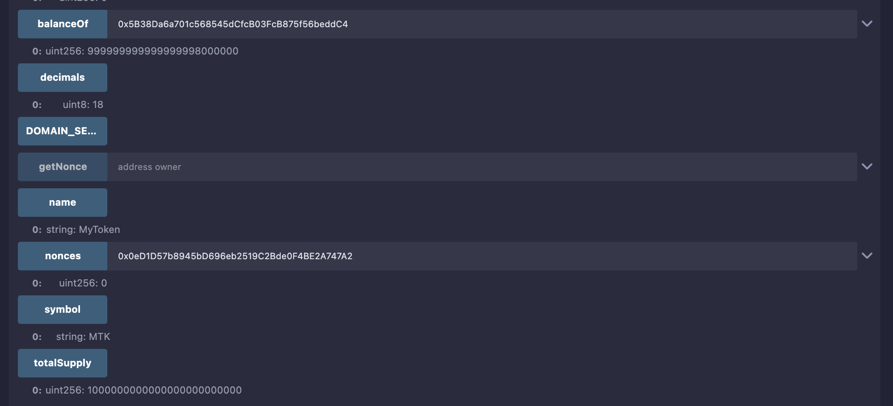
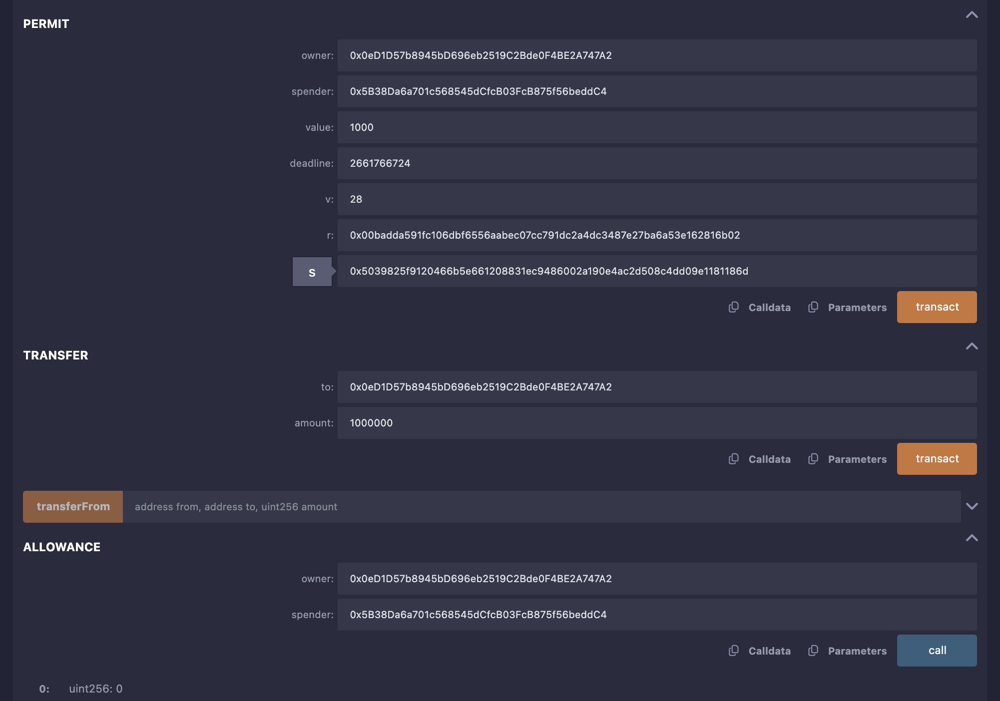
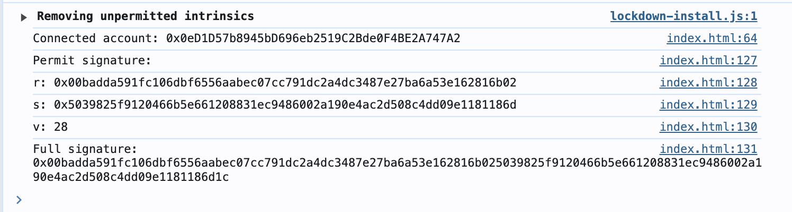

### Explanation of the Contract

This contract implements an ERC20 token with EIP-2612 permit functionality, which allows gasless approvals via signed messages. Here's a breakdown:

1. **Imports**:
   - `ERC20.sol`: Provides the standard ERC20 token functionality (transfer, approve, balanceOf, etc.).
   - `draft-ERC20Permit.sol`: Implements EIP-2612, adding the `permit` function, `nonces`, and `DOMAIN_SEPARATOR`.

2. **Constructor**:
   - Initializes the token with name "MyToken" and symbol "MTK".
   - Inherits `ERC20Permit` with the same token name for EIP-712 domain separation.
   - Mints an initial supply of 1,000,000 tokens to the deployer for testing.

3. **Additional Functions**:
   - `mint`: Allows minting additional tokens for testing.
   - `getNonce`: Returns the current nonce for an address (useful for testing permit).
   - `getDomainSeparator`: Returns the EIP-712 domain separator.

4. **EIP-2612 Features**:
   - `permit(address owner, address spender, uint256 value, uint256 deadline, uint8 v, bytes32 r, bytes32 s)`: Allows a signed message to set an allowance without a direct transaction from the owner.
   - `nonces(address owner)`: Tracks the nonce for each address to prevent replay attacks.
   - `DOMAIN_SEPARATOR()`: Returns the EIP-712 domain separator to ensure signatures are chain- and contract-specific.

- **Contract**:
  
 
  
  
### Steps to Test in Remix

#### Step 1: Set Up Remix
1. Open [Remix IDE](https://remix.ethereum.org).
2. Create a new file named `MyToken.sol` and paste the contract code above.
3. Ensure the Solidity compiler version is set to `0.8.4` or higher (matching the pragma statement).
4. Compile the contract by clicking the "Solidity Compiler" tab and selecting "Compile MyToken.sol".

#### Step 2: Deploy the Contract
1. Go to the "Deploy & Run Transactions" tab in Remix.
2. Select the "JavaScript VM (London)" environment for testing (simulates Ethereum mainnet with EIP-1559).
3. Choose `MyToken` from the contract dropdown.
4. Click "Deploy". This will deploy the contract and mint 1,000,000 tokens to the deployer's address (Account 0 in Remix).
5. Note the deployed contract's address (e.g., `0xd9145CCE52D386f254917e481eB44e9943F39138`).

#### Step 3: Test Basic ERC20 Functionality
1. In the "Deployed Contracts" section, expand the `MyToken` contract.
2. Call `balanceOf` with the deployer's address to verify the initial 1,000,000 tokens (output will be in wei, e.g., `1000000000000000000000000` for 18 decimals).
3. Test `transfer` by sending tokens to another Remix account (e.g., Account 1: `0x5B38Da6a701c568545dCfcB03FcB875f56beddC4`).
4. Test `approve` to set an allowance for another address.

#### Step 4: Test Permit Functionality
To test the `permit` function, you'll need to generate a signed message off-chain and submit it to the contract. Since Remix's JavaScript VM doesn't support `eth_signTypedData_v4`, we'll use a local HTML file (based on your provided `index.html`) to sign the permit message and then manually input the signature into Remix.

##### Step 4.1: Prepare the Signing Script
Create a local `index.html` file with the following code, updated to work with the deployed contract:

1. Replace `YOUR_CONTRACT_ADDRESS` in the `index.html` file with the actual contract address from Remix.
2. Save the file locally and open it in a browser with MetaMask installed.
3. Ensure MetaMask is connected to the Remix JavaScript VM network (add a custom network with RPC URL `http://localhost:8545` and chainId `1` if needed, though MetaMask may not connect directly to Remix VM).
4. Alternatively, deploy the contract to a testnet (e.g., Sepolia) and use that network in MetaMask.

##### Step 4.2: Generate the Permit Signature
1. Open the `index.html` file in a browser.
2. Click the "Sign Permit" button. This will:
   - Connect to MetaMask and request account access.
   - Sign a permit message allowing `spender` (e.g., Account 1) to spend 1000 tokens on behalf of the owner (MetaMask account).
3. Check the browser console for the signature output, which includes:
   - `r`: First 32 bytes of the signature.
   - `s`: Next 32 bytes of the signature.
   - `v`: Recovery parameter (27 or 28).
   - `Full signature`: The complete 65-byte signature.

##### Step 4.3: Submit the Permit to Remix
1. In Remix, go to the `permit` function in the deployed `MyToken` contract.
2. Enter the following parameters:
   - `owner`: The MetaMask account address used to sign the permit.
   - `spender`: The address from the signing script (e.g., `0x5B38Da6a701c568545dCfcB03FcB875f56beddC4`).
   - `value`: `1000000000000000000000` (1000 tokens in wei, assuming 18 decimals).
   - `deadline`: The same deadline used in the signing script (e.g., current timestamp + 3600).
   - `v`: The `v` value from the signature.
   - `r`: The `r` value from the signature.
   - `s`: The `s` value from the signature.
3. Submit the transaction using a different Remix account (e.g., Account 2) to simulate a relayer.
4. Verify the allowance by calling `allowance(owner, spender)`. It should return `1000000000000000000000`.

#### Step 5: Test TransferFrom
1. Using the spender's address (e.g., Account 1), call `transferFrom(owner, to, value)` where:
   - `owner`: The MetaMask account.
   - `to`: Any address (e.g., Account 2).
   - `value`: An amount up to the approved 1000 tokens (e.g., `1000000000000000000000`).
2. Verify the transfer by checking balances of the owner and recipient.

#### Step 6: Test Edge Cases
1. **Expired Deadline**:
   - Generate a permit with a past deadline (e.g., current timestamp - 3600).
   - Submit it in Remix. The transaction should revert with an error like "ERC20Permit: expired deadline".
2. **Invalid Nonce**:
   - Use a nonce other than the current nonce (check `getNonce(owner)`).
   - The transaction should revert with an error like "ERC20Permit: invalid signature".
3. **Invalid Signature**:
   - Modify the `r`, `s`, or `v` values slightly and submit. The transaction should revert.

### Notes
- **Nonce Management**: Each successful `permit` call increments the owner's nonce. Always check `getNonce` before signing a new permit.
- **Chain ID**: Remix JavaScript VM uses chainId 1. For testnets, update the `chainId` in `index.html` to match (e.g., 11155111 for Sepolia).
- **Security**: Ensure the `DOMAIN_SEPARATOR` matches the contract's (use `getDomainSeparator` to verify). Incorrect domain data will invalidate signatures.
- **Testing on Testnets**: For a more realistic test, deploy to a testnet like Sepolia, update the contract address and chainId in `index.html`, and use MetaMask with testnet ETH.

This setup allows you to fully test the ERC20 token with permit functionality, demonstrating gasless approvals as intended by EIP-2612.