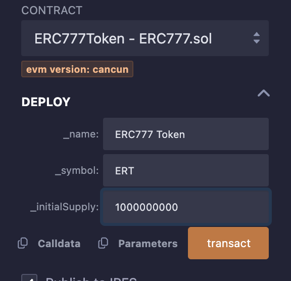
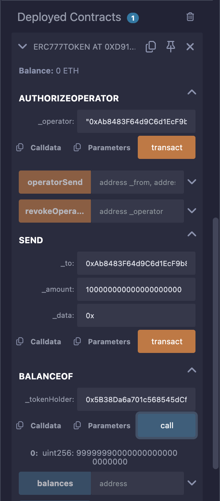

# ERC777Token Smart Contract

This repository contains the `ERC777Token` smart contract, an implementation of the ERC777 token standard on Ethereum. The contract supports token transfers, operator authorization, and operator-based transfers with additional data fields. This README provides a step-by-step guide to check, deploy, and test the contract using the Remix IDE.

## Table of Contents
- [ERC777Token Smart Contract](#erc777token-smart-contract)
  - [Table of Contents](#table-of-contents)
  - [Contract Overview](#contract-overview)
    - [Key Functions](#key-functions)
  - [Prerequisites](#prerequisites)
  - [Checking the Contract in Remix](#checking-the-contract-in-remix)
  - [Deploying the Contract](#deploying-the-contract)
    - [Using JavaScript VM](#using-javascript-vm)
    - [Using a Testnet (Optional)](#using-a-testnet-optional)
  - [Testing the Contract](#testing-the-contract)
  - [Screenshots](#screenshots)
  - [Security Considerations](#security-considerations)
  - [License](#license)

## Contract Overview
The `ERC777Token` contract includes the following features:
- **Token Details**: Configurable name, symbol, and decimals (set to 18).
- **Total Supply**: Set during deployment, allocated to the deployer.
- **Balances**: Tracks token balances for each address.
- **Operator Authorization**: Allows token holders to authorize operators to send tokens on their behalf.
- **Token Transfers**: Supports direct transfers (`send`) and operator-based transfers (`operatorSend`).
- **Events**: Emits `Transfer`, `AuthorizedOperator`, and `RevokedOperator` events.

### Key Functions
- `constructor(string memory _name, string memory _symbol, uint256 _initialSupply)`: Initializes the token with a name, symbol, and initial supply.
- `balanceOf(address _tokenHolder)`: Returns the token balance of an address.
- `authorizeOperator(address _operator)`: Authorizes an operator to send tokens on behalf of the caller.
- `revokeOperator(address _operator)`: Revokes operator authorization.
- `send(address _to, uint256 _amount, bytes calldata _data)`: Transfers tokens from the caller to another address.
- `operatorSend(address _from, address _to, uint256 _amount, bytes calldata _data, bytes calldata _operatorData)`: Allows an authorized operator to transfer tokens on behalf of a token holder.

## Prerequisites
- **Web Browser**: Chrome, Firefox, or any modern browser.
- **Remix IDE**: Access [Remix IDE](https://remix.ethereum.org/).
- **MetaMask (Optional)**: For testnet deployment (e.g., Sepolia). Install MetaMask and acquire testnet ETH from a faucet like [Sepolia Faucet](https://sepolia-faucet.pk910.de/).
- **Contract File**: The `ERC777Token.sol` file provided in this repository.

## Checking the Contract in Remix
Follow these steps to verify the contract code in Remix:

1. **Open Remix IDE**:
   - Navigate to [Remix IDE](https://remix.ethereum.org/).
   - Ensure you have a stable internet connection.

2. **Create a New File**:
   - In the "File Explorers" tab (left sidebar), click the "+" icon to create a new file.
   - Name the file `ERC777Token.sol`.

3. **Paste the Contract Code**:
   - Copy the `ERC777Token.sol` code from this repository.
   - Paste it into the `ERC777Token.sol` file in Remix.
   - Save the file (Ctrl+S or Cmd+S).

4. **Compile the Contract**:
   - Go to the "Solidity Compiler" tab (left sidebar).
   - Select a compiler version compatible with `^0.8.0` (e.g., 0.8.20).
   - Click the "Compile ERC777Token.sol" button.
   - Verify that compilation succeeds (a green checkmark appears next to the file name).
   - If errors occur, check for syntax issues or mismatched compiler versions.

**Screenshot**: Take a screenshot of the Remix IDE showing the "Solidity Compiler" tab with the compiled `ERC777Token.sol` file and the green checkmark. Save it as `compile_screenshot.png`.

## Deploying the Contract
Deploy the contract using Remix's JavaScript VM for testing or a testnet for real-world simulation.

### Using JavaScript VM
1. **Switch to Deploy Tab**:
   - Go to the "Deploy & Run Transactions" tab (left sidebar).

2. **Select Environment**:
   - In the "Environment" dropdown, choose "JavaScript VM (London)" to use a simulated blockchain with test accounts (each with 100 ETH).

3. **Set Constructor Parameters**:
   - In the "Deploy" section, select `ERC777Token` from the contract dropdown.
   - Enter constructor arguments:
     - `_name`: Token name (e.g., `"MyToken"`).
     - `_symbol`: Token symbol (e.g., `"MTK"`).
     - `_initialSupply`: Initial supply (e.g., `1000` for 1000 tokens, which becomes `1000 * 10^18` due to 18 decimals).
     - Example input: `"MyToken", "MTK", 1000`.

4. **Deploy the Contract**:
   - Click the "Deploy" button.
   - Wait for the transaction to process (visible in the Remix console at the bottom).
   - In the "Deployed Contracts" section, expand the deployed `ERC777Token` instance to see its functions.

**Screenshot**: Capture the Remix IDE showing the "Deploy & Run Transactions" tab with the deployed contract, constructor parameters, and the "Deployed Contracts" section expanded. Save it as `deploy_screenshot.png`.

### Using a Testnet (Optional)
1. **Set Up MetaMask**:
   - Install MetaMask and connect to the Sepolia testnet.
   - Acquire testnet ETH from a faucet.

2. **Select Testnet Environment**:
   - In the "Environment" dropdown, choose "Injected Provider - MetaMask".
   - Approve the connection in MetaMask.

3. **Deploy**:
   - Follow the same steps as above for constructor parameters and deployment.
   - Confirm the transaction in MetaMask (paying gas with testnet ETH).
   - Note the contract address from the Remix console or MetaMask.

**Screenshot**: Take a screenshot of MetaMask confirming the deployment transaction on Sepolia, showing the gas cost and contract address. Save it as `testnet_deploy_screenshot.png`.

## Testing the Contract
Test the contract’s functionality using the JavaScript VM environment for simplicity. Ensure you have deployed the contract as described above.

1. **Interact with the Contract**:
   - In the "Deployed Contracts" section, expand the `ERC777Token` instance to access its functions.
   - Use the test accounts provided in the "Account" dropdown (JavaScript VM accounts).

2. **Test Scenarios**:
   - **Check Initial Balance**:
     - Call `balanceOf` with the deployer’s address (copy from the "Account" dropdown).
     - Expected output: `1000000000000000000000` (1000 * 10^18 tokens).
   - **Authorize an Operator**:
     - Switch to the deployer’s account.
     - Call `authorizeOperator` with another account’s address (e.g., Account 2).
     - Check the console for the `AuthorizedOperator` event.
   - **Send Tokens**:
     - With the deployer’s account, call `send` with:
       - `_to`: Another account (e.g., Account 2).
       - `_amount`: `100000000000000000000` (100 tokens, accounting for 18 decimals).
       - `_data`: `0x` (empty).
     - Verify the recipient’s balance using `balanceOf`.
     - Check the console for the `Transfer` event.
   - **Operator Send**:
     - Switch to the operator’s account (e.g., Account 2).
     - Call `operatorSend` with:
       - `_from`: Deployer’s address.
       - `_to`: Another account (e.g., Account 3).
       - `_amount`: `50000000000000000000` (50 tokens).
       - `_data`: `0x`.
       - `_operatorData`: `0x`.
     - Verify balances and the `Transfer` event.
   - **Revoke Operator**:
     - Switch to the deployer’s account.
     - Call `revokeOperator` with the operator’s address (e.g., Account 2).
     - Attempt `operatorSend` again with the same operator—it should fail with "Operator not authorized".
     - Check the console for the `RevokedOperator` event.
   - **Edge Cases**:
     - Try sending tokens to `0x0000000000000000000000000000000000000000` (should fail with "Invalid address").
     - Try sending more tokens than the balance (should fail with "Insufficient balance").
     - Try `operatorSend` with an unauthorized operator (should fail).

3. **Verify Events and Transactions**:
   - Check the Remix console for transaction logs, emitted events (`Transfer`, `AuthorizedOperator`, `RevokedOperator`), and errors.
   - Ensure transactions succeed (green checkmark in the console).

**Screenshot**: Capture the Remix IDE showing the "Deployed Contracts" section with function calls (e.g., `balanceOf`, `send`, `operatorSend`) and the console output with events and transaction details. Save it as `test_screenshot.png`.

4. **Debugging**:
   - If a transaction fails, check the console for error messages (e.g., "revert Insufficient balance").
   - Use the "Debug" button next to failed transactions to step through execution.
   - Review gas usage in the console to optimize contract efficiency.

## Screenshots
The following screenshots illustrate the deployment and testing process. Attach these images to the README file in your repository.

1. **Compilation Screenshot** (`compile_screenshot.png`):
   - Shows the "Solidity Compiler" tab with `ERC777Token.sol` compiled successfully (green checkmark).
   - Instructions: Take this screenshot after compiling the contract.

2. **Deployment Screenshot** (`deploy_screenshot.png`):
   - Shows the "Deploy & Run Transactions" tab with constructor parameters, the "Deploy" button, and the expanded "Deployed Contracts" section.
   - Instructions: Take this screenshot after deploying the contract in JavaScript VM.

3. **Testnet Deployment Screenshot** (`testnet_deploy_screenshot.png`):
   - Shows MetaMask confirming the deployment transaction on Sepolia (optional).
   - Instructions: Take this screenshot if deploying to a testnet.

4. **Testing Screenshot** (`test_screenshot.png`):
   - Shows the "Deployed Contracts" section with function calls and the console output displaying events and transaction details.
   - Instructions: Take this screenshot after testing multiple functions (e.g., `balanceOf`, `send`, `operatorSend`).

To include screenshots in this README, add them to your repository and update the markdown with image links, e.g.:
```markdown




```

## Security Considerations
- **Basic Implementation**: This contract is a simplified ERC777 implementation for educational purposes. It lacks features like ERC1820 registry integration, reentrancy protection, or hooks for advanced token interactions.
- **Audits**: For production use, conduct a security audit and consider using audited libraries like OpenZeppelin’s ERC777 implementation.
- **Edge Cases**: The contract handles invalid addresses and insufficient balances but may need additional checks for specific use cases.
- **Gas Optimization**: Review gas usage for functions like `operatorSend` to ensure efficiency.

## License
This contract is licensed under the MIT License. See the `SPDX-License-Identifier: MIT` in the contract code.


