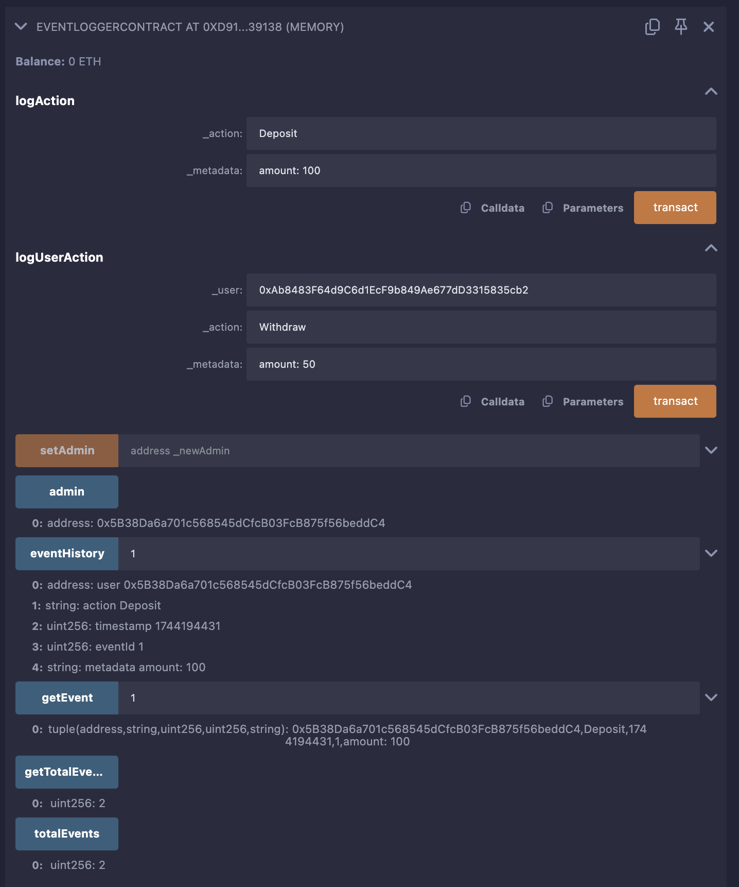

# EventLoggerContract README

## Overview

`EventLoggerContract` is a Solidity smart contract designed for logging and tracking events in a decentralized application (dApp). It provides a robust mechanism to record activities with metadata, enforce access control, and optionally store event history on-chain. This contract is suitable for real-world use cases such as supply chain tracking, financial transaction logging, or user activity monitoring in dApps.

### Key Features
- **Access Control**: Only an admin can log events or update the admin role, ensuring secure operation.
- **Flexible Event Logging**: Supports logging actions for the admin or specific users with customizable metadata.
- **Event Emission**: Emits `ActivityLogged` events with indexed fields for efficient off-chain filtering.
- **On-Chain History (Optional)**: Stores event details in a mapping for on-chain querying (can be removed for gas efficiency).
- **Query Functions**: Allows retrieval of event details and total event count.

### Use Cases
- **Supply Chain**: Log events like `"Shipped"` with metadata `"location: NY"`.
- **Finance**: Record `"Transfer"` with metadata `"amount: 50 ETH"`.
- **Gaming**: Track `"LevelUp"` with metadata `"level: 10"`.

---

## Prerequisites
- **Remix IDE**: Use [Remix](https://remix.ethereum.org/) for deployment and testing.
- **MetaMask (Optional)**: For testnet deployment.
- **Basic Solidity Knowledge**: Understanding of events, modifiers, and structs.

---

## Deployment in Remix

Follow these steps to deploy `EventLoggerContract` using Remix IDE:

### Step 1: Setup Remix Environment
1. Open [Remix IDE](https://remix.ethereum.org/).
2. In the **File Explorer** (left sidebar), click the "+" button.
3. Name the file `EventLoggerContract.sol` and ensure the contract code is pasted into it.

### Step 2: Compile the Contract
1. Navigate to the **Solidity Compiler** tab (hammer icon).
2. Select a compiler version (e.g., `0.8.19` or higher).
3. Click **Compile EventLoggerContract.sol**. A green checkmark indicates successful compilation.

### Step 3: Deploy the Contract
1. Go to the **Deploy & Run Transactions** tab (play icon).
2. Set the **Environment** to **JavaScript VM (London)** for local testing (provides fake ETH).
3. Ensure the contract dropdown shows `EventLoggerContract`.
4. Click **Deploy**. The contract will appear under **Deployed Contracts**.
5. Note the deployer’s address (e.g., `0x5B38...`)—this is the initial admin.

---

## Testing in Remix

Below are detailed steps to test `EventLoggerContract` in Remix, including specific test cases to verify functionality.

### Testing Steps

#### Step 1: Verify Initial State
1. Expand the deployed contract under **Deployed Contracts**.
2. Call `getTotalEvents` (orange button). Output should be `0`.
3. Call `admin`. Output should match the deployer’s address (e.g., `0x5B38...`).

#### Step 2: Test Logging an Action
1. Find the `logAction` function.
2. Input `_action` as `"Deposit"` and `_metadata` as `"amount: 100"`.
3. Click **logAction** (red button).
4. Check the Remix terminal (bottom panel) for the transaction receipt.
5. Expand the logs to verify:
   - `user`: Deployer’s address.
   - `action`: `"Deposit"`.
   - `eventId`: `1`.
   - `metadata`: `"amount: 100"`.
6. Call `getEvent` with input `1`. Confirm the returned struct matches the logged data.

#### Step 3: Test Logging a User Action
1. Find the `logUserAction` function.
2. Input:
   - `_user`: Another test address from the VM dropdown (e.g., `0xCA35...`).
   - `_action`: `"Withdraw"`.
   - `_metadata`: `"amount: 50"`.
3. Click **logUserAction**.
4. Check the logs for the `ActivityLogged` event and verify `eventId` is `2`.
5. Call `getEvent` with `2` to confirm details.

#### Step 4: Test Access Control
1. Switch to a different account in the **Account** dropdown (e.g., `0xCA35...`).
2. Attempt to call `logAction` with `"Test"`, `"data"`. It should fail with "Only admin can call this function".
3. Switch back to the admin account.
4. Call `setAdmin` with a new address (e.g., `0xCA35...`). Verify `admin` updates by calling `admin`.

#### Step 5: Test Edge Cases
1. Call `getEvent` with `0`. Should revert with "Invalid event ID".
2. Call `getEvent` with `999`. Should revert if `totalEvents` is less than 999.
3. Call `setAdmin` with `0x0000000000000000000000000000000000000000`. Should revert with "Invalid admin address".

---

## Test Cases

| Test Case                 | Description                                      | Input                                      | Expected Output                                      |
|---------------------------|--------------------------------------------------|--------------------------------------------|-----------------------------------------------------|
| Initial State             | Check `totalEvents` and `admin` on deployment    | None                                       | `totalEvents = 0`, `admin = deployer address`       |
| Log Action                | Log an admin action                              | `"Deposit"`, `"amount: 100"`              | Event emitted, `eventId = 1`, data in `getEvent(1)` |
| Log User Action           | Log an action for another user                   | `0xCA35...`, `"Withdraw"`, `"amount: 50"` | Event emitted, `eventId = 2`, data in `getEvent(2)` |
| Access Control (Fail)     | Non-admin tries to log                           | `"Test"`, `"data"` (from non-admin)       | Reverts with "Only admin can call this function"    |
| Update Admin              | Change admin address                             | `0xCA35...`                              | `admin` updates to `0xCA35...`                     |
| Invalid Event ID (Low)    | Query event ID 0                                 | `0`                                       | Reverts with "Invalid event ID"                    |
| Invalid Event ID (High)   | Query non-existent event                         | `999` (if `totalEvents < 999`)            | Reverts with "Invalid event ID"                    |
| Invalid Admin Address     | Set admin to zero address                        | `0x0`                                     | Reverts with "Invalid admin address"               |

---

## Screenshots

-  

1. **Deployed Contract Screenshot**:
   - **Description**: Shows the `EventLoggerContract` deployed in Remix under "Deployed Contracts" with the admin address visible.
   - **Placement**: After "Step 3: Deploy the Contract".

2. **Successful Log Action Screenshot**:
   - **Description**: Displays the Remix terminal with the `ActivityLogged` event logs after calling `logAction` with `"Deposit"`, `"amount: 100"`.
   - **Placement**: After "Step 2: Test Logging an Action".

3. **Access Control Failure Screenshot**:
   - **Description**: Shows the error message "Only admin can call this function" in the terminal when a non-admin calls `logAction`.
   - **Placement**: After "Step 4: Test Access Control".

---

## Deploying to a Testnet (Optional)

To deploy `EventLoggerContract` to a testnet like Sepolia:
1. **Setup MetaMask**:
   - Install MetaMask and switch to the Sepolia network.
   - Get test ETH from a faucet (e.g., [Sepolia Faucet](https://sepoliafaucet.com/)).
2. **Connect Remix**:
   - In the "Deploy & Run Transactions" tab, set **Environment** to **Injected Provider - MetaMask**.
   - Connect MetaMask when prompted.
3. **Deploy**:
   - Click **Deploy** and approve the transaction in MetaMask.
   - Note the contract address from Remix or check it on [Sepolia Etherscan](https://sepolia.etherscan.io/).
4. **Test**: Use the same testing steps with your MetaMask wallet as the admin.

---

## Gas Optimization Tips
- **Remove On-Chain Storage**: Delete `eventHistory` and `getEvent` if you only need off-chain event tracking.
- **Short Metadata**: Keep `_metadata` strings concise to reduce gas costs.
- **Indexed Fields**: `user` and `action` are indexed for efficient off-chain filtering.

---

## Conclusion

`EventLoggerContract` is a versatile and secure contract for logging events in a dApp. With Remix, you can easily deploy and test it locally or on a testnet. The test cases ensure it works as expected, and the optional on-chain history makes it adaptable to various needs. For production, consider gas optimization based on your use case.

For questions or enhancements (e.g., adding roles, removing storage), feel free to modify or extend the contract!
