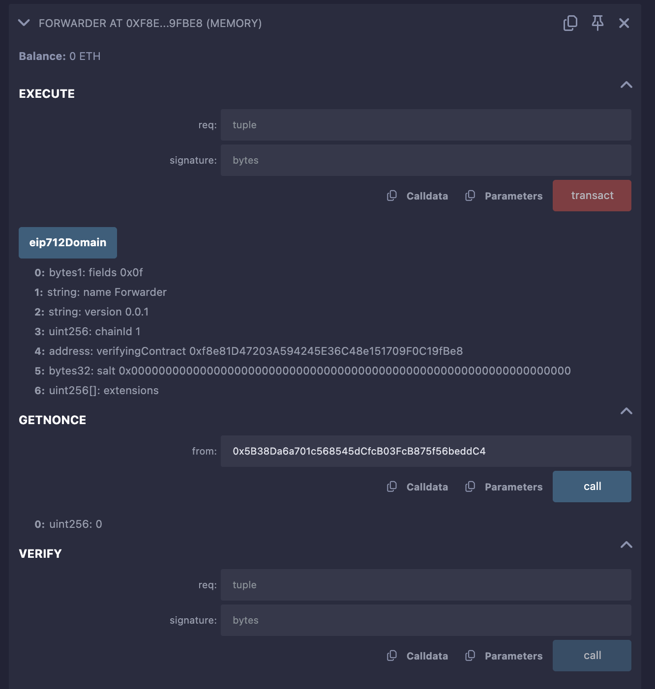

# GaslessVoting and Forwarder Contracts

This README provides a detailed guide for deploying and testing the `GaslessVoting` and `Forwarder` smart contracts in the Remix Ethereum IDE using the JavaScript VM environment. It includes an explanation of the contracts, their use cases, step-by-step deployment and testing instructions, all possible test cases, and common mistakes that could lead to errors during testing. The focus is on testing within Remix without external tools, ensuring clarity for users unfamiliar with the process.


- **Contract**:



## Table of Contents
- [GaslessVoting and Forwarder Contracts](#gaslessvoting-and-forwarder-contracts)
  - [Table of Contents](#table-of-contents)
  - [Contract Overview](#contract-overview)
    - [GaslessVoting Contract](#gaslessvoting-contract)
    - [Forwarder Contract](#forwarder-contract)
  - [Use Cases](#use-cases)
  - [Prerequisites](#prerequisites)
  - [Setup in Remix](#setup-in-remix)
  - [Deploying the Contracts](#deploying-the-contracts)
    - [Common Deployment Mistakes](#common-deployment-mistakes)
  - [Testing the Contracts](#testing-the-contracts)
    - [Test Case 1: Direct Voting (Non-Gasless)](#test-case-1-direct-voting-non-gasless)
    - [Test Case 2: Gasless Voting (Meta-Transaction)](#test-case-2-gasless-voting-meta-transaction)
    - [Test Case 3: Edge Cases](#test-case-3-edge-cases)
    - [Common Testing Mistakes](#common-testing-mistakes)
  - [Debugging Tips](#debugging-tips)
  - [Production Considerations](#production-considerations)

## Contract Overview

### GaslessVoting Contract
The `GaslessVoting` contract is a decentralized voting system designed to allow users to create and vote on proposals, with support for gasless transactions via meta-transactions (EIP-2771). It ensures that users can participate in voting without paying gas fees, as a relayer submits transactions on their behalf.

**Purpose**:
- Facilitates decentralized voting where users propose and vote on decisions.
- Supports gasless voting, making it accessible to users without cryptocurrency.

**Key Features**:
- **Proposal Creation**: Users can create proposals, each assigned a unique ID starting from 1.
- **Voting Mechanism**: Users can vote on a proposal, with restrictions to prevent double voting and ensure valid proposal IDs.
- **Meta-Transaction Support**: Integrates with a forwarder contract to enable gasless voting by overriding the `_msgSender` function to identify the original user from meta-transactions.
- **State Management**: Tracks votes per proposal and whether a user has voted.

**Key Components**:
- **trustedForwarder**: Stores the address of the `Forwarder` contract for meta-transactions.
- **hasVoted**: Mapping to ensure each user votes only once.
- **votes**: Mapping to track vote counts per proposal ID.
- **proposalCount**: Tracks the total number of proposals created.
- **_msgSender**: Overrides the inherited `Context` contract’s function to support meta-transactions.
- **createProposal**: Increments `proposalCount` and returns the new proposal ID.
- **vote**: Records a vote for a proposal, enforcing single-vote and valid ID checks.
- **getVoteCount**: Returns the number of votes for a given proposal.

### Forwarder Contract
The `Forwarder` contract implements the EIP-2771 and EIP-712 standards to handle meta-transactions, allowing a relayer to submit signed transactions on behalf of users, who pay no gas.

**Purpose**:
- Enables gasless transactions by verifying user signatures and forwarding requests to the target contract (`GaslessVoting`).

**Key Features**:
- **Signature Verification**: Uses EIP-712 typed data hashing to verify user signatures.
- **Nonce Management**: Prevents replay attacks by tracking nonces per user.
- **Transaction Execution**: Forwards the user’s intended function call to the target contract.
- **Security**: Ensures only valid signatures and nonces are processed.

**Key Components**:
- **ForwardRequest**: A struct defining the meta-transaction (user address, target contract, value, gas, nonce, data).
- **_nonces**: Mapping to track nonces per user.
- **_TYPEHASH**: EIP-712 type hash for the `ForwardRequest` struct.
- **getNonce**: Returns the current nonce for a user.
- **verify**: Checks if a signature and nonce are valid.
- **execute**: Executes the meta-transaction by calling the target contract.

## Use Cases
- **Decentralized Autonomous Organizations (DAOs)**: Enables gasless voting for governance proposals, increasing participation by removing gas cost barriers.
- **Community Polls**: Allows communities to conduct polls in dApps without requiring users to hold ETH.
- **Onboarding New Users**: Attracts blockchain newcomers by eliminating gas fees for voting.
- **Gaming dApps**: Supports in-game voting (e.g., for decisions or leaderboards) without gas costs.
- **Cost Management**: Shifts gas costs to a relayer (e.g., dApp provider), improving user experience.

## Prerequisites
- **Remix Ethereum IDE**: Access at [remix.ethereum.org](https://remix.ethereum.org/).
- **Browser**: Any modern browser (e.g., Chrome with MetaMask for testnet testing, though not required for JavaScript VM).
- **OpenZeppelin Dependencies**:
  - `Context.sol`: For `_msgSender` in `GaslessVoting`.
  - `EIP712.sol`: For typed data hashing in `Forwarder`.
  - `ECDSA.sol`: For signature recovery in `Forwarder`.
  - Use OpenZeppelin version 4.9.0 for compatibility with Solidity `^0.8.0`.
- **Accounts**:
  - **User Account**: For signing meta-transactions (e.g., `0x5B38Da6a701c568545dCfcB03FcB875f56beddC4`).
  - **Relayer Account**: For deploying contracts and submitting meta-transactions (e.g., `0xAb8483F64d9C6d1EcF9b849Ae677dD3315835cb2`).
- **Environment**: Remix’s JavaScript VM (London) for local testing with pre-funded accounts.

## Setup in Remix
1. **Open Remix**:
   - Navigate to [Remix Ethereum IDE](https://remix.ethereum.org/).
2. **Create a Workspace**:
   - In the **File Explorer** (left sidebar), click the “+” button to create a new workspace named `GaslessVotingWorkspace`.
3. **Add OpenZeppelin Dependencies**:
   - Create a folder structure: `node_modules/@openzeppelin/contracts/utils`.
   - Add `Context.sol`:
     - Create `Context.sol` in the `utils` folder.
     - Copy the content from [OpenZeppelin v4.9.0 Context.sol](https://github.com/OpenZeppelin/openzeppelin-contracts/blob/v4.9.0/contracts/utils/Context.sol).
   - Create a subfolder: `node_modules/@openzeppelin/contracts/utils/cryptography`.
   - Add `EIP712.sol`:
     - Create `EIP712.sol` in the `cryptography` folder.
     - Copy from [OpenZeppelin v4.9.0 EIP712.sol](https://github.com/OpenZeppelin/openzeppelin-contracts/blob/v4.9.0/contracts/utils/cryptography/EIP712.sol).
   - Add `ECDSA.sol`:
     - Create `ECDSA.sol` in the `cryptography` folder.
     - Copy from [OpenZeppelin v4.9.0 ECDSA.sol](https://github.com/OpenZeppelin/openzeppelin-contracts/blob/v4.9.0/contracts/utils/cryptography/ECDSA.sol).
4. **Add Contract Files**:
   - In the root of the workspace, create:
     - `GaslessVoting.sol`: Contains the voting logic with meta-transaction support.
     - `Forwarder.sol`: Handles meta-transactions for gasless execution.
   - Ensure both contracts use `pragma solidity ^0.8.0` and import the correct OpenZeppelin paths.

## Deploying the Contracts
Follow these steps to deploy the contracts in Remix using the JavaScript VM.

1. **Compile Contracts**:
   - Go to the **Solidity Compiler** tab (hammer icon).
   - Set the compiler version to `0.8.20` (compatible with OpenZeppelin v4.9.0).
   - Select `Forwarder.sol` and click **Compile Forwarder.sol**.
   - Select `GaslessVoting.sol` and click **Compile GaslessVoting.sol**.
   - Check the **Terminal** (bottom panel) for compilation success. Ensure no errors appear.

2. **Set Up Environment**:
   - In the **Deploy & Run Transactions** tab, set **Environment** to **JavaScript VM (London)**.
   - This provides pre-funded accounts (e.g., `0x5B38Da6a701c568545dCfcB03FcB875f56beddC4` and `0xAb8483F64d9C6d1EcF9b849Ae677dD3315835cb2`).
   - Set **Gas limit** to `3000000` and **Value** to `0 Wei` for all transactions.

3. **Deploy Forwarder**:
   - Select `Forwarder` in the contract dropdown.
   - Set **Account** to the Relayer (`0xAb8483F64d9C6d1EcF9b849Ae677dD3315835cb2`).
   - Click **Deploy**.
   - In the **Deployed Contracts** section, copy the deployed address (e.g., `0xf8e81D47203A594245E36C48e151709F0C19fBe8`).
   - Verify by calling `getNonce(0x5B38Da6a701c568545dCfcB03FcB875f56beddC4)`. Should return `0`.

4. **Deploy GaslessVoting**:
   - Select `GaslessVoting` in the contract dropdown.
   - In the `_trustedForwarder` input field, paste the `Forwarder` address (e.g., `0xf8e81D47203A594245E36C48e151709F0C19fBe8`).
   - Set **Account** to `0xAb8483F64d9C6d1EcF9b849Ae677dD3315835cb2`.
   - Click **Deploy**.
   - Copy the deployed address (e.g., `0xa136D13a69d2C738A665b53f65C6F6e4f4EeAD95`).
   - Verify by calling `trustedForwarder`. Should return the `Forwarder` address.

### Common Deployment Mistakes
- **Wrong Compiler Version**:
  - **Mistake**: Using a Solidity version incompatible with OpenZeppelin v4.9.0 (e.g., `0.7.x`).
  - **Error**: Compilation errors like “TypeError: Member not found”.
  - **Fix**: Set compiler to `0.8.20`.
- **Incorrect Import Paths**:
  - **Mistake**: Wrong folder structure for OpenZeppelin contracts (e.g., missing `node_modules/@openzeppelin`).
  - **Error**: “File import not found”.
  - **Fix**: Ensure `Context.sol`, `EIP712.sol`, and `ECDSA.sol` are in the correct paths.
- **Invalid Forwarder Address**:
  - **Mistake**: Entering an incorrect or non-deployed `_trustedForwarder` address in `GaslessVoting`.
  - **Error**: Deployment succeeds, but meta-transactions fail later.
  - **Fix**: Verify the `Forwarder` address before deploying `GaslessVoting`.

## Testing the Contracts
We’ll test the contracts in three scenarios using the JavaScript VM:
1. Direct voting (non-gasless) to verify basic functionality.
2. Gasless voting using a modified `Forwarder` to bypass signature verification (since JavaScript VM doesn’t support off-chain signing).
3. Edge cases to test contract robustness.

### Test Case 1: Direct Voting (Non-Gasless)
This tests the `GaslessVoting` contract’s core voting functionality without meta-transactions.

1. **Create a Proposal**:
   - Expand `GaslessVoting` at `0xa136D13a69d2C738A665b53f65C6F6e4f4EeAD95` in **Deployed Contracts**.
   - Set **Account** to `0xAb8483F64d9C6d1EcF9b849Ae677dD3315835cb2` (Relayer).
   - Call `createProposal` and click **Transact** (`Gas limit`: `3000000`, `Value`: `0 Wei`).
   - Check the **Terminal** for a successful transaction (e.g., `logs: 0`, `hash` present).
   - Call `proposalCount`. **Expected**: Returns `1`.

2. **Vote on Proposal**:
   - Set **Account** to `0x5B38Da6a701c568545dCfcB03FcB875f56beddC4` (User).
   - Call `vote` with `proposalId` set to `1`.
   - Click **Transact**.
   - Check the **Terminal** for success.
   - Verify:
     - Call `hasVoted(0x5B38Da6a701c568545dCfcB03FcB875f56beddC4)`. **Expected**: Returns `true`.
     - Call `getVoteCount(1)`. **Expected**: Returns `1`.

3. **Test Double Voting**:
   - Call `vote(1)` again with `0x5B3...eddC4`.
   - Click **Transact**.
   - **Expected**: Reverts with “Already voted” in the **Terminal**.

4. **Test Invalid Proposal**:
   - Call `vote(999)` with `0x5B3...eddC4`.
   - Click **Transact**.
   - **Expected**: Reverts with “Invalid proposal ID” in the **Terminal**.

### Test Case 2: Gasless Voting (Meta-Transaction)
Since the JavaScript VM doesn’t support off-chain signing, we’ll create a modified `ForwarderTest` contract to bypass signature verification for testing meta-transactions.

1. **Create ForwarderTest Contract**:
   - In the **File Explorer**, create `ForwarderTest.sol` with the same code as `Forwarder.sol`, but modify the `verify` function to:
     ```solidity
     function verify(ForwardRequest calldata req, bytes calldata signature)
         public
         view
         returns (bool)
     {
         return true; // Bypass signature verification for testing
     }
     ```
   - Compile `ForwarderTest.sol` in the **Solidity Compiler** tab.

2. **Deploy ForwarderTest**:
   - Select `ForwarderTest` in the **Deploy & Run Transactions** tab.
   - Set **Account** to `0xAb8483F64d9C6d1EcF9b849Ae677dD3315835cb2`.
   - Click **Deploy** (`Gas limit`: `3000000`, `Value`: `0 Wei`).
   - Copy the deployed address (e.g., `0xNewForwarder`).

3. **Redeploy GaslessVoting**:
   - Select `GaslessVoting` and enter `0xNewForwarder` as `_trustedForwarder`.
   - Deploy with `0xAb8...35cb2`.
   - Copy the new address (e.g., `0xNewVoting`).
   - Verify by calling `trustedForwarder`. **Expected**: Returns `0xNewForwarder`.

4. **Create a Proposal**:
   - In `GaslessVoting` at `0xNewVoting`, call `createProposal` with `0xAb8...35cb2`.
   - Click **Transact**.
   - Verify `proposalCount` returns `1`.

5. **Construct ForwardRequest for vote(1)**:
   - Calculate the `data` field for `vote(1)`:
     - Function: `vote(uint256)`
     - Selector: `keccak256("vote(uint256)")` = `0x0121b93f`
     - Parameter: `1` (padded to 32 bytes: `0000000000000000000000000000000000000000000000000000000000000001`)
     - Full `data`: `0x0121b93f0000000000000000000000000000000000000000000000000000000000000001`
   - In `ForwarderTest` at `0xNewForwarder`, prepare the `execute` input:
     ```json
     [
       "0x5B38Da6a701c568545dCfcB03FcB875f56beddC4", // from (User)
       "0xNewVoting", // to (GaslessVoting)
       0, // value
       100000, // gas
       0, // nonce (from getNonce)
       "0x0121b93f0000000000000000000000000000000000000000000000000000000000000001" // data
     ]
     ```
   - Signature: `0x00` (dummy, as `verify` is bypassed).

6. **Submit Meta-Transaction**:
   - Call `execute` in `ForwarderTest` with the `req` tuple and `signature` (`0x00`).
   - Use `0xAb8...35cb2` (Relayer).
   - Click **Transact**.
   - Check the **Terminal** for success.

7. **Verify Gasless Vote**:
   - In `GaslessVoting` at `0xNewVoting`:
     - Call `hasVoted(0x5B38Da6a701c568545dCfcB03FcB875f56beddC4)`. **Expected**: Returns `true`.
     - Call `getVoteCount(1)`. **Expected**: Returns `1`.
   - In `ForwarderTest`, call `getNonce(0x5B38Da6a701c568545dCfcB03FcB875f56beddC4)`. **Expected**: Returns `1`.

### Test Case 3: Edge Cases
These tests ensure the contracts handle invalid inputs correctly.

1. **Double Voting (Gasless)**:
   - Repeat the `execute` call with the same `req` from Test Case 2.
   - Use `0xAb8...35cb2`.
   - **Expected**: Reverts with “Already voted” in the **Terminal**.

2. **Invalid Proposal ID (Gasless)**:
   - Modify the `data` field to vote for `999`:
     - New `data`: `0x0121b93f00000000000000000000000000000000000000000000000000000000000003e7`
   - Call `execute` with the updated `req`.
   - **Expected**: Reverts with “Invalid proposal ID”.

3. **Invalid Nonce (Using Original Forwarder)**:
   - Deploy the original `Forwarder` (not `ForwarderTest`) and redeploy `GaslessVoting` with its address.
   - Create a new proposal and construct a `req` with `nonce` set to `999`.
   - Call `execute` with a dummy signature (`0x00`).
   - **Expected**: Reverts with “Forwarder: signature does not match”.

4. **Low Gas Limit (Gasless)**:
   - In `ForwarderTest`, set `gas` to `1000` in the `req` tuple.
   - Call `execute`.
   - **Expected**: Reverts with “Forwarder: call failed” due to insufficient gas.

5. **Invalid Target Contract**:
   - In `ForwarderTest`, set `to` to an invalid address (e.g., `0x0000000000000000000000000000000000000000`).
   - Call `execute`.
   - **Expected**: Reverts with “Forwarder: call failed”.

### Common Testing Mistakes
- **Using Wrong Account**:
  - **Mistake**: Voting with `0xAb8...35cb2` instead of `0x5B3...eddC4` in direct voting.
  - **Error**: May cause “Already voted” if the account already voted.
  - **Fix**: Ensure the correct account is selected in Remix.
- **Incorrect Data Field**:
  - **Mistake**: Using wrong `data` in `execute` (e.g., incorrect function selector).
  - **Error**: “Forwarder: call failed” due to invalid function call.
  - **Fix**: Verify `data` (e.g., `0x0121b93f...` for `vote(1)`).
- **Reusing Nonce**:
  - **Mistake**: Using the same `nonce` in multiple `execute` calls with the original `Forwarder`.
  - **Error**: “Forwarder: signature does not match”.
  - **Fix**: Check `getNonce` before constructing `req`.
- **Low Gas Limit**:
  - **Mistake**: Setting `Gas limit` too low in Remix or `gas` in `req`.
  - **Error**: Transaction fails or reverts.
  - **Fix**: Use `3000000` for Remix and `100000` for `req.gas`.
- **Not Redeploying GaslessVoting**:
  - **Mistake**: Using the old `GaslessVoting` address with `ForwarderTest`.
  - **Error**: Meta-transactions fail due to mismatched `_trustedForwarder`.
  - **Fix**: Redeploy `GaslessVoting` with the new `ForwarderTest` address.

## Debugging Tips
- **Check Terminal**: Look for transaction hashes and revert reasons in the Remix **Terminal**.
- **Add Events**:
  - In `GaslessVoting`, add: `event VoteCast(address voter, uint256 proposalId);` in `vote`.
  - In `Forwarder`, add: `event Executed(address from, address to, bool success);` in `execute`.
  - Redeploy and check event logs in the **Terminal**.
- **Verify Nonces**: Call `getNonce` to ensure the correct nonce is used.
- **Reset State**: Redeploy contracts to clear `hasVoted` or `_nonces` if tests fail unexpectedly.
- **Gas Estimation**: Increase `Gas limit` to `5000000` if transactions fail.

## Production Considerations
- **Signature Verification**: Remove the `verify` bypass in `ForwarderTest` for production.
- **Relayer Service**: Use services like Gelato or Biconomy for meta-transactions.
- **Security**: Add pausability and access control to prevent abuse.
- **Testnet Testing**: Deploy on Sepolia before mainnet to ensure functionality.
- **Gas Funding**: Ensure the relayer has sufficient ETH or tokens.


