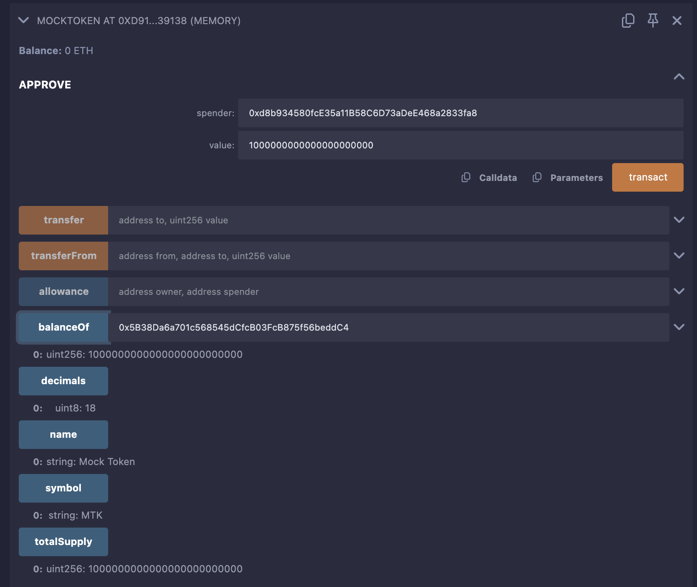
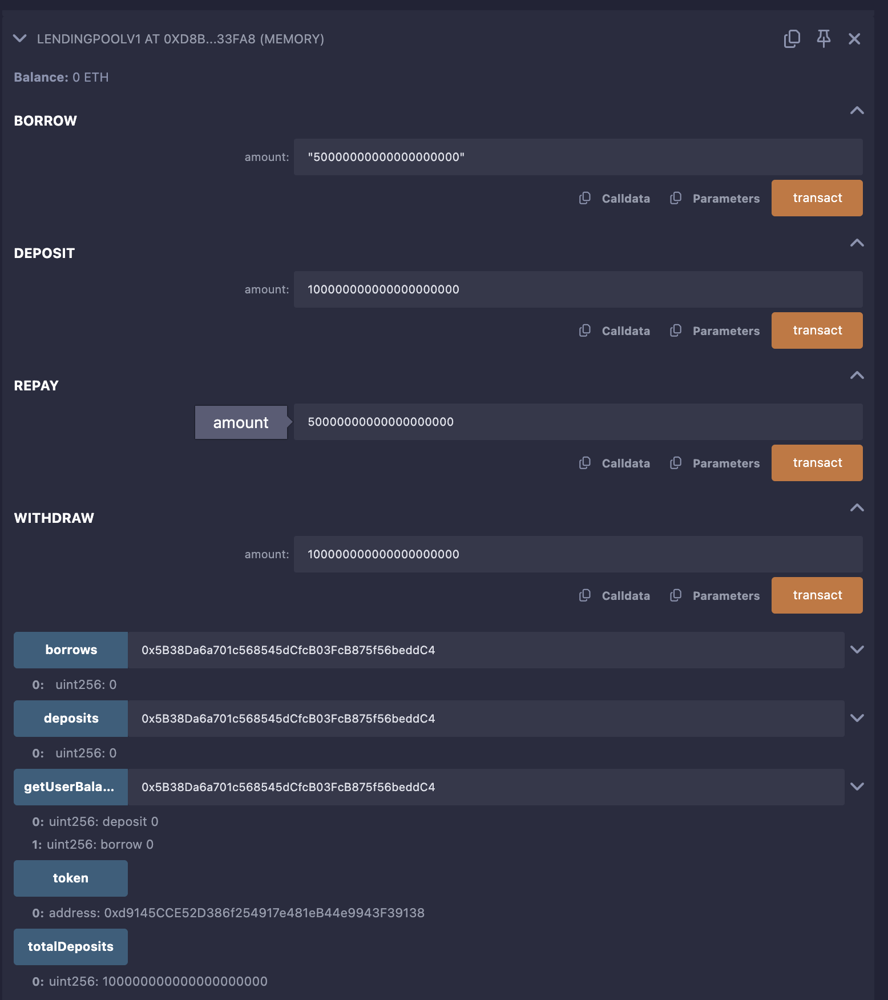

# LendingPoolV1 Smart Contract

## Overview

The **LendingPoolV1** smart contract is a basic decentralized lending protocol built on Ethereum, allowing users to deposit and borrow ERC-20 tokens. It interacts with a single ERC-20 token (via the **MockToken** contract for testing) and tracks user deposits and borrows. The contract is designed for simplicity, with plans for future enhancements like interest rates, collateral, liquidation, and multi-token support.

This README provides a detailed guide on how the contracts work, how to set up, test, and deploy them using Remix, and includes a screenshot of the deployed contract in Remix.

## Contract Details

### LendingPoolV1
- **Purpose**: Facilitates lending and borrowing of ERC-20 tokens.
- **Key Features**:
  - **Deposit**: Users deposit tokens into the pool, increasing liquidity.
  - **Borrow**: Users borrow tokens if sufficient liquidity is available.
  - **Repay**: Users repay borrowed tokens, restoring liquidity.
  - **Withdraw**: Users withdraw their deposited tokens if liquidity permits.
  - **Balance Tracking**: Tracks user deposits and borrows via mappings.
  - **Events**: Emits events (`Deposited`, `Borrowed`, `Repaid`, `Withdrawn`) for transparency.
- **Dependencies**: Uses OpenZeppelin's `IERC20` interface for ERC-20 token interactions.
- **Constructor**: Takes the address of the ERC-20 token to interact with.

### MockToken
- **Purpose**: A mock ERC-20 token for testing LendingPoolV1.
- **Key Features**:
  - Standard ERC-20 functionality (transfer, approve, balanceOf, etc.).
  - Mints 1,000,000 tokens (with 18 decimals) to the deployer.
  - Used to simulate a real ERC-20 token in the lending pool.

## How the Contracts Work

1. **Initialization**:
   - Deploy `MockToken` to create a test ERC-20 token.
   - Deploy `LendingPoolV1`, passing the `MockToken` address to the constructor.
2. **Deposit**:
   - Users approve `LendingPoolV1` to spend their tokens.
   - Users call `deposit` to transfer tokens to the pool, increasing their deposit balance and the pool's total liquidity (`totalDeposits`).
3. **Borrow**:
   - Users call `borrow` to borrow tokens, provided the pool has sufficient liquidity.
   - Borrowed tokens are transferred to the user, reducing `totalDeposits` and increasing the user's borrow balance.
4. **Repay**:
   - Users approve `LendingPoolV1` to spend tokens for repayment.
   - Users call `repay` to return borrowed tokens, reducing their borrow balance and increasing `totalDeposits`.
5. **Withdraw**:
   - Users call `withdraw` to retrieve their deposited tokens, provided they have sufficient deposits and the pool has liquidity.
6. **Balance Checks**:
   - The `getUserBalance` function returns a user's deposit and borrow balances.
   - The `totalDeposits` variable tracks the pool's available liquidity.

## Planned Enhancements
The following features are planned to enhance the LendingPoolV1 contract:
- **Interest Rates**: Implement interest accrual for borrows to incentivize lenders.
- **Collateral**: Require users to deposit collateral (e.g., ETH or another token) before borrowing.
- **Liquidation**: Allow liquidation of undercollateralized loans to protect the pool.
- **Multiple Token Support**: Enable the pool to handle multiple ERC-20 tokens.

## Prerequisites
- **Remix IDE**: Use [Remix](https://remix.ethereum.org/) for compiling, testing, and deploying.
- **MetaMask**: For testnet deployment (e.g., Sepolia).
- **Testnet ETH**: Obtain Sepolia ETH from a faucet (e.g., [Sepolia Faucet](https://sepoliafaucet.com/)).
- **Browser**: A modern browser (e.g., Chrome) with MetaMask installed.

## Setup Instructions
1. **Open Remix**:
   - Navigate to [Remix IDE](https://remix.ethereum.org/).
2. **Create Contract Files**:
   - In the "File Explorer" tab, create two files: `LendingPoolV1.sol` and `MockToken.sol`.
   - Ensure the contracts are correctly implemented (refer to the separate `.sol` files).
3. **Install Dependencies**:
   - Remix automatically resolves OpenZeppelin dependencies (e.g., `@openzeppelin/contracts`).
   - Ensure Solidity version `^0.8.20` is used.
4. **Compile Contracts**:
   - Go to the "Solidity Compiler" tab.
   - Select compiler version `0.8.20`.
   - Compile `MockToken.sol` and `LendingPoolV1.sol`.
   - Verify no compilation errors.

## Testing Instructions
Testing is performed in Remix's JavaScript VM (Cancun EVM version) to simulate blockchain interactions.

### Environment Setup
- **Environment**: JavaScript VM (Cancun)
- **Account**: Use the default account (e.g., `0x5B38Da6a701c568545dCfcB03FcB875f56beddC4`).
- **Gas Limit**: Set to `3,000,000` (default in Remix).
- **Value**: `0 Wei` (no ETH sent with transactions).
- **Contract**: Select `MockToken` and `LendingPoolV1` as needed.

### Test Steps
1. **Deploy MockToken**:
   - In the "Deploy & Run Transactions" tab, select `MockToken`.
   - Click "Deploy".
   - Note the contract address (e.g., `0xd9145CCE52D386f254917e481eB44e9943F39138`).
   - Verify the deployer receives 1,000,000 tokens (call `balanceOf` with the deployer address).
2. **Deploy LendingPoolV1**:
   - Select `LendingPoolV1`.
   - Enter the `MockToken` address in the constructor input.
   - Click "Deploy".
   - Note the contract address (e.g., `0xd8b934580fcE35a11B58C6D73aDeE468a2833fa8`).
3. **Approve Tokens**:
   - In the `MockToken` interface, call `approve`:
     - `spender`: LendingPoolV1 address (e.g., `0xd8b934580fcE35a11B58C6D73aDeE468a2833fa8`).
     - `value`: `1,000 * 10^18` (1,000 tokens, accounting for 18 decimals).
   - Verify the approval via the `allowance` function.
4. **Deposit Tokens**:
   - In the `LendingPoolV1` interface, call `deposit`:
     - `amount`: `100 * 10^18` (100 tokens).
   - Check the `Deposited` event in the transaction logs.
   - Verify `totalDeposits` increases to `100 * 10^18`.
   - Call `getUserBalance` to confirm the user’s deposit balance.
5. **Borrow Tokens**:
   - Call `borrow`:
     - `amount`: `50 * 10^18` (50 tokens).
   - Check the `Borrowed` event.
   - Verify `totalDeposits` decreases to `50 * 10^18`.
   - Call `getUserBalance` to confirm the user’s borrow balance.
6. **Repay Tokens**:
   - Approve `LendingPoolV1` to spend `50 * 10^18` tokens via `MockToken.approve`.
   - Call `repay`:
     - `amount`: `50 * 10^18`.
   - Check the `Repaid` event.
   - Verify `totalDeposits` increases to `100 * 10^18`.
   - Call `getUserBalance` to confirm the borrow balance is `0`.
7. **Withdraw Tokens**:
   - Call `withdraw`:
     - `amount`: `100 * 10^18`.
   - Check the `Withdrawn` event.
   - Verify `totalDeposits` is `0`.
   - Call `getUserBalance` to confirm the deposit balance is `0`.
8. **Handle Errors**:
   - If a transaction reverts (e.g., "Insufficient liquidity"), ensure sufficient `totalDeposits` or user deposits.
   - Example: A `withdraw` attempt failed due to insufficient liquidity (see transaction hash `0xad4...70e27`). Repaying borrowed tokens resolved this.

### Transaction Logs (Example)
Below are example transactions from testing:
- **MockToken Deployment**: Hash `0x4a3...d80bd`, address `0xd9145CCE52D386f254917e481eB44e9943F39138`.
- **LendingPoolV1 Deployment**: Hash `0x351...1b835`, address `0xd8b934580fcE35a11B58C6D73aDeE468a2833fa8`.

### Debugging Tips
- **Revert Errors**:
  - "Insufficient liquidity": Ensure `totalDeposits` is sufficient for borrows or withdrawals.
  - "Transfer failed": Verify token approvals and balances.
- **Logs**: Check Remix’s terminal for event emissions and transaction hashes.
- **Gas**: If transactions fail, increase the gas limit slightly (e.g., from 3,000,000 to 3,500,000).

## Deployment Instructions
To deploy the contracts to a testnet (e.g., Sepolia):

1. **Set Up MetaMask**:
   - Install MetaMask and connect it to the Sepolia testnet.
   - Fund your wallet with Sepolia ETH via a faucet.
2. **Configure Remix**:
   - In the "Deploy & Run Transactions" tab, select "Injected Provider - MetaMask" as the environment.
   - Ensure MetaMask is connected to Remix.
3. **Deploy MockToken**:
   - Compile and deploy `MockToken.sol` on Sepolia.
   - Note the contract address.
4. **Deploy LendingPoolV1**:
   - Compile and deploy `LendingPoolV1.sol`, passing the `MockToken` address.
   - Confirm the transaction in MetaMask (pay gas fees).
5. **Verify Deployment**:
   - Check the contract addresses on [Sepolia Etherscan](https://sepolia.etherscan.io/).
   - Interact with the contracts using Remix’s interface (approve, deposit, borrow, etc.).
6. **Optional: Publish to IPFS**:
   - In Remix, use the "Publish to IPFS" option to share contract metadata (if needed).

## Screenshot of Deployed Contract
Below is a placeholder for the screenshot of the deployed contracts in Remix. To capture this:

## Known Limitations
- **Single Token**: Currently supports only one ERC-20 token.
- **No Interest**: Borrowing is interest-free (to be added).
- **No Collateral**: Borrowing doesn’t require collateral (to be added).
- **Basic Security**: Not audited; use for testing only.

## Future Improvements
- Implement interest rate calculations for borrows.
- Add collateral requirements for borrowing.
- Enable liquidation of undercollateralized loans.
- Support multiple ERC-20 tokens in the pool.
- Add unit tests using Hardhat or Foundry for robust testing.

## License
This project is licensed under the MIT License. See the `LICENSE` file for details.

## Contact
For questions or contributions, please reach out via GitHub issues or the project repository.

