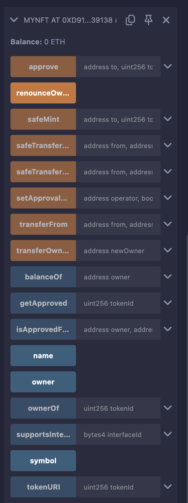
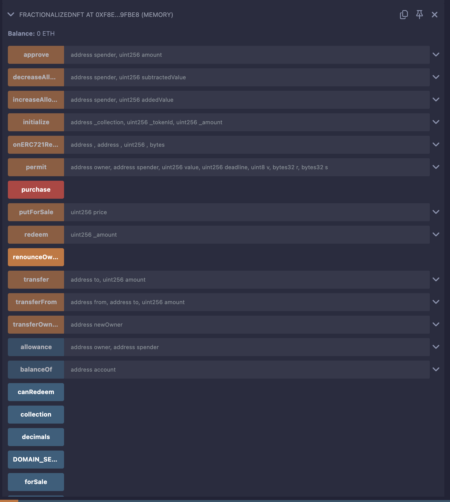
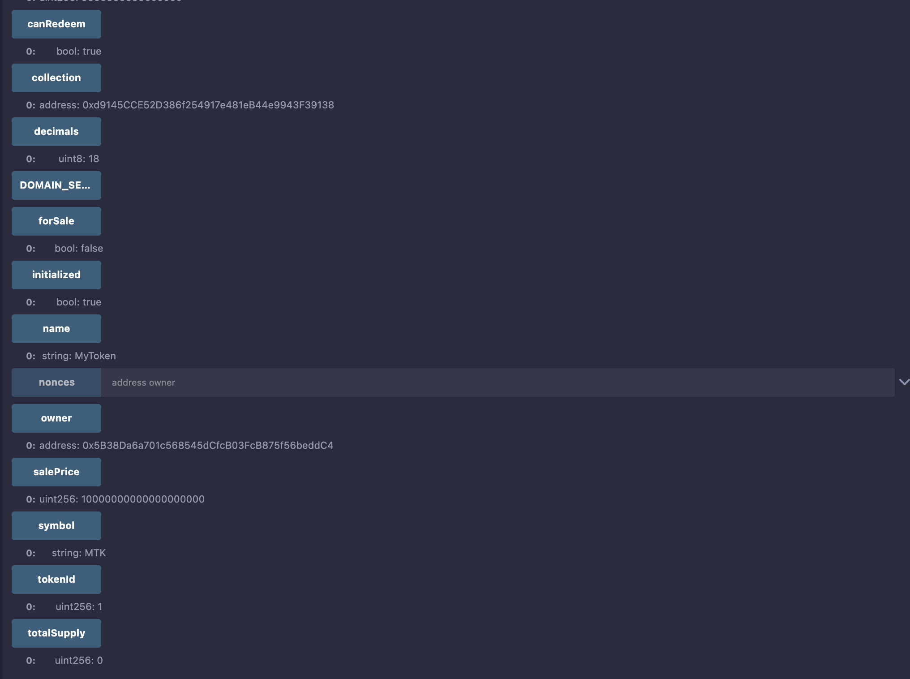

# FractionalizedNFT and MyNFT Smart Contracts

This repository contains two Ethereum smart contracts: `FractionalizedNFT.sol` and `MyNFT.sol`. These contracts work together to enable the fractionalization of an ERC721 non-fungible token (NFT) into ERC20 tokens, allowing multiple users to own fractions of a single NFT and interact with it through sale, purchase, and redemption mechanisms.

## Overview

### MyNFT Contract
- **Purpose**: An ERC721-based NFT contract that allows the owner to mint unique tokens.
- **Key Features**:
  - Minting of NFTs via the `safeMint` function, restricted to the contract owner.
  - Standard ERC721 functionality like `name`, `symbol`, `ownerOf`, and `balanceOf`.
  - Uses OpenZeppelin's `ERC721` and `Ownable` contracts for robust implementation.
- **Token Details**:
  - Name: `MyNFT`
  - Symbol: `MTK`

### FractionalizedNFT Contract
- **Purpose**: An ERC20-based contract that fractionalizes an ERC721 NFT from the `MyNFT` contract into fungible tokens, enabling fractional ownership, sale, and redemption.
- **Key Features**:
  - Initializes with an NFT from the `MyNFT` contract and mints ERC20 tokens representing fractional ownership.
  - Allows the owner to put the NFT for sale at a specified price.
  - Enables users to purchase the NFT by paying the sale price in Ether.
  - Supports redemption of fractional tokens for a proportional share of Ether after a purchase.
  - Uses OpenZeppelin's `ERC20`, `Ownable`, `ERC20Permit`, and `ERC721Holder` for secure token management.
- **Token Details**:
  - Name: `MyToken`
  - Symbol: `MTK`
  - Decimals: 18 (standard for ERC20 tokens)

## Prerequisites
To deploy and test these contracts, you need:
- **Remix IDE**: Access Remix at [remix.ethereum.org](https://remix.ethereum.org).
- **MetaMask**: A browser extension for interacting with Ethereum networks.
- **Test Ether**: Use a testnet like Sepolia or a local VM environment in Remix for testing.
- **Basic Solidity Knowledge**: Understanding of ERC20 and ERC721 standards is helpful.

## Deployment and Testing in Remix IDE

Below is a step-by-step guide to deploy and test the `MyNFT` and `FractionalizedNFT` contracts using Remix IDE. This guide assumes you are using Remix's JavaScript VM (Cancun) for testing.

### Step 1: Set Up Remix Environment
1. **Open Remix IDE**:
   - Navigate to [remix.ethereum.org](https://remix.ethereum.org).
   - Ensure the Remix version is compatible (e.g., 0.63.1 or later).
2. **Create Contract Files**:
   - In the **File Explorer**, create two files: `MyNFT.sol` and `FractionalizedNFT.sol`.
   - Copy and paste the provided contract code into the respective files.
3. **Select Compiler**:
   - Go to the **Solidity Compiler** tab.
   - Set the compiler version to `0.8.4` (or a compatible version for OpenZeppelin 4.6.0).
   - Enable **Auto-Compile** or manually compile both contracts.
4. **Select Environment**:
   - In the **Deploy & Run Transactions** tab, select **JavaScript VM (Cancun)** for a local testing environment.
   - Ensure the gas limit is set to at least `3,000,000` for deployment.

**Screenshot**: Remix IDE setup with contract files and environment selection.

### Step 2: Deploy MyNFT Contract
1. **Select MyNFT Contract**:
   - In the **Deploy & Run Transactions** tab, choose `MyNFT` from the contract dropdown.
2. **Deploy the Contract**:
   - Click **Deploy**. This creates an instance of `MyNFT` with the name `MyNFT` and symbol `MTK`.
   - Note the deployed contract address (e.g., `0xd9145CCE52D386f254917e481eB44e9943F39138`).
3. **Mint an NFT**:
   - In the deployed contract interface, locate the `safeMint` function.
   - Input:
     - `to`: An address (e.g., `0x5B38Da6a701c568545dCfcB03FcB875f56beddC4`).
     - `tokenId`: `1` (a unique identifier for the NFT).
   - Click **Transact** to mint the NFT.
   - Verify the minting by calling `ownerOf(1)` to confirm the owner is the `to` address.
4. **Set Approval for FractionalizedNFT**:
   - Call `setApprovalForAll` to allow the `FractionalizedNFT` contract to manage the NFT.
     - `operator`: The address of the `FractionalizedNFT` contract (to be deployed later, e.g., `0xf8e81D47203A594245E36C48e151709F0C19fBe8`).
     - `approved`: `true`.
   - Click **Transact** to grant approval.

**Screenshot**: Deploying `MyNFT` and minting an NFT.

### Step 3: Deploy FractionalizedNFT Contract
1. **Select FractionalizedNFT Contract**:
   - In the **Deploy & Run Transactions** tab, choose `FractionalizedNFT`.
2. **Deploy the Contract**:
   - Click **Deploy**. This creates an instance with the name `MyToken` and symbol `MTK`.
   - Note the deployed contract address (e.g., `0xf8e81D47203A594245E36C48e151709F0C19fBe8`).
3. **Initialize the Contract**:
   - Locate the `initialize` function in the deployed contract interface.
   - Input:
     - `_collection`: The `MyNFT` contract address (e.g., `0xd9145CCE52D386f254917e481eB44e9943F39138`).
     - `_tokenId`: `1` (the NFT token ID minted earlier).
     - `_amount`: The number of ERC20 tokens to mint (e.g., `10000000000000000`).
   - Click **Transact** to initialize. This transfers the NFT to the `FractionalizedNFT` contract and mints ERC20 tokens to the caller.
   - If the transaction reverts with `ERC721InsufficientApproval`, ensure `setApprovalForAll` was called in Step 2.
   - Verify initialization by calling `initialized()` (should return `true`) and `balanceOf` to check the caller's token balance.

**Screenshot**: Deploying and initializing `FractionalizedNFT`.

### Step 4: Test FractionalizedNFT Features
1. **Put NFT for Sale**:
   - Call `putForSale` with a `price` (e.g., `10000000000000000` Wei, or 0.01 ETH).
   - Verify by calling `forSale()` (should return `true`) and `salePrice()` to check the price.
2. **Purchase the NFT**:
   - Switch to a different account in Remix (e.g., `0xAb8483F64d9C6d1EcF9b849Ae677dD3315835cb2`).
   - Call `purchase` with a `value` equal to or greater than the `salePrice` (e.g., `10000000000000000` Wei).
   - Verify the NFT transfer by calling `ownerOf(1)` on the `MyNFT` contract to confirm the new owner.
   - Check `canRedeem()` (should return `true`).
3. **Redeem Fractional Tokens**:
   - Switch back to the original account (e.g., `0x5B38Da6a701c568545dCfcB03FcB875f56beddC4`).
   - Call `redeem` with an `_amount` (e.g., `1000000` tokens).
   - Verify the transaction burns the tokens and transfers a proportional share of the contract's Ether balance.
   - Check the updated balance using `balanceOf`.

**Screenshot**: Testing `FractionalizedNFT` features (sale, purchase, redemption).

### Step 5: Debugging and Troubleshooting
- **Check Transaction Logs**:
  - In the Remix **Terminal**, review transaction details (e.g., `logs`, `hash`) for successful or failed transactions.
  - For errors like `revert`, inspect the error message (e.g., `Already initialized` or `ERC721InsufficientApproval`) and adjust inputs or permissions.
- **Increase Gas Limit**:
  - If transactions fail due to insufficient gas, increase the gas limit in the **Deploy & Run Transactions** tab (e.g., to `5,000,000`).
- **Use Debugger**:
  - For complex issues, use the **Debugger** tab to step through transaction execution and identify errors.

### Step 6: Verify Contract State
- **MyNFT**:
  - Call `name()` (returns `MyNFT`), `symbol()` (returns `MTK`), `ownerOf(1)` (returns current owner), and `balanceOf(address)` to verify NFT ownership.
- **FractionalizedNFT**:
  - Call `name()` (returns `MyToken`), `symbol()` (returns `MTK`), `totalSupply()`, `balanceOf(address)`, `forSale()`, `salePrice()`, `canRedeem()`, `collection()`, and `tokenId()` to verify contract state.

## Notes
- **Security**: The contracts use OpenZeppelin 4.6.0 for secure implementations. Ensure proper access control (e.g., `onlyOwner`) is maintained in production.
- **Testnet Deployment**: For real-world testing, deploy to a testnet like Sepolia using MetaMask and obtain test Ether from a faucet.
- **IPFS Publishing**: To publish contract metadata to IPFS, use Remix's **Publish to IPFS** feature in the **Deploy & Run Transactions** tab.
- **Gas Optimization**: Monitor gas usage in Remix's terminal and optimize contract logic for production use if needed.

## Screenshots
The following screenshots illustrate key steps in Remix:
1. **MyNFT Deployment**: Deploying and minting an NFT.
   - 
2. **FractionalizedNFT Deployment**: Deploying and initializing the contract.
   - 
3. **FractionalizedNFT Testing**: Testing sale, purchase, and redemption.
   - 
   -  - 

*Note*: Placeholder screenshot paths are provided. Replace with actual screenshot files in your repository.

## License
The contracts are licensed under the MIT License. See the SPDX-License-Identifier in each contract file for details.

## Disclaimer
This is a sample implementation for educational purposes. Conduct thorough testing and audits before deploying to a production environment.

