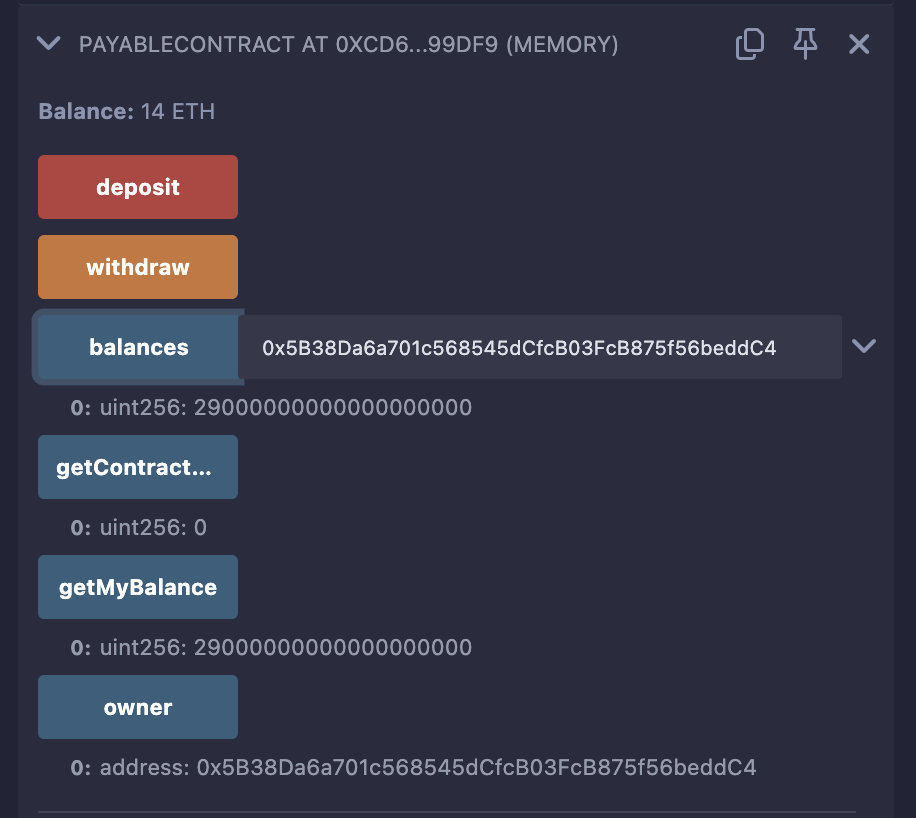

# PayableContract

This README provides an overview of the `PayableContract` smart contract, written in Solidity, and instructions for deploying and testing it in Remix IDE. The contract allows Ether deposits after deployment (but not during deployment) and restricts withdrawals to the contract owner

## Contract Overview

`PayableContract` is a basic Ethereum smart contract with the following functionality:

- **Accepts Ether post-deployment**: Via the `deposit()` function or direct transfers.
- **Blocks Ether during deployment**: Non-payable constructor prevents initial funding.
- **Owner-only withdrawals**: Only the deployer can withdraw funds.
- **Tracks contributions**: Uses a `balances` mapping to log deposits per address.

### Key Features

- **Owner**: The contract deployer, with exclusive withdrawal rights.
- **Balances**: A mapping (`address => uint256`) recording each address’s total deposits in wei.
- **Events**: `Deposit` and `Withdrawal` events for transparency.
- **Restrictions**: No Ether accepted at deployment; withdrawals limited to the owner.

### State Variables

- `owner` (`address payable`): Set to the deployer’s address during construction.
- `balances` (`mapping(address => uint256)`): Tracks total Ether deposited by each address in wei.

### Functions

- `constructor()`: Initializes the owner; non-payable to reject Ether at deployment.
- `receive()`: Payable fallback function that triggers `deposit()` for direct Ether transfers.
- `deposit()`: Accepts Ether, updates `balances`, and emits a `Deposit` event.
- `getContractBalance()`: Returns the contract’s total Ether balance.
- `withdraw()`: Transfers all Ether to the owner; restricted by `onlyOwner` modifier.
- `getMyBalance()`: Returns the caller’s total deposits from `balances`.

### Events

- `Deposit(address indexed sender, uint256 amount, uint256 timestamp)`: Logs Ether deposits.
- `Withdrawal(address indexed receiver, uint256 amount, uint256 timestamp)`: Logs Ether withdrawals.

---

## Prerequisites

- **Remix IDE**: Access at [https://remix.ethereum.org/](https://remix.ethereum.org/).
- **Environment**: Use JavaScript VM (provides 100 ETH per account for testing).
- **Solidity Compiler**: Version 0.8.x or higher.

---

## Setup Instructions

1. **Open Remix**:
   - Navigate to [https://remix.ethereum.org/](https://remix.ethereum.org/).
2. **Create a File**:
   - In the "File Explorers" tab, create a new file named `PayableContract.sol`.
3. **Add the Code**:
   - Copy and paste the contract code into `PayableContract.sol`.
4. **Compile**:
   - Go to the "Solidity Compiler" tab.
   - Select version `0.8.x`.
   - Click "Compile PayableContract.sol" (or press `Ctrl+S`).
5. **Prepare Deployment**:
   - Go to the "Deploy & Run Transactions" tab.
   - Set Environment to "JavaScript VM".
   - Ensure "Value" is `0 ether` (default).
   -  - 

---

## Testing in Remix

Follow these test cases to verify the contract’s behavior. Each case includes steps, expected outcomes, and verification methods.

### Test Case 1: Deploy the Contract (No Ether Accepted)

**Goal**: Confirm deployment succeeds without Ether and fails with Ether.

- **Steps**:
  1. Set "Value" to `0 ether`.
  2. Click "Deploy".
  3. Verify:
     - Console shows the contract address.
     - `getContractBalance()` returns `0`.
     - `getMyBalance()` returns `0`.
     - `owner()` returns the deployer’s address (e.g., `0x5B38Da6a701c568545dCfcB03FcB875f56beddC4`).
  4. Attempt with Ether:
     - Set "Value" to `5 ether`.
     - Click "Deploy".
     - Expected: Reverts with "The called function should be payable...".

### Test Case 2: Deposit Ether After Deployment

**Goal**: Test Ether deposits via `deposit()` and direct transfers.

- **Steps**:
  1. Deploy with `Value: 0 ether`.
  2. **Via `deposit()`**:
     - From Account 1 (owner), set "Value" to `5 ether`.
     - Call `deposit()`.
     - Verify:
       - `getContractBalance()` returns `5000000000000000000` (5 ETH).
       - `getMyBalance()` returns `5000000000000000000`.
       - Console shows `Deposit` event with `amount: 5000000000000000000`.
  3. **Via Direct Transfer**:
     - From Account 2, set "Value" to `3 ether`.
     - Click the "Send Transaction" button next to the contract address (or use "Low-level Interaction" with no data).
     - Verify:
       - `getContractBalance()` returns `8000000000000000000` (8 ETH).
       - `getMyBalance()` (Account 2) returns `3000000000000000000`.
       - Console shows `Deposit` event.

### Test Case 3: Withdraw Ether (Owner Only)

**Goal**: Verify withdrawal works for the owner and fails for others.

- **Steps**:
  1. Deploy and deposit 8 ETH (as in Test Case 2).
  2. **Withdraw as Owner**:
     - From Account 1 (owner), call `withdraw()`.
     - Verify:
       - `getContractBalance()` returns `0`.
       - Console shows `Withdrawal` event with `amount: 8000000000000000000`.
       - Owner’s balance increases by 8 ETH (check Remix account list).
  3. **Attempt as Non-Owner**:
     - From Account 2, call `withdraw()`.
     - Expected: Reverts with "Only owner can call this function".

### Test Case 4: Edge Cases

**Goal**: Test invalid scenarios to ensure proper reverts.

- **Steps**:
  1. **Deposit 0 Ether**:
     - Set "Value" to `0 ether`.
     - Call `deposit()`.
     - Expected: Reverts with "Must send some Ether".
  2. **Withdraw with No Funds**:
     - After withdrawing all funds, call `withdraw()`.
     - Expected: Reverts with "No funds to withdraw".
  3. **Check Non-Depositor Balance**:
     - From a new account, call `getMyBalance()`.
     - Expected: Returns `0`.

---

## Interaction Guide

### Deploying

- Set "Value" to `0 ether` and click "Deploy". Sending Ether during deployment will fail.

### Depositing Ether

- **Using `deposit()`**:
  - Set "Value" (e.g., `2 ether`).
  - Call `deposit()` from any account.
- **Using Direct Transfer**:
  - Set "Value" (e.g., `3 ether`).
  - Send to the contract address via the "Send Transaction" button.

### Checking Balances

- **Contract Total**: Call `getContractBalance()`.
- **Your Deposits**: Call `getMyBalance()`.
- **Specific Address**: Query `balances` by entering an address in Remix.

### Withdrawing

- Call `withdraw()` from the owner account to transfer all Ether.

---

## Troubleshooting

- **Deployment Fails**: Ensure "Value" is `0 ether`.
- **Deposit Fails**: Verify "Value" is greater than `0`.
- **Withdrawal Fails**: Check you’re using the owner account and the contract has funds.
- **Gas Errors**: Increase "Gas Limit" (e.g., to 5,000,000) in Remix.

---

## Additional Notes

- **Units**: Amounts are in wei (1 ETH = 10^18 wei). Use "ether" in Remix’s "Value" field.
- **Balances Mapping**: Records deposits but doesn’t decrease on withdrawal (historical tracking).
- **Security**: This is a learning contract; add safeguards like reentrancy protection for real-world use.
