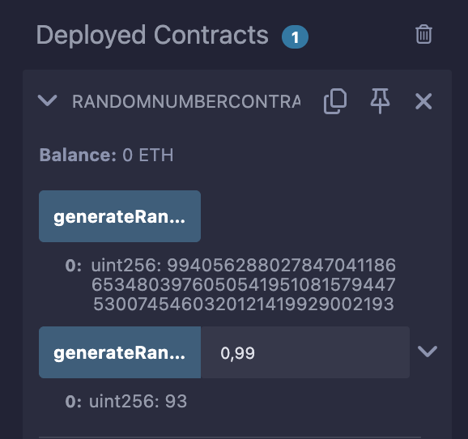

# RandomNumberContract README

## Overview
`RandomNumberContract` is a simple Solidity smart contract that generates pseudo-random numbers on the Ethereum blockchain. It provides two main functions:
1. `generateRandomNumber()`: Returns a pseudo-random `uint256` value based on blockchain variables.
2. `generateRandomNumberInRange(uint256 min, uint256 max)`: Returns a pseudo-random number within a specified range.

**Note**: This contract uses a basic pseudo-random number generation method that is **not cryptographically secure**. It relies on `block.timestamp`, `msg.sender`, and `block.number`, which can be influenced by miners or predictable in certain scenarios. For production use cases requiring secure randomness (e.g., lotteries, gaming), consider using an oracle like Chainlink VRF.

- **Solidity Version**: `^0.8.0`
- **License**: MIT
- **Deployed on**: Any Ethereum-compatible network (e.g., Remix VM, Sepolia testnet)

## Prerequisites
- **Remix IDE**: Use the Remix online IDE (https://remix.ethereum.org/) for deployment and testing.
- **MetaMask**: Optional, for deploying to a testnet like Sepolia.
- **Test ETH**: Required if deploying to a testnet (e.g., from a Sepolia faucet).

## Deployment Instructions
1. **Open Remix**:
   - Go to https://remix.ethereum.org/.
   - Create a new file named `RandomNumberContract.sol` and paste the contract code.

2. **Compile the Contract**:
   - In the "Solidity Compiler" tab, select version `0.8.0` (or higher within `^0.8.0`).
   - Click "Compile RandomNumberContract.sol".

3. **Deploy the Contract**:
   - Go to the "Deploy & Run Transactions" tab.
   - Environment: Choose "Remix VM (Shanghai)" for local testing or "Injected Provider - MetaMask" for testnet deployment.
   - Click "Deploy". If using MetaMask, confirm the transaction.

4. **Interact with the Contract**:
   - Once deployed, the contract will appear under "Deployed Contracts" in Remix. Expand it to access the functions.

## Usage
The contract is read-only (uses `view` functions), so no gas is required to call its functions after deployment unless deployed on a live network.

### Functions
1. **`generateRandomNumber()`**
   - **Input**: None
   - **Output**: `uint256` (a large pseudo-random number)
   - **Description**: Generates a pseudo-random number using `keccak256` with `block.timestamp`, `msg.sender`, and `block.number` as seeds.

2. **`generateRandomNumberInRange(uint256 min, uint256 max)`**
   - **Input**:
     - `min`: The minimum value of the range (inclusive).
     - `max`: The maximum value of the range (inclusive).
   - **Output**: `uint256` (a pseudo-random number between `min` and `max`)
   - **Description**: Maps the result of `generateRandomNumber()` to a specified range using modulo arithmetic.

### Example Calls
- `generateRandomNumber()`: Click the button to get a random `uint256`.
- `generateRandomNumberInRange(1, 100)`: Enter `1` and `100` in the input fields to get a number between 1 and 100.

## Test Cases
Below are test cases to verify the contract’s functionality in Remix. Use the Remix VM for simplicity, as it allows you to control the environment and test without real ETH.

### Setup
- Deploy the contract in Remix VM (Shanghai).
- Use the "Deployed Contracts" interface to call functions.

### Test Case 1: Generate a Random Number
- **Objective**: Verify that `generateRandomNumber()` returns a valid `uint256`.
- **Steps**:
  1. Call `generateRandomNumber()`.
  2. Record the output.
  3. Call it again from the same account without advancing the block.
- **Expected Result**:
  - The output is a large `uint256` (e.g., `123456789...`).
  - The result is the same on repeated calls (since `block.timestamp` and `block.number` don’t change in Remix VM without advancing blocks).
- **Notes**: To see variation, advance the block manually in Remix VM by deploying a dummy transaction or switching accounts.

### Test Case 2: Generate a Number in Range (Valid Input)
- **Objective**: Ensure `generateRandomNumberInRange()` returns a number within the specified range.
- **Steps**:
  1. Call `generateRandomNumberInRange(1, 10)`.
  2. Record the output.
  3. Repeat with different ranges (e.g., `5, 15`, `0, 100`).
- **Expected Result**:
  - The output is between `min` and `max` (e.g., for `1, 10`, expect 1 to 10 inclusive).
- **Notes**: Results may repeat if block conditions don’t change.

### Test Case 3: Invalid Range (max <= min)
- **Objective**: Verify the contract reverts when `max` is not greater than `min`.
- **Steps**:
  1. Call `generateRandomNumberInRange(10, 10)`.
  2. Call `generateRandomNumberInRange(5, 2)`.
- **Expected Result**:
  - Transaction reverts with the error: `"Max must be greater than min"`.
- **Notes**: Check the Remix console for the revert message.

### Test Case 4: Different Callers
- **Objective**: Test if `msg.sender` affects randomness.
- **Steps**:
  1. In Remix VM, switch to a different account (e.g., Account 1 to Account 2).
  2. Call `generateRandomNumber()` from each account.
  3. Record the outputs.
- **Expected Result**:
  - Outputs differ between accounts (due to `msg.sender` in the seed).
- **Notes**: In Remix VM, block variables may not update unless you advance blocks, so differences depend on `msg.sender`.

### Test Case 5: Consistency Across Blocks
- **Objective**: Check if randomness changes with block advancement.
- **Steps**:
  1. Call `generateRandomNumber()` and note the result.
  2. Advance the block in Remix VM (e.g., deploy a dummy contract or send a transaction).
  3. Call `generateRandomNumber()` again.
- **Expected Result**:
  - The output changes after advancing the block (due to `block.number` or `block.timestamp` changing).
- **Notes**: Remix VM may require manual block advancement.

## Limitations
- **Predictability**: The randomness is pseudo-random and can be influenced by miners (e.g., manipulating `block.timestamp`).
- **Testing in Remix**: Results may appear static unless you change `msg.sender` or advance blocks manually.
- **Security**: Not suitable for high-stakes applications (e.g., gambling) due to potential manipulation.

## Troubleshooting
- **Revert on Call**: Ensure inputs for `generateRandomNumberInRange` satisfy `max > min`.
- **Same Output**: Advance blocks or switch accounts in Remix VM to see variation.
- **Deployment Fails**: Check Solidity version compatibility (`^0.8.0`) and sufficient test ETH if on a testnet.
