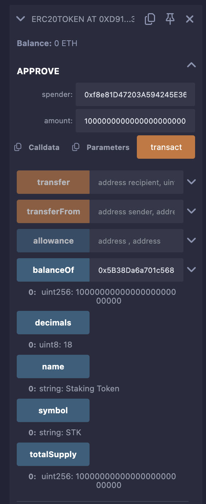

# Staking With Rewards Contract

This repository contains a Solidity-based Staking With Rewards contract, allowing users to stake ERC20 tokens and earn proportional rewards in another ERC20 token. The implementation is modular, with separate files for the ERC20 interface, token implementation, and staking logic.

## Overview

The StakingRewards contract enables:
- **Staking**: Users stake tokens to participate in the reward pool.
- **Rewards**: Users earn rewards proportional to their staked amount over time.
- **Withdrawal**: Users can withdraw staked tokens and claim accumulated rewards.

The system uses two ERC20 tokens:
- **Staking Token**: The token users stake.
- **Rewards Token**: The token distributed as rewards.

## File Descriptions

- **`IERC20.sol`**:
  - Defines the standard ERC20 interface with functions like `transfer`, `approve`, `transferFrom`, `balanceOf`, `allowance`, and `totalSupply`.
  - Used by both the staking and rewards tokens, as well as the StakingRewards contract.

- **`ERC20Token.sol`**:
  - A simple ERC20 token implementation that adheres to the IERC20 interface.
  - Used to create both the Staking Token and Rewards Token with customizable name, symbol, and initial supply.
  - Includes standard ERC20 functionality for transfers, approvals, and balance tracking.

- **`StakingRewards.sol`**:
  - The core staking contract where users can stake tokens, withdraw stakes, and claim rewards.
  - Tracks staked amounts, calculates rewards based on time and stake proportion, and distributes rewards.
  - Includes owner-only functions to set reward duration and notify reward amounts.

**Screenshot of Deployed Contracts**:
-   
- 
-   
-    
- 
## Prerequisites

- **Remix IDE**: Use [Remix](https://remix.ethereum.org/) for compiling, deploying, and testing.
- **MetaMask**: Required for testnet deployment (e.g., Sepolia).
- **Testnet ETH**: Obtain Sepolia ETH from faucets like [Infura](https://infura.io/) or [Alchemy](https://www.alchemy.com/) for testnet deployment.

## Step-by-Step Guide to Deploy and Test in Remix

### 1. Set Up Remix Environment
1. Open [Remix IDE](https://remix.ethereum.org/).
2. In the "File Explorer" tab, ensure the following files are present in your workspace:
   - `IERC20.sol`
   - `ERC20Token.sol`
   - `StakingRewards.sol`

### 2. Compile the Contracts
1. Go to the "Solidity Compiler" tab.
2. Select compiler version `0.8.26` (compatible with `^0.8.26`).
3. Compile the files in this order:
   - `IERC20.sol` (interface, no deployment needed).
   - `ERC20Token.sol`.
   - `StakingRewards.sol`.
4. Check for compilation errors and resolve them if any (e.g., ensure correct Solidity version).

### 3. Deploy the Tokens
Use Remix's JavaScript VM (London) for local testing, which simulates a blockchain environment.

#### Deploy Staking Token
1. Go to the "Deploy & Run Transactions" tab.
2. Select "JavaScript VM (London)" as the environment.
3. Choose `ERC20Token` from the contract dropdown.
4. Input constructor parameters:
   - `_name`: "Staking Token"
   - `_symbol`: "STK"
   - `_initialSupply`: `1000000` (1 million tokens)
5. Click "Deploy" and note the contract address.
6. Verify deployment by calling `balanceOf` with your account address to confirm the initial supply (1,000,000 * 10^18 tokens).

#### Deploy Rewards Token
1. Repeat the process for another `ERC20Token` instance.
2. Input constructor parameters:
   - `_name`: "Rewards Token"
   - `_symbol`: "RWD"
   - `_initialSupply`: `1000000` (1 million tokens)
3. Click "Deploy" and note the contract address.
4. Verify deployment by calling `balanceOf` with your account address.

### 4. Deploy the StakingRewards Contract
1. Select `StakingRewards` from the contract dropdown.
2. Input constructor parameters:
   - `_stakingToken`: Address of the deployed Staking Token.
   - `_rewardToken`: Address of the deployed Rewards Token.
3. Click "Deploy" and note the contract address.
4. Transfer Rewards Tokens to the StakingRewards contract:
   - In the Rewards Token contract, call `transfer`:
     - `recipient`: StakingRewards contract address.
     - `amount`: `100000000000000000000000` (100,000 tokens * 10^18).
   - Verify by calling `balanceOf` on the Rewards Token contract with the StakingRewards address.

### 5. Test the StakingRewards Contract
Simulate staking, withdrawing, and claiming rewards.

1. **Set Rewards Duration**:
   - In the `StakingRewards` contract, call `setRewardsDuration`:
     - `_duration`: `86400` (1 day in seconds).
   - Ensure the caller is the owner (default account).

2. **Notify Reward Amount**:
   - Call `notifyRewardAmount`:
     - `_amount`: `10000000000000000000000` (10,000 tokens * 10^18).
   - This sets the reward rate and starts the reward period.

3. **Approve Staking Tokens**:
   - In the Staking Token contract, call `approve`:
     - `spender`: StakingRewards contract address.
     - `amount`: `1000000000000000000000` (1,000 tokens * 10^18).

4. **Stake Tokens**:
   - In the `StakingRewards` contract, call `stake`:
     - `_amount`: `1000000000000000000000` (1,000 tokens * 10^18).
   - Verify by calling `balanceOf` with your account address to see the staked amount.

5. **Check Earned Rewards**:
   - Advance time in the JavaScript VM by making dummy transactions (e.g., transfer 0 tokens).
   - Call `earned` with your account address to see accumulated rewards (should be non-zero).

6. **Claim Rewards**:
   - Call `getReward` to claim rewards.
   - Verify by checking your Rewards Token balance (`balanceOf` in the Rewards Token contract).

7. **Withdraw Staked Tokens**:
   - Call `withdraw`:
     - `_amount`: `500000000000000000000` (500 tokens * 10^18).
   - Verify by checking `balanceOf` in the `StakingRewards` contract and your Staking Token balance.

### 6. Deploy to a Testnet (Sepolia)
To deploy on a real testnet like Sepolia:

1. **Set Up MetaMask**:
   - Install MetaMask and connect to the Sepolia testnet.
   - Obtain Sepolia ETH from a faucet (e.g., [Infura](https://infura.io/) or [Alchemy](https://www.alchemy.com/)).

2. **Configure Remix**:
   - In the "Deploy & Run Transactions" tab, select "Injected Provider - MetaMask" as the environment.
   - Ensure MetaMask is connected to Sepolia and has sufficient ETH.

3. **Deploy Tokens**:
   - Deploy the Staking Token and Rewards Token as described in Step 3, but on Sepolia.
   - Note the contract addresses.

4. **Deploy StakingRewards**:
   - Deploy the `StakingRewards` contract with the Sepolia token addresses.
   - Follow the same testing steps as in the JavaScript VM.

5. **Verify on Etherscan**:
   - Visit [Sepolia Etherscan](https://sepolia.etherscan.io/).
   - Search for your contract addresses.
   - Use Remix’s "Verify Contract" plugin to verify the contract code on Etherscan.

### 7. Testing Best Practices
- **Edge Cases**:
  - Try staking zero amount (should fail).
  - Attempt to withdraw more than staked (should fail).
  - Call `notifyRewardAmount` with insufficient rewards token balance (should fail).
- **Multiple Accounts**:
  - Use different accounts in Remix’s "Account" dropdown to simulate multiple users.
- **Time Manipulation**:
  - In JavaScript VM, advance time by making transactions to test reward accumulation.

### 8. Common Issues and Fixes
- **"transferFrom" Fails**: Ensure `approve` was called on the Staking Token for the `StakingRewards` contract.
- **"reward amount > balance"**: Verify the `StakingRewards` contract has enough Rewards Tokens.
- **Compilation Errors**: Ensure all files use Solidity version `^0.8.26`.

## License
This project is licensed under the MIT License. See the `SPDX-License-Identifier` in each file.
