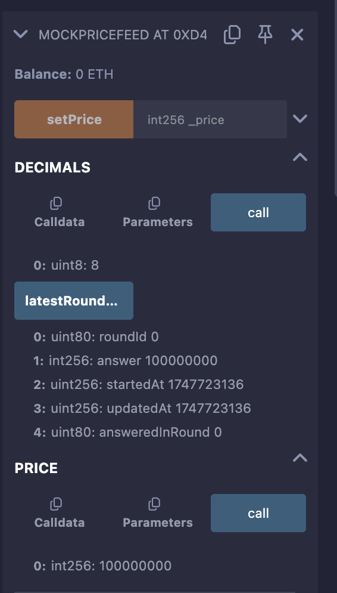
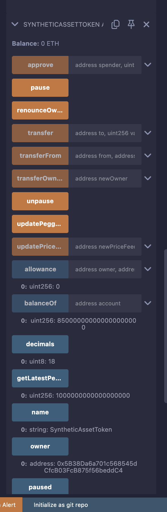

# SyntheticAssetToken

## Overview

The `SyntheticAssetToken` is an ERC-20 token contract designed to represent the value of an off-chain asset (e.g., USD, gold, stocks) on the Ethereum blockchain. It leverages OpenZeppelin’s audited contracts for ERC-20 functionality, ownership, and pausability, and integrates with Chainlink’s price feeds to maintain a pegged value that tracks the real-world asset. The contract is secure, interoperable with DeFi ecosystems, and suitable for real-world applications such as trading, lending, and payments.

## Purpose

The contract was created to bridge traditional finance and decentralized finance (DeFi) by enabling users to hold, trade, and utilize synthetic assets on Ethereum. By pegging the token’s value to an off-chain asset via a Chainlink oracle, it ensures trustless and real-time price updates, making it ideal for decentralized applications requiring stable or asset-backed value representations.

## Real-World Use Cases

1. **DeFi Trading**:
   - Trade synthetic assets (e.g., a token pegged to gold) on decentralized exchanges like Uniswap, enabling exposure to real-world assets without physical ownership.
   - **Why Valuable**: Provides 24/7 liquidity, global access, and low transaction fees compared to traditional markets.

2. **Lending and Borrowing**:
   - Use as collateral in DeFi protocols like Aave, where the `peggedValue` serves as a reliable price reference for loans.
   - **Why Valuable**: Enables users to leverage asset-backed tokens for yield farming or borrowing other assets.

3. **Payments**:
   - Facilitate stable payments for goods/services if pegged to a stable asset like USD, ensuring predictable value transfers.
   - **Why Valuable**: Faster and cheaper than traditional cross-border payments, with blockchain transparency.

4. **Tokenized Assets**:
   - Represent fractional ownership of high-value assets (e.g., real estate, art) by pegging to their market value.
   - **Why Valuable**: Democratizes investment by allowing small investors to own fractions of assets with high liquidity.

5. **Hedging and Speculation**:
   - Gain exposure to price movements of assets (e.g., stocks, commodities) without custodial intermediaries.
   - **Why Valuable**: Reduces counterparty risk and enables global participation in restricted markets.

## Prerequisites

- **Remix**: Access [remix.ethereum.org](https://remix.ethereum.org) for deployment and testing.
- **MetaMask**: For Sepolia testnet deployment, install MetaMask and obtain test ETH from [Sepolia Faucet](https://sepoliafaucet.com/) or [Infura Faucet](https://www.infura.io/faucet).
- **Files**: Ensure you have `SyntheticAssetToken.sol` and `MockPriceFeed.sol` in Remix’s File Explorer.

## Deployment in Remix (JavaScript VM)

The JavaScript VM simulates a blockchain for testing without real ETH. Follow these steps to deploy and resolve errors like those encountered (e.g., constructor revert).

### Step-by-Step Deployment

1. **Open Remix**:
   - Navigate to [remix.ethereum.org](https://remix.ethereum.org).
   - In the File Explorer (left sidebar, folder icon), ensure `MockPriceFeed.sol` and `SyntheticAssetToken.sol` are loaded.

2. **Compile Contracts**:
   - Go to the “Solidity Compiler” tab (hammer icon).
   - Set **Compiler**: `0.8.20` (or latest compatible with `pragma solidity ^0.8.0`).
   - Set **EVM Version**: `cancun`.
   - Click “Compile MockPriceFeed.sol” and “Compile SyntheticAssetToken.sol”.
   - Verify green checkmarks next to both files. Check console for errors.

3. **Deploy MockPriceFeed**:
   - Go to “Deploy & Run Transactions” tab (deploy icon).
   - Set **Environment**: “JavaScript VM (Berlin)” or “JavaScript VM (London)”.
   - Set **Account**: Select an account (e.g., `0x5B38Da6a701c568545dCfcB03FcB875f56beddC4`).
   - Set **Gas Limit**: `5000000`.
   - Set **Value**: `0 Wei`.
   - Select **Contract**: `MockPriceFeed - MockPriceFeed.sol`.
   - Enter parameters:
     - `_price`: `100000000` ($1.00 with 8 decimals, simulating a Chainlink USD feed).
     - `_decimals`: `8`.
   - Click “Deploy” (red button).
   - Note the deployed address (e.g., `0xD4Fc541236927E2EAf8F27606bD7309C1Fc2cbee`) under “Deployed Contracts”.

4. **Deploy SyntheticAssetToken**:
   - In “Deploy & Run Transactions” tab, keep same environment settings.
   - Select **Contract**: `SyntheticAssetToken - SyntheticAssetToken.sol`.
   - Enter parameters:
     - `name_`: `SyntheticAssetToken`
     - `symbol_`: `SAT`
     - `initialSupply`: `1000` (1000 tokens, adjusted for 18 decimals)
     - `initialPriceFeed`: Use `MockPriceFeed` address (e.g., `0xD4Fc541236927E2EAf8F27606bD7309C1Fc2cbee`)
     - `priceFeedDecimals`: `8`
   - Click “Deploy”.
   - Console should show: `creation of SyntheticAssetToken pending...` followed by success (e.g., `SyntheticAssetToken at 0x5FD...9d88D`).
   - If revert occurs, see “Troubleshooting” below.

**Screenshot of Deployed Contracts**:
-   
- 

## Testing in Remix (JavaScript VM)

Test the contract to ensure functionality and reproduce/fix errors like “Insufficient allowance” or constructor reverts.

### Test Cases

1. **Verify Deployment**:
   - Expand `SyntheticAssetToken` at `0x5FD...9d88D` under “Deployed Contracts”.
   - Call view functions (orange buttons):
     - `name`: Expect `SyntheticAssetToken`.
     - `symbol`: Expect `SAT`.
     - `decimals`: Expect `18`.
     - `totalSupply`: Expect `1000000000000000000000` (1000 * 10^18).
     - `balanceOf`: Enter `0x5B38Da6a701c568545dCfcB03FcB875f56beddC4`. Expect `1000000000000000000000`.
     - `peggedValue`: Expect `1000000000000000000` ($1.00 * 10^18).
     - `owner`: Expect `0x5B38Da6a701c568545dCfcB03FcB875f56beddC4`.
     - `priceFeed`: Expect `0xD4Fc541236927E2EAf8F27606bD7309C1Fc2cbee`.
     - `priceFeedDecimals`: Expect `8`.
     - `paused`: Expect `false`.

2. **Test Transfer**:
   - Call `transfer`:
     - `to`: `0xAb8483F64d9C6d1EcF9b849Ae677dD3315835cb2`.
     - `value`: `100000000000000000000` (100 tokens).
     - Click “transact” (red button).
   - Verify:
     - `balanceOf` for `0x5B38Da6a701c568545dCfcB03FcB875f56beddC4`: `900000000000000000000`.
     - `balanceOf` for `0xAb8483F64d9C6d1EcF9b849Ae677dD3315835cb2`: `100000000000000000000`.
     - Check console for `Transfer` event.

3. **Test Approve and TransferFrom**:
   - **Approve**:
     - Call `approve`:
       - `spender`: `0xAb8483F64d9C6d1EcF9b849Ae677dD3315835cb2`.
       - `value`: `50000000000000000000` (50 tokens).
     - Verify: Call `allowance` with `owner: 0x5B38Da6a701c568545dCfcB03FcB875f56beddC4`, `spender: 0xAb8483F64d9C6d1EcF9b849Ae677dD3315835cb2`. Expect `50000000000000000000`.
     - Check console for `Approval` event.
   - **TransferFrom**:
     - Switch “Account” to `0xAb8483F64d9C6d1EcF9b849Ae677dD3315835cb2`.
     - Call `transferFrom`:
       - `from`: `0x5B38Da6a701c568545dCfcB03FcB875f56beddC4`.
       - `to`: `0x4B0897b0513fdC7C541B6d9D7E929C4e5364D2dB`.
       - `value`: `50000000000000000000`.
     - Verify:
       - `balanceOf` for `0x5B38Da6a701c568545dCfcB03FcB875f56beddC4`: `850000000000000000000`.
       - `balanceOf` for `0x4B0897b0513fdC7C541B6d9D7E929C4e5364D2dB`: `50000000000000000000`.
       - `allowance` for `0x5B38Da6a701c568545dCfcB03FcB875f56beddC4`, `0xAb8483F64d9C6d1EcF9b849Ae677dD3315835cb2`: `0`.
       - Check console for `Transfer` event.

4. **Test Peg Updates**:
   - On `MockPriceFeed` at `0xD4F...2cbee`:
     - Call `setPrice` with `200000000` ($2.00 with 8 decimals).
   - On `SyntheticAssetToken`:
     - Call `updatePeggedValue`.
     - Verify: `peggedValue` returns `2000000000000000000` ($2.00 * 10^18).
     - Check console for `PegUpdated` event.

5. **Test Pause/Unpause**:
   - Call `pause` (as owner).
   - Try `transfer` or `transferFrom`. Expect failure: “Pausable: paused”.
   - Call `unpause`.
   - Try `transfer` again. Expect success.
   - Check console for `Paused` and `Unpaused` events.

6. **Test Access Control**:
   - Switch to non-owner account (e.g., `0xAb8483F64d9C6d1EcF9b849Ae677dD3315835cb2`).
   - Try `pause`, `unpause`, or `updatePriceFeed`. Expect failure: “Ownable: caller is not the owner”.
   - Switch back to owner and retry. Expect success.

7. **Edge Cases**:
   - Transfer to `0x0`: Expect failure: “ERC20: transfer to the zero address”.
   - Transfer more than balance: Expect failure: “ERC20: transfer amount exceeds balance”.
   - `updatePeggedValue` when paused: Expect failure: “Pausable: paused”.
   - Set `MockPriceFeed` price to `0` and call `updatePeggedValue`: Expect failure: “Invalid price from oracle”.

## Deployment with MetaMask (Sepolia Testnet)

For real-world testing, deploy to the Sepolia testnet using MetaMask.

### Step-by-Step Deployment

1. **Set Up MetaMask**:
   - Install MetaMask (browser extension).
   - Switch to Sepolia testnet (Network > Sepolia).
   - Obtain test ETH from [Sepolia Faucet](https://sepoliafaucet.com/) or [Infura Faucet](https://www.infura.io/faucet) (0.5–1 ETH).

2. **Connect MetaMask to Remix**:
   - In “Deploy & Run Transactions” tab, set “Environment” to “Injected Provider - MetaMask”.
   - MetaMask prompts to connect. Select your account and approve.

3. **Compile Contracts**:
   - Follow Step 2 from “Deployment in Remix” to compile both contracts.

4. **Deploy SyntheticAssetToken**:
   - Set **Gas Limit**: `5000000`.
   - Set **Value**: `0 Wei`.
   - Select **Contract**: `SyntheticAssetToken - SyntheticAssetToken.sol`.
   - Enter parameters:
     - `name_`: `SyntheticAssetToken`
     - `symbol_`: `SAT`
     - `initialSupply`: `1000`
     - `initialPriceFeed`: `0x694AA1769357215DE4FAC081bf1f309aDC325306` (Sepolia ETH/USD feed, 8 decimals)
     - `priceFeedDecimals`: `8`
   - Click “Deploy”. Confirm in MetaMask (gas fee: ~0.001–0.01 ETH).
   - Console shows: `creation of SyntheticAssetToken pending...`. Contract appears under “Deployed Contracts”.

5. **Test on Sepolia**:
   - Follow “Test Cases” above, using real Chainlink data for `updatePeggedValue`.
   - Verify `peggedValue` reflects the latest ETH/USD price (e.g., $3000 = `3000000000000000000000`).
   - Transactions cost gas; ensure sufficient test ETH.

6. **Verify on Sepolia Etherscan**:
   - Copy contract address from Remix.
   - Go to [Sepolia Etherscan](https://sepolia.etherscan.io/), paste address.
   - Click “Verify and Publish” in “Code” tab.
   - Select “Via flattened source code”.
   - In Remix, go to “Solidity Compiler” > “Flatten” > Copy flattened `SyntheticAssetToken.sol`.
   - Paste flattened code, enter constructor arguments (`SyntheticAssetToken`, `SAT`, `1000`, `0x694AA1769357215DE4FAC081bf1f309aDC325306`, `8`), and submit.

## Troubleshooting Common Errors

1. **Constructor Revert**:
   - **Error**: `creation of SyntheticAssetToken errored: revert` (e.g., `hash: 0x7f4...05420`).
   - **Cause**: Constructor calls `getLatestPeggedValue()`, which fails if `initialPriceFeed` is invalid or not deployed.
   - **Fix**: Deploy `MockPriceFeed` first in VM and use its address (e.g., `0xD4Fc541236927E2EAf8F27606bD7309C1Fc2cbee`). Ensure `_price` is positive (e.g., `100000000`).
   - **Action**: Follow deployment steps exactly. Use Remix’s “Debugger” tab with transaction hash to identify revert point.

2. **Insufficient Allowance**:
   - **Error**: `transact to SyntheticAssetToken.transferFrom errored: ERC20InsufficientAllowance` (e.g., `hash: 0xc04...4ef88`).
   - **Cause**: `approve` not called or insufficient allowance set for spender.
   - **Fix**: Call `approve` with sufficient `value` (e.g., `50000000000000000000`) before `transferFrom`. Verify with `allowance`.
   - **Action**: Follow Test Case 3. Check console for `Approval` event.

3. **Gas Issues**:
   - **Error**: Transaction fails with “out of gas”.
   - **Cause**: Gas limit too low for deployment or complex operations.
   - **Fix**: Increase gas limit to `6000000` in Remix or MetaMask.
   - **Action**: Monitor gas usage in console (e.g., `transaction cost: 39195 gas` for `updatePeggedValue`).

4. **Invalid Price from Oracle**:
   - **Error**: `updatePeggedValue` fails with “Invalid price from oracle”.
   - **Cause**: `MockPriceFeed` price set to `0` or negative.
   - **Fix**: Set positive price (e.g., `200000000`) in `MockPriceFeed` before calling `updatePeggedValue`.

## Notes

- **Security**: Audit the contract before mainnet deployment. Consider multi-sig ownership for `updatePriceFeed` and `pause`.
- **DeFi Integration**: Add `SAT` to Uniswap (create liquidity pool) or Aave (as collateral, requires listing).
- **Frontend**: Use Ethers.js to interact with `peggedValue`, `transfer`, etc., in a dApp.
- **Peg Stability**: Chainlink ensures reliable price updates, but monitor oracle health in production.
 frontend example, specific DeFi integration, or further debugging, let me know!