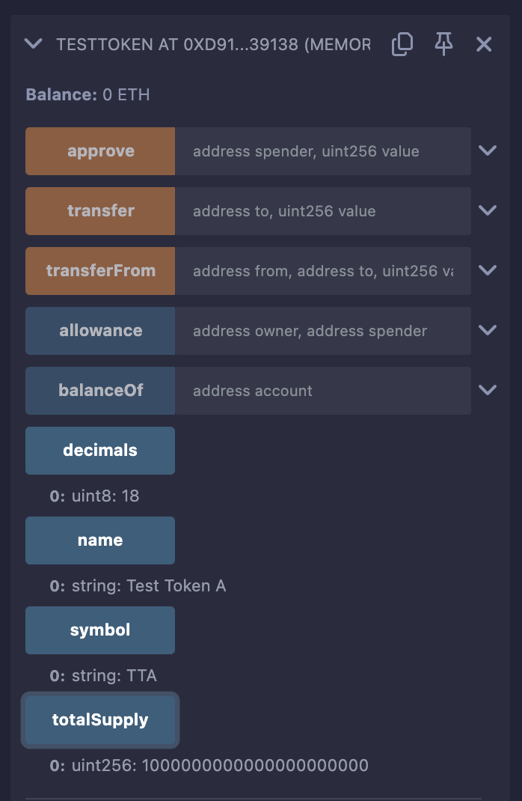
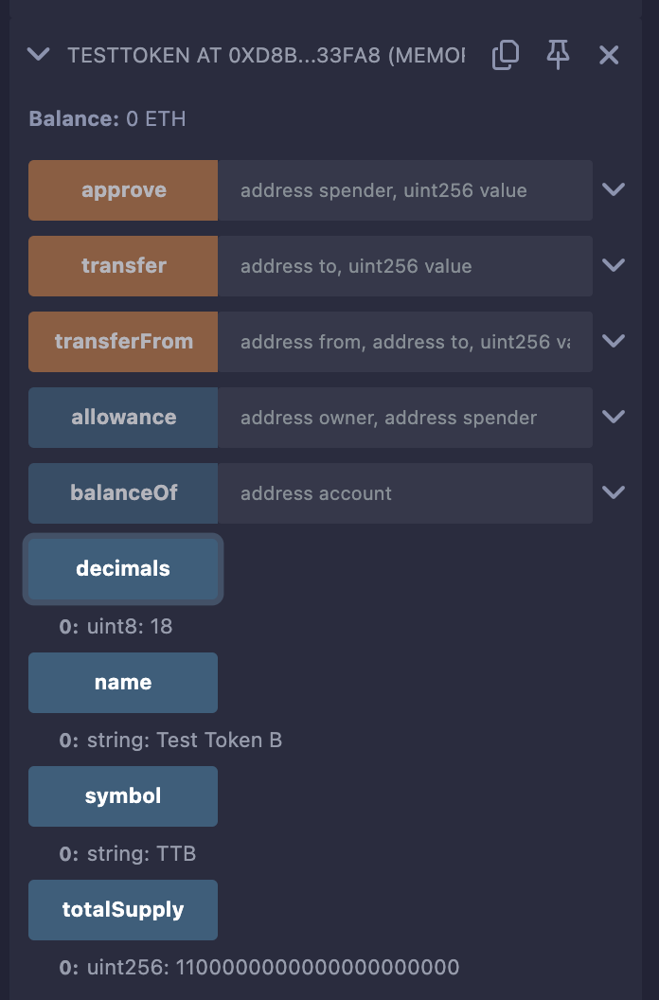
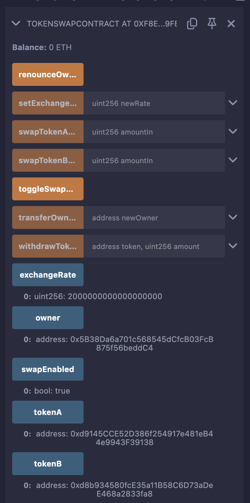

## Token Swap Smart Contracts

This project includes two Solidity smart contracts:
1. **`TestToken.sol`**: A simple ERC-20 token contract for testing purposes.
2. **`TokenSwapContract.sol`**: A contract that facilitates swapping between two ERC-20 tokens with a configurable exchange rate.

These contracts are designed to be deployed and tested using the Remix IDE on a test network (e.g., Sepolia).

---

## Contract Explanations

### TestToken.sol
- **Purpose**: A basic ERC-20 token implementation used to create test tokens (TokenA and TokenB) for the swap contract.
- **Features**:
  - Inherits from OpenZeppelin's `ERC20` contract.
  - Mints an initial supply to the deployer.
- **Key Functions**:
  - Constructor: Sets token name, symbol, and initial supply.
  - Standard ERC-20 functions: `transfer`, `approve`, `transferFrom`, etc.
- **Use Case**: Provides tokens to test the `TokenSwapContract`.

### TokenSwapContract.sol
- **Purpose**: Enables swapping between two ERC-20 tokens (TokenA and TokenB) at a predefined exchange rate.
- **Features**:
  - Bidirectional swapping (TokenA ↔ TokenB).
  - Configurable exchange rate (set by owner).
  - Swap enable/disable toggle (owner-only).
  - Token withdrawal capability (owner-only).
  - Event logging for transparency.
- **Security**:
  - Inherits from OpenZeppelin's `Ownable` for access control.
  - Includes input validation and balance checks.
  - Uses safe token transfers via `IERC20`.
- **Key Functions**:
  - `swapTokenAtoB`: Swap TokenA for TokenB.
  - `swapTokenBtoA`: Swap TokenB for TokenA.
  - `setExchangeRate`: Update the exchange rate (owner-only).
  - `toggleSwapEnabled`: Enable/disable swapping (owner-only).
  - `withdrawTokens`: Withdraw tokens from the contract (owner-only).

---

## Prerequisites
- **Remix IDE**: Access at [https://remix.ethereum.org/](https://remix.ethereum.org/).
- **MetaMask**: Browser extension connected to a test network (e.g., Sepolia).
- **Test ETH**: Obtain from a faucet for the chosen network (e.g., Sepolia faucet).
- **Basic Knowledge**: Understanding of Remix, Solidity, and Ethereum transactions.

---

## Deployment Instructions

### Step 1: Set Up Remix Environment
1. Open Remix IDE at [https://remix.ethereum.org/](https://remix.ethereum.org/).

2. In the "File Explorer" tab (left sidebar), create two files:
   - `TestToken.sol`
   - `TokenSwapContract.sol`

3. Compile both contracts:
   - Go to "Solidity Compiler" tab.
   - Select version `0.8.20` (or any 0.8.x).
   - Compile `TestToken.sol`, then `TokenSwapContract.sol`.

### Step 2: Connect MetaMask
1. In "Deploy & Run Transactions" tab:
   - Select "Injected Provider - MetaMask" as the environment.
   - Approve the connection in MetaMask.
2. Switch MetaMask to a test network (e.g., Sepolia).
3. Ensure your account has test ETH (at least 0.1 ETH).

### Step 3: Deploy Test Tokens
1. **Deploy TokenA**:
   - Select "TestToken" in the "Deploy & Run Transactions" tab.
   - Parameters:
     - `name`: "Test Token A"
     - `symbol`: "TTA"
     - `initialSupply`: `1000`
   - Click "Deploy" and confirm in MetaMask.
   - Copy the deployed address (e.g., `0x123...`).
2. **Deploy TokenB**:
   - Parameters:
     - `name`: "Test Token B"
     - `symbol`: "TTB"
     - `initialSupply`: `1000`
   - Deploy and copy the address (e.g., `0x456...`).
3. Verify:
   - Call `balanceOf` with your address to confirm 1000e18 tokens each.

### Step 4: Deploy TokenSwapContract
1. Select "TokenSwapContract" in the dropdown.
2. Parameters:
   - `_tokenA`: TokenA address (e.g., `0x123...`).
   - `_tokenB`: TokenB address (e.g., `0x456...`).
   - `_exchangeRate`: `2000000000000000000` (2e18, 2 TokenB per TokenA).
   - `initialOwner`: Your MetaMask address.
3. Click "Deploy" and confirm in MetaMask.
4. Verify:
   - Call `tokenA`, `tokenB`, `exchangeRate`, `swapEnabled` to check values.

---

## Step-by-Step Testing Guide in Remix

### Step 5: Fund the Swap Contract
1. **Approve Tokens**:
   - In TokenA:
     - `approve(TokenSwapContract_address, 500000000000000000000)` (500e18).
   - In TokenB:
     - `approve(TokenSwapContract_address, 1000000000000000000000)` (1000e18).
2. **Transfer Tokens**:
   - In TokenA:
     - `transfer(TokenSwapContract_address, 500000000000000000000)` (500e18).
   - In TokenB:
     - `transfer(TokenSwapContract_address, 1000000000000000000000)` (1000e18).
3. Verify:
   - Check `balanceOf(TokenSwapContract_address)` for both tokens.

### Step 6: Test Swap Functions
1. **Approve for Swapping**:
   - TokenA: `approve(TokenSwapContract_address, 10000000000000000000)` (10e18).
   - TokenB: `approve(TokenSwapContract_address, 20000000000000000000)` (20e18).
2. **swapTokenAtoB**:
   - Call with `10000000000000000000` (10e18).
   - Confirm in MetaMask.
   - Verify: TokenA decreases by 10, TokenB increases by 20.
3. **swapTokenBtoA**:
   - Call with `20000000000000000000` (20e18).
   - Verify: TokenB decreases by 20, TokenA increases by 10.

### Step 7: Test Owner Functions
1. **setExchangeRate**:
   - Call with `3000000000000000000` (3e18).
   - Verify: `exchangeRate` updates to 3e18.
2. **toggleSwapEnabled**:
   - Call once (disables swapping).
   - Test swap (should fail).
   - Call again (re-enables).
3. **withdrawTokens**:
   - Call with TokenA address and `100000000000000000000` (100e18).
   - Verify: Your TokenA balance increases by 100.

---

## Test Cases

### TestToken.sol
1. **Deployment**:
   - Deploy with initial supply 1000.
   - Expected: Deployer receives 1000e18 tokens.
2. **Transfer**:
   - Transfer 100 tokens to another address.
   - Expected: Balances update correctly.
3. **Approve/TransferFrom**:
   - Approve 50 tokens, then transferFrom.
   - Expected: Tokens move, allowance decreases.

### TokenSwapContract.sol
1. **Successful Swap A to B**:
   - Input: 10 TokenA.
   - Expected: Receive 20 TokenB (2:1 rate).
2. **Successful Swap B to A**:
   - Input: 20 TokenB.
   - Expected: Receive 10 TokenA.
3. **Zero Amount Swap**:
   - Input: 0.
   - Expected: Reverts with "Amount must be greater than 0".
4. **Swap Disabled**:
   - Disable via `toggleSwapEnabled`.
   - Attempt swap.
   - Expected: Reverts with "Swapping is disabled".
5. **Insufficient Contract Balance**:
   - Withdraw most tokens, then swap.
   - Expected: Reverts with "Insufficient contract balance".
6. **Non-Owner Access**:
   - From another account, call `setExchangeRate`.
   - Expected: Reverts with "Ownable: caller is not the transactional owner".
7. **Invalid Withdrawal**:
   - Withdraw with amount 0 or invalid token.
   - Expected: Reverts with appropriate message.

---

## Troubleshooting
- **Compilation Errors**: Ensure correct Solidity version and imports.
- **Gas Issues**: Increase gas limit in MetaMask if transactions fail.
- **Revert Debugging**: Check Remix console for error messages.
- **Balance Verification**: Use `balanceOf` to track token movements.

