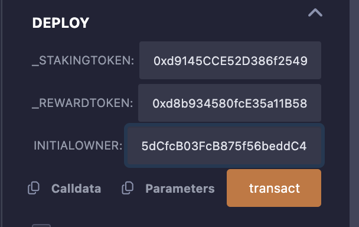
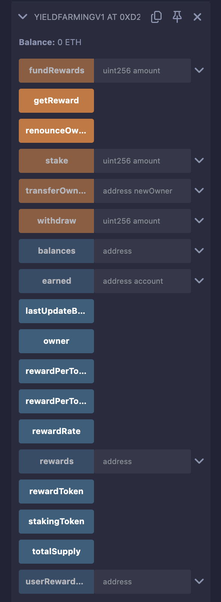

# YieldFarmingV1 and TestToken Smart Contracts

## Overview

This project includes two smart contracts:
1. **YieldFarmingV1**: A decentralized finance (DeFi) yield farming contract that allows users to stake ERC20 tokens to earn rewards in another ERC20 token. It supports staking, withdrawing, and claiming rewards based on a per-block reward rate.
2. **TestToken**: A simple ERC20 token contract used for testing the `YieldFarmingV1` contract. It is deployed as both the staking token and reward token in the test environment.

The contracts are written in **Solidity ^0.8.0** and use **OpenZeppelin** libraries for ERC20 and access control functionality. They are designed to be deployed and tested in the **Remix IDE** using the JavaScript VM or a testnet like Sepolia.

## Use Cases

### YieldFarmingV1
- **Passive Income**: Users can stake tokens to earn rewards, providing a way to generate passive income in DeFi ecosystems.
- **Liquidity Provision**: Encourages users to lock tokens in liquidity pools, supporting decentralized exchanges (DEXs) or lending protocols.
- **Incentive Programs**: Protocols can distribute governance or utility tokens as rewards to attract users and bootstrap network activity.
- **Customizable Rewards**: The contract supports configurable reward rates, making it adaptable for various DeFi applications.

### TestToken
- **Testing Environment**: Acts as a mock ERC20 token for staking and rewards in the `YieldFarmingV1` contract during development and testing.
- **Prototyping**: Useful for simulating tokenomics in a controlled environment before deploying with real tokens.
- **Education**: Demonstrates ERC20 token functionality for learning purposes.

## Prerequisites

To deploy and test the contracts, you need:
- **Remix IDE**: Access at [remix.ethereum.org](https://remix.ethereum.org/).
- **MetaMask**: Browser extension for testnet deployments (optional).
- **Test ETH**: Required for testnet deployments (e.g., from a Sepolia faucet like [sepoliafaucet.com](https://sepoliafaucet.com/)).
- **Basic Solidity Knowledge**: Understanding of ERC20 tokens, smart contract deployment, and Remix IDE.

## Contract Details

### YieldFarmingV1
- **Purpose**: Allows users to stake ERC20 tokens and earn rewards based on the number of blocks their tokens are staked.
- **Key Features**:
  - Stake tokens to a pool.
  - Earn rewards proportional to staked amount and duration (10 reward tokens per block, adjustable).
  - Withdraw staked tokens.
  - Claim accumulated rewards.
  - Owner can fund the contract with reward tokens.
- **Dependencies**:
  - OpenZeppelin’s `IERC20` for token interactions.
  - OpenZeppelin’s `Ownable` for access control.
- **Constructor Parameters**:
  - `_stakingToken`: Address of the ERC20 token to stake.
  - `_rewardToken`: Address of the ERC20 token for rewards.
  - `initialOwner`: Address of the contract owner (typically the deployer).

### TestToken
- **Purpose**: A mock ERC20 token for testing.
- **Key Features**:
  - Standard ERC20 functionality (transfer, approve, balanceOf, etc.).
  - Mints an initial supply to the deployer.
- **Constructor Parameters**:
  - `name`: Token name (e.g., "Staking Token").
  - `symbol`: Token symbol (e.g., "STK").
  - `initialSupply`: Initial token supply (e.g., 1 million tokens with 18 decimals).

## Screenshots
- **Deploy Contract**:
  
  

## Deployment and Testing in Remix IDE

Follow these steps to deploy and test the contracts in Remix IDE. The instructions assume you have two Solidity files: `YieldFarmingV1.sol` and `TestToken.sol`.

### Step 1: Set Up Remix Environment
1. **Open Remix IDE**:
   - Navigate to [remix.ethereum.org](https://remix.ethereum.org/).
2. **Create Files**:
   - In the **File Explorer**, ensure you have:
     - `TestToken.sol`: Contains the ERC20 token contract.
     - `YieldFarmingV1.sol`: Contains the yield farming contract.
   - Verify that both files include the correct OpenZeppelin imports:
     ```solidity
     import "@openzeppelin/contracts/token/ERC20/IERC20.sol";
     import "@openzeppelin/contracts/access/Ownable.sol"; // For YieldFarmingV1
     import "@openzeppelin/contracts/token/ERC20/ERC20.sol"; // For TestToken
     ```
3. **Check Internet Connection**:
   - Remix fetches OpenZeppelin contracts from GitHub, so ensure you’re online.

### Step 2: Compile the Contracts
1. **Go to the Solidity Compiler Tab**:
   - Select a compiler version compatible with `^0.8.0` (e.g., `0.8.20`).
   - Compile `TestToken.sol` first. Check for errors in the **Compiler Output**.
   - Compile `YieldFarmingV1.sol`. Ensure no errors (e.g., missing constructor arguments).
2. **Troubleshooting**:
   - If you see import errors, verify the OpenZeppelin paths.
   - Ensure the Solidity version matches the pragma statement (`pragma solidity ^0.8.0;`).

### Step 3: Deploy the TestToken Contracts
1. **Go to the Deploy & Run Transactions Tab**:
   - Choose an environment:
     - **JavaScript VM**: For local testing (recommended for simplicity).
     - **Injected Provider - MetaMask**: For testnet deployment (requires MetaMask and test ETH).
   - If using MetaMask, connect it to a testnet (e.g., Sepolia) and ensure you have test ETH.
2. **Deploy Staking Token**:
   - Select `TestToken` from the contract dropdown.
   - Input constructor parameters:
     - `name`: "Staking Token"
     - `symbol`: "STK"
     - `initialSupply`: `1000000000000000000000000` (1 million tokens, 18 decimals).
   - Click **Deploy**. Copy the deployed contract address (e.g., `0x123...`).
3. **Deploy Reward Token**:
   - Deploy another `TestToken` instance:
     - `name`: "Reward Token"
     - `symbol`: "RWD"
     - `initialSupply`: `1000000000000000000000000` (1 million tokens).
   - Copy the deployed contract address.

### Step 4: Deploy the YieldFarmingV1 Contract
1. **Select YieldFarmingV1**:
   - In the Deploy & Run Transactions tab, select `YieldFarmingV1`.
2. **Input Constructor Parameters**:
   - `_stakingToken`: Paste the address of the deployed `TestToken` (Staking Token).
   - `_rewardToken`: Paste the address of the deployed `TestToken` (Reward Token).
   - `initialOwner`: Input the deployer’s address (e.g., your MetaMask wallet address or the default account in JavaScript VM).
3. **Deploy the Contract**:
   - Click **Deploy**.
   - If using a testnet, confirm the transaction in MetaMask.
   - Copy the deployed `YieldFarmingV1` contract address.
4. **Screenshot of Deployed Contract**:
- **Deploy Contract**:
  
  

### Step 5: Fund the YieldFarmingV1 Contract
The contract needs reward tokens to distribute to users.
1. **Approve Reward Tokens**:
   - Select the `TestToken` (Reward Token) contract.
   - Call the `approve` function:
     - `spender`: Paste the `YieldFarmingV1` contract address.
     - `amount`: `1000000000000000000000000` (1 million tokens).
     - Execute the transaction.
2. **Fund the Contract**:
   - Select the `YieldFarmingV1` contract.
   - Call the `fundRewards` function:
     - `amount`: `1000000000000000000000000` (1 million tokens).
     - Execute the transaction.
   - Verify the contract’s reward token balance:
     - In the `TestToken` (Reward Token) contract, call `balanceOf` with the `YieldFarmingV1` contract address.

### Step 6: Test Staking
1. **Approve Staking Tokens**:
   - Select the `TestToken` (Staking Token) contract.
   - Call the `approve` function:
     - `spender`: Paste the `YieldFarmingV1` contract address.
     - `amount`: `1000000000000000000000` (1,000 tokens).
     - Execute the transaction.
2. **Stake Tokens**:
   - Select the `YieldFarmingV1` contract.
   - Call the `stake` function:
     - `amount`: `1000000000000000000000` (1,000 tokens).
     - Execute the transaction.
   - Verify:
     - Call `balances` with your wallet address to confirm 1,000 tokens staked.
     - Call `totalSupply` to check the total staked tokens (should be 1,000).

### Step 7: Test Reward Accumulation
1. **Advance Blocks**:
   - In the JavaScript VM, execute a few transactions (e.g., call `rewardPerToken`) to increase the block number.
   - On a testnet, wait for blocks to be mined (~12 seconds per block on Sepolia).
2. **Check Earned Rewards**:
   - Call the `earned` function with your wallet address to view accumulated rewards.
   - Rewards are calculated as:
     ```
     (currentBlock - lastUpdateBlock) * rewardRate * stakedAmount / totalSupply
     ```
     With `rewardRate = 10` tokens per block, expect 10 tokens per block for 1,000 staked tokens (if you’re the only staker).
3. **Claim Rewards**:
   - Call the `getReward` function.
   - Verify your reward token balance:
     - In the `TestToken` (Reward Token) contract, call `balanceOf` with your wallet address.

### Step 8: Test Withdrawal
1. **Withdraw Tokens**:
   - Call the `withdraw` function:
     - `amount`: `500000000000000000000` (500 tokens).
     - Execute the transaction.
   - Verify:
     - Call `balances` to confirm your staked balance is now 500 tokens.
     - In the `TestToken` (Staking Token) contract, call `balanceOf` to confirm 500 tokens were returned to your wallet.
2. **Check Rewards After Withdrawal**:
   - Call `earned` to ensure rewards were updated correctly.
   - Call `getReward` to claim any remaining rewards.

### Step 9: Test Cases
The following test cases ensure the `YieldFarmingV1` and `TestToken` contracts function correctly and handle edge cases appropriately. These tests should be performed in Remix IDE after deploying the contracts.

#### Test Case 1: Deploy TestToken Contracts
- **Objective**: Verify that `TestToken` contracts deploy successfully with correct initial supply.
- **Steps**:
  1. Deploy `TestToken` as the staking token with `name = "Staking Token"`, `symbol = "STK"`, `initialSupply = 1000000000000000000000000` (1 million tokens).
  2. Deploy `TestToken` as the reward token with `name = "Reward Token"`, `symbol = "RWD"`, `initialSupply = 1000000000000000000000000`.
  3. Call `balanceOf` with the deployer’s address for both tokens.
- **Expected Outcome**:
  - Both contracts deploy without errors.
  - `balanceOf` returns `1000000000000000000000000` for the deployer on both tokens.

#### Test Case 2: Deploy YieldFarmingV1 Contract
- **Objective**: Verify that `YieldFarmingV1` deploys with valid constructor parameters.
- **Steps**:
  1. Deploy `YieldFarmingV1` with:
     - `_stakingToken`: Address of the staking `TestToken`.
     - `_rewardToken`: Address of the reward `TestToken`.
     - `initialOwner`: Deployer’s address.
  2. Call `stakingToken`, `rewardToken`, and `owner` to verify constructor values.
- **Expected Outcome**:
  - Contract deploys successfully.
  - `stakingToken` and `rewardToken` return the correct token addresses.
  - `owner` returns the deployer’s address.

#### Test Case 3: Fund Reward Tokens
- **Objective**: Verify that the owner can fund the contract with reward tokens.
- **Steps**:
  1. In the reward `TestToken`, call `approve` with `spender = YieldFarmingV1 address`, `amount = 1000000000000000000000000`.
  2. In `YieldFarmingV1`, call `fundRewards` with `amount = 1000000000000000000000000`.
  3. In the reward `TestToken`, call `balanceOf` with the `YieldFarmingV1` address.
- **Expected Outcome**:
  - `approve` and `fundRewards` execute without errors.
  - `balanceOf` returns `1000000000000000000000000` for the `YieldFarmingV1` contract.

#### Test Case 4: Stake Tokens
- **Objective**: Verify that a user can stake tokens and the contract updates balances correctly.
- **Steps**:
  1. In the staking `TestToken`, call `approve` with `spender = YieldFarmingV1 address`, `amount = 1000000000000000000000` (1,000 tokens).
  2. In `YieldFarmingV1`, call `stake` with `amount = 1000000000000000000000`.
  3. Call `balances` with the user’s address and `totalSupply`.
- **Expected Outcome**:
  - `approve` and `stake` execute without errors.
  - `balances` returns `1000000000000000000000` for the user.
  - `totalSupply` returns `1000000000000000000000`.

#### Test Case 5: Reward Accumulation
- **Objective**: Verify that rewards accumulate correctly over blocks.
- **Steps**:
  1. After staking 1,000 tokens (Test Case 4), advance blocks by executing 5 transactions (e.g., call `rewardPerToken` 5 times in JavaScript VM).
  2. Call `earned` with the user’s address.
  3. Calculate expected rewards: `5 blocks * 10 rewardRate * 1000 staked / 1000 totalSupply = 50 tokens` (scaled by 1e18).
- **Expected Outcome**:
  - `earned` returns approximately `50000000000000000000` (50 tokens, 18 decimals).

#### Test Case 6: Claim Rewards
- **Objective**: Verify that a user can claim accumulated rewards.
- **Steps**:
  1. After Test Case 5, call `getReward`.
  2. In the reward `TestToken`, call `balanceOf` with the user’s address.
- **Expected Outcome**:
  - `getReward` executes without errors.
  - `balanceOf` returns approximately `50000000000000000000` (50 tokens).
  - Call `earned` again; it should return 0 (rewards reset).

#### Test Case 7: Withdraw Tokens
- **Objective**: Verify that a user can withdraw staked tokens and rewards are updated.
- **Steps**:
  1. After staking 1,000 tokens, call `withdraw` with `amount = 500000000000000000000` (500 tokens).
  2. Call `balances` with the user’s address and `totalSupply`.
  3. In the staking `TestToken`, call `balanceOf` with the user’s address.
  4. Call `earned` to check if rewards were updated.
- **Expected Outcome**:
  - `withdraw` executes without errors.
  - `balances` returns `500000000000000000000` (500 tokens).
  - `totalSupply` returns `500000000000000000000`.
  - `balanceOf` increases by `500000000000000000000` for the user.
  - `earned` reflects updated rewards based on remaining stake.

#### Test Case 8: Stake Zero Tokens
- **Objective**: Verify that staking zero tokens fails.
- **Steps**:
  1. In `YieldFarmingV1`, call `stake` with `amount = 0`.
- **Expected Outcome**:
  - Transaction reverts with “Cannot stake 0”.

#### Test Case 9: Withdraw More Than Staked
- **Objective**: Verify that withdrawing more than the staked amount fails.
- **Steps**:
  1. After withdrawing 500 tokens (Test Case 7), call `withdraw` with `amount = 1000000000000000000000` (1,000 tokens).
- **Expected Outcome**:
  - Transaction reverts with “Insufficient balance”.

#### Test Case 10: Claim Rewards When None Available
- **Objective**: Verify that claiming rewards with no accumulated rewards fails.
- **Steps**:
  1. After claiming rewards (Test Case 6), call `getReward` again.
- **Expected Outcome**:
  - Transaction reverts with “No rewards to claim”.

#### Test Case 11: Non-Owner Funding Attempt
- **Objective**: Verify that only the owner can fund rewards.
- **Steps**:
  1. Switch to a different account in Remix’s JavaScript VM (or MetaMask).
  2. In the reward `TestToken`, call `approve` with `spender = YieldFarmingV1 address`, `amount = 1000000000000000000000`.
  3. In `YieldFarmingV1`, call `fundRewards` with `amount = 1000000000000000000000`.
- **Expected Outcome**:
  - `fundRewards` reverts with “Ownable: caller is not the owner”.

#### Test Case 12: Multiple Users Staking
- **Objective**: Verify that rewards are distributed correctly among multiple users.
- **Steps**:
  1. With the first account, stake 1,000 tokens (Test Case 4).
  2. Switch to a second account in JavaScript VM.
  3. In the staking `TestToken`, transfer 2,000 tokens to the second account using `transfer`.
  4. Approve and stake 2,000 tokens with the second account.
  5. Advance 5 blocks.
  6. Call `earned` for both accounts.
  7. Expected rewards (totalSupply = 3,000):
     - First account: `5 * 10 * 1000 / 3000 = 16.666 tokens` (approx. `16666666666666666666`).
     - Second account: `5 * 10 * 2000 / 3000 = 33.333 tokens` (approx. `33333333333333333333`).
- **Expected Outcome**:
  - `earned` returns proportional rewards for both accounts.
  - Total rewards sum to approximately 50 tokens (scaled by 1e18).

### Step 10: Debugging and Troubleshooting
1. **Transaction Failures**:
   - Check the **Transaction Log** in Remix for error messages (e.g., revert reasons).
   - Use the **Debugger** tab with the transaction hash to trace execution.
2. **Gas Issues**:
   - Monitor gas costs in Remix’s **Gas Estimator**. Optimize storage operations if costs are high.
3. **Common Errors**:
   - **Constructor Error**: Ensure the `initialOwner` address is valid in the `YieldFarmingV1` constructor.
   - **Token Approval Failure**: Verify sufficient token balance and correct `approve` calls.
   - **Import Errors**: Ensure Remix can access OpenZeppelin contracts (check internet connection).

### Step 11: Test on a Testnet (Optional)
1. **Set Up MetaMask**:
   - Switch to the Sepolia testnet.
   - Obtain test ETH from a faucet (e.g., [sepoliafaucet.com](https://sepoliafaucet.com/)).
2. **Deploy and Test**:
   - Repeat the deployment and testing steps using **Injected Provider - MetaMask**.
   - Note that block times (~12 seconds) affect reward accumulation speed.
3. **Verify Transactions**:
   - Use a block explorer like [Sepolia Etherscan](https://sepolia.etherscan.io/) to verify contract deployment and transactions.

## Security Considerations
- **Smart Contract Risks**:
  - Unaudited contracts may have vulnerabilities (e.g., reentrancy, overflow).
  - Use only for testing, not production, without a professional audit.
- **Token Approvals**:
  - Ensure users approve tokens before staking or funding.
- **Owner Privileges**:
  - The `initialOwner` has control over funding rewards. Secure the owner’s private key.
- **Test Environment**:
  - Use the JavaScript VM or a testnet to avoid real fund loss.

## Future Improvements
- **Time-Based Rewards**: Replace block-based rewards with time-based calculations.
- **Multiple Pools**: Support staking multiple token types in separate pools.
- **Pause Functionality**: Add emergency pause for security.
- **Events**: Emit events for staking, withdrawing, and claiming rewards to improve transparency.
- **Upgradability**: Use a proxy pattern for future upgrades.

## License
This project is licensed under the MIT License. See the `SPDX-License-Identifier: MIT` in the contract files.

## Support
For issues or feature requests:
- Check the Remix IDE documentation: [remix-ide.readthedocs.io](https://remix-ide.readthedocs.io/).
- Consult OpenZeppelin’s documentation: [docs.openzeppelin.com](https://docs.openzeppelin.com/).
- Reach out to the project maintainer or community forums (e.g., Ethereum Stack Exchange).

